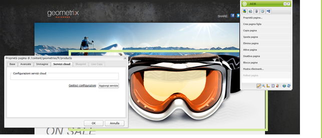
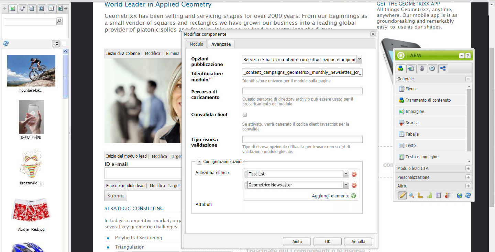
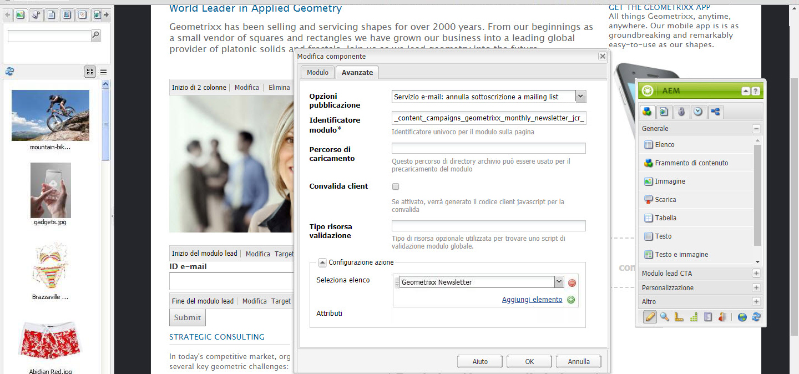
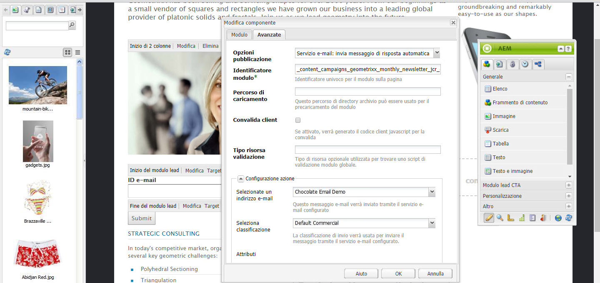

# Gestione degli abbonamenti{#managing-subscriptions}

>[!CAUTION]
>
>AEM 6.4 ha raggiunto la fine del supporto esteso e questa documentazione non viene più aggiornata. Per maggiori dettagli, consulta la nostra [periodi di assistenza tecnica](https://helpx.adobe.com/it/support/programs/eol-matrix.html). Trova le versioni supportate [qui](https://experienceleague.adobe.com/docs/).

>[!NOTE]
>
>Adobe non prevede di migliorare ulteriormente questa funzionalità (Gestione di lead ed elenchi).\
>La raccomandazione è di sfruttare [Adobe Campaign e la sua integrazione AEM](/help/sites-administering/campaign.md).

È possibile chiedere agli utenti di iscriversi **Provider di servizi e-mail** mailing list con l&#39;aiuto di **Modulo** componente utilizzato in una pagina web AEM. Per preparare una pagina AEM con un modulo di iscrizione per l’iscrizione alle mailing list del servizio e-mail, è necessario applicare la configurazione del servizio corrispondente alla pagina AEM che verrà visitata dal potenziale utente iscritto.

## Applicazione della configurazione del servizio e-mail a una pagina {#applying-email-service-configuration-to-a-page}

Per configurare una pagina AEM:

1. Passa a **Siti Web** scheda .
1. Seleziona la pagina da configurare per il servizio. Fai clic con il pulsante destro del mouse sulla pagina e seleziona **Proprietà**.

1. Seleziona **Cloud Services** then **Aggiungi servizio**. Seleziona una configurazione dall’elenco delle configurazioni disponibili.

   

1. Fai clic su **OK**.

## Creazione di un modulo di iscrizione su una pagina AEM per iscriversi o annullare l’iscrizione alle mailing list {#creating-a-sign-up-form-on-an-aem-page-for-subscribing-unsubscribing-to-lists}

Per creare un modulo di iscrizione e configurarlo per gli abbonamenti alle mailing list del provider di servizi e-mail:

1. Apri la pagina AEM che verrà visitata dall’utente.
1. Applica la configurazione del provider di servizi e-mail alla pagina.

1. Aggiungi un **Modulo** per passare alla pagina, trascinate il componente dalla barra laterale. Se il componente non è disponibile, passa alla modalità Progettazione e attiva **Modulo** gruppo.
1. Fai clic su **Modifica** in **Inizio del modulo** e naviga fino al **Avanzate** scheda .
1. In **Modulo** menu a discesa, seleziona **Servizio e-mail: Crea utente con sottoscrizione** e aggiungi all&#39;elenco.
1. Nella parte inferiore della finestra di dialogo, apri le **Configurazione azione** a discesa, che consente di selezionare uno o più elenchi di sottoscrizioni.
1. In **Seleziona elenco**, selezionate l’elenco a cui iscrivere l’utente. È possibile aggiungere più elenchi utilizzando il pulsante più (**Aggiungi elemento**).

   

   >[!NOTE]
   >
   >La finestra di dialogo può variare a seconda del provider di servizi di posta elettronica.

1. In **Modulo** selezionare la pagina di ringraziamento a cui si desidera indirizzare gli utenti dopo l’invio del modulo (se lasciato vuoto, il modulo viene visualizzato nuovamente all’invio). Fai clic su **OK**. Un **ID e-mail** Il componente viene visualizzato nel Modulo , che consente di creare un modulo in cui gli utenti possono inviare i propri indirizzi e-mail per effettuare o annullare l’iscrizione a una mailing list.
1. Aggiungi il **Invia** componente pulsante dal **Modulo** nella barra laterale.

   Il modulo è pronto. Pubblica la pagina configurata nei passaggi precedenti insieme alla **grazie** nell’istanza di pubblicazione. Tutti i potenziali utenti che visitano la pagina possono compilare il modulo e iscriversi all’elenco fornito nella configurazione.

   >[!NOTE]
   >
   >Per eseguire correttamente la funzione di iscrizione al modulo, procedere come segue. [le chiavi di crittografia dell’autore devono essere esportate e importate nell’istanza di pubblicazione](#exporting-keys-from-author-and-importing-on-publish).

## Esportazione delle chiavi dall’istanza di creazione e importazione al momento della pubblicazione {#exporting-keys-from-author-and-importing-on-publish}

Affinché l’abbonamento al servizio e-mail e il suo annullamento funzionino tramite il modulo di registrazione nell’istanza di pubblicazione, è necessario seguire questi passaggi:

1. Nell’istanza di authoring, passa a Gestione pacchetti.
1. Crea un nuovo pacchetto. Imposta il filtro come `/etc/key`.
1. Crea e scarica il pacchetto.
1. Passa a Gestione pacchetti nell’istanza di pubblicazione e carica il pacchetto.
1. Passa alla console di Publish osgi e riavvia il bundle denominato **Supporto Crypto di Adobe Granite**.

## Annullamento dell’iscrizione degli utenti dagli elenchi {#unsubscribing-users-from-lists}

Per annullare l’iscrizione degli utenti agli elenchi:

1. Aprite le proprietà della pagina AEM che contiene il modulo di registrazione per annullare l’iscrizione a un lead.
1. Applica la configurazione del servizio alla pagina.
1. Crea un modulo di registrazione sulla pagina.
1. Durante la configurazione del componente, seleziona l’azione . **Servizio e-mail**: **Annulla l’iscrizione all’elenco degli utenti.**
1. Dal menu a discesa , seleziona l’elenco appropriato dal quale verrà rimosso l’utente.

   

1. Esporta le chiavi dall’istanza di creazione a quella di pubblicazione.

## Configurazione delle e-mail di risposta automatica per il servizio e-mail {#configuring-auto-responder-emails-for-email-service}

Per configurare un messaggio e-mail di risposta automatica per un utente iscritto:

1. Apri le proprietà della pagina AEM che dispone del modulo di registrazione per configurare la risposta automatica per un lead.
1. Applica la configurazione ExactTarget alla pagina.

1. Aggiungi un **Modulo** per passare alla pagina, trascinate il componente dalla barra laterale. Se il componente non è disponibile, passa alla modalità di progettazione e attiva la **Modulo** gruppo.
1. Fai clic su **Modifica** in **Inizio del modulo** e naviga fino al **Avanzate** scheda .
1. In **Modulo** menu a discesa, seleziona **Servizio e-mail: Invia messaggio di risposta automatica.**
1. **Selezionare un messaggio e-mail** (si tratta dell’e-mail inviata come risposta automatica).

1. **Seleziona classificazione** (classificazione utilizzata per inviare l’e-mail).
1. Seleziona la **Grazie** (pagina a cui vengono indirizzati gli utenti dopo l’invio del modulo).

   In **Modulo** selezionare la pagina di ringraziamento a cui si desidera indirizzare gli utenti dopo l’invio del modulo. Se lasciato vuoto, il modulo viene visualizzato nuovamente al momento dell’invio. Fai clic su **OK**.

1. Esporta le chiavi dall’istanza di creazione a quella di pubblicazione.
1. Aggiungi il **Invia** componente pulsante dal **Modulo** nella barra laterale.

   Il modulo di registrazione è pronto. Pubblica la pagina configurata nei passaggi precedenti insieme alla **grazie** nell’istanza di pubblicazione. Gli utenti che visiteranno la pagina potranno compilare il modulo e, dopo l’invio, riceveranno un messaggio e-mail di risposta automatica sull’ID e-mail compilato nel modulo.

   >[!NOTE]
   >
   >Affinché la funzione di iscrizione funzioni correttamente nel modulo, [le chiavi di crittografia dell’autore devono essere esportate e importate nell’istanza di pubblicazione](#exporting-keys-from-author-and-importing-on-publish).

   
