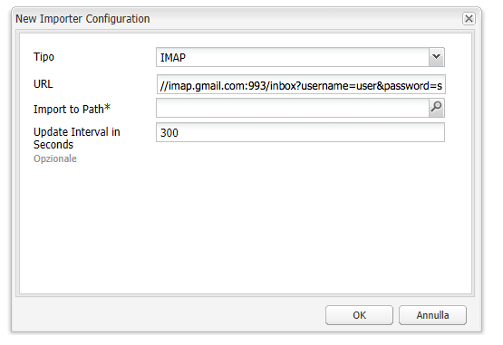

# Tracciamento dei messaggi e-mail non pervenuti a destinazione{#tracking-bounced-emails}

>[!NOTE]
>
>Adobe non intende migliorare ulteriormente il tracciamento dei messaggi e-mail aperti/non pervenuti a destinazione inviati dal servizio SMTP AEM.
>
>È consigliabile [sfruttare Adobe Campaign e la relativa integrazione](/help/sites-administering/campaign.md)AEM.

Quando invii una newsletter a molti utenti, è probabile che la mailing list contenga alcuni indirizzi e-mail non validi. In questo caso le newsletter inviate restituiranno un messaggio di errore di mancato recapito. Una volta configurato il contatore per non arrivate a destinazione, AEM è in grado di gestire tali errori e impedire che le newsletter vengano inviate a tali indirizzi. La frequenza di rimbalzo è impostata su 3 come impostazione predefinita, ma è possibile modificarla.

Per impostare AEM per il tracciamento dei messaggi e-mail non pervenuti a destinazione, è necessario impostare AEM per il polling di una casella postale esistente che riceva i messaggi di rimbalzo (in genere si tratta dell’indirizzo e-mail “Da” specificato per l’invio della newsletter). AEM controlla tale casella in entrata e importa tutti i messaggi e-mail che si trovano nel percorso specificato nella configurazione di polling. La ricerca degli indirizzi e-mail degli utenti che hanno provocato un errore avviene mediante l’attivazione di un flusso di lavoro il quale, per gli utenti in questione, aggiorna di conseguenza il valore delle proprietà del contatore per le newsletter non arrivate a destinazione. Una volta raggiunto il limite massimo di rimbalzi, l’utente viene rimosso dalla mailing list della newsletter.

## Configurazione di Feed Importer {#configuring-the-feed-importer}

Importazione feed consente di importare ripetutamente i contenuti provenienti da fonti esterne nella directory archivio. Mediante la configurazione di Feed Importer, AEM verifica se la casella del mittente contiene dei messaggi rimbalzati.

Per configurare Feed Importer per il tracciamento dei messaggi e-mail rimbalzati:

1. In **Strumenti**, selezionate Feed Importer.

1. Fate clic su **Aggiungi** per creare una nuova configurazione.

   

1. Aggiungi una nuova configurazione selezionando il tipo e aggiungendo all’URL di polling le informazioni necessarie per configurare l’host e la porta. Inoltre, è necessario aggiungere alla query URL alcuni parametri relativi all’e-mail e al protocollo. Impostate la configurazione affinché venga effettuato il polling almeno una volta al giorno.

   Per tutte le configurazioni, nell’URL di polling è necessario inserire le seguenti informazioni:

   `username`: Nome utente da usare per la connessione

   `password`: Password da usare per la connessione

   Inoltre, a seconda del protocollo, è possibile configurare alcune impostazioni.

   **Proprietà di configurazione POP3:**

   `pop3.leave.on.server`: Definisce se lasciare o meno i messaggi sul server. Imposta questa proprietà su true per lasciare i messaggi sul server, su false per non lasciarli. L’impostazione predefinita è true.

   **Esempi POP3:**

   | pop3s://pop.gmail.com:995/INBOX?username=user&amp;password=secret | Per utilizzare pop3 su SSL per collegarsi a GMail sulla porta 995 con nome utente &amp;quot;user&amp;quot; e password &amp;quot;secret&amp;quot;, e lasciare i messaggi sul server |
   |---|---|
   | pop3s://pop.gmail.com:995/INBOX?username=user&amp;password=secret&amp;pop3.leave.on.server=false | pop3s://pop.gmail.com:995/INBOX?username=user&amp;password=secret&amp;pop3.leave.on.server=false |

   **Proprietà di configurazione IMAP:**

   Consente di impostare i flag da cercare. 

   `imap.flag.SEEN`:Impostate false per i messaggi nuovi/non visualizzati, true per i messaggi già letti

   See [https://java.sun.com/products/javamail/javadocs/javax/mail/Flags.Flag.html](https://java.sun.com/products/javamail/javadocs/javax/mail/Flags.Flag.html) for the full list of flags.

   **Esempi IMAP:**

   | imaps://imap.gmail.com:993/inbox?username=user&amp;password=secret | Per utilizzare IMAP su SSL per collegarsi a GMail sulla porta 993 con nome utente &amp;quot;user&amp;quot; e password &amp;quot;secret&amp;quot;. Per impostazione predefinita vengono ricevuti solo i nuovi messaggi. |
   |---|---|
   | imaps://imap.gmail.com:993/inbox?username=user&amp;password=secret&amp;imap.flag.SEEN=true | Per utilizzare IMAP su SSL per collegarsi a GMail sulla porta 993 con nome utente &amp;quot;user&amp;quot; e password &amp;quot;secret&amp;quot; e per ricevere solo i messaggi già letti. |
   | imaps://imap.gmail.com:993/inbox?username=user&amp;password=secret&amp;imap.flag.SEEN=true&amp;imap.flag.SEEN=false | Per utilizzare IMAP su SSL per collegarsi a GMail sulla porta 993 con nome utente &amp;quot;user&amp;quot; e password &amp;quot;secret&amp;quot; e per ricevere i messaggi già letti OPPURE quelli nuovi. |

1. Salvate la configurazione.

## Configurazione del componente del servizio newsletter {#configuring-the-newsletter-service-component}

Dopo aver configurato Importazione feed, è necessario configurare l’indirizzo mittente e il contatore per non arrivate a destinazione.

Per configurare il servizio newsletter:

1. In the OSGi console at `<host>:<port>/system/console/configMgr` and navigate to **MCM Newsletter**.

1. Configurate il servizio e salvate le modifiche.

   

   Per regolare il comportamento, è possibile impostare le seguenti configurazioni:

   | Massimo per contatore rimbalzi (max.bounce.count) | Numero di messaggi rimbalzati (messaggi non pervenuti a destinazione) prima che un utente non venga più incluso nella mailing list per l’invio di una newsletter. Per disattivare il contatore, impostate questo valore su 0. |
   |---|---|
   | Attività senza cache (sent.activity.nocache) | Impostazione della cache per l’attività di newsletter inviata. |

   Una volta salvata questa configurazione, il servizio MCM Newsletter effettua le seguenti operazioni:

   * Scrive un’attività per il flusso nascosto degli utenti non appena viene ricevuta correttamente una newsletter.
   * Scrive un’attività se viene rilevato un rimbalzo e il contatore per non arrivate a destinazione viene modificato per l’utente in questione.
