# Marketing e-mail{#e-mail-marketing}

>[!CAUTION]
>
>AEM 6.4 ha raggiunto la fine del supporto esteso e questa documentazione non viene più aggiornata. Per maggiori dettagli, consulta la nostra [periodi di assistenza tecnica](https://helpx.adobe.com/it/support/programs/eol-matrix.html). Trova le versioni supportate [qui](https://experienceleague.adobe.com/docs/).

>[!NOTE]
>
>L’Adobe non prevede ulteriori miglioramenti delle e-mail aperte/rimbalzate inviate dal servizio SMTP AEM.\
>La raccomandazione è di [sfruttare Adobe Campaign e la sua integrazione AEM](/help/sites-administering/campaign.md).

Il marketing e-mail (ad esempio le newsletter) è una parte importante di qualsiasi campagna di marketing, in quanto vengono utilizzati per inviare contenuti ai lead. In AEM è possibile creare newsletter a partire da contenuti AEM esistenti e aggiungere nuovi contenuti specifici per le newsletter.

Una volta create, è possibile inviare le newsletter al gruppo specifico di utenti immediatamente o in un altro momento pianificato (tramite un flusso di lavoro). Inoltre, gli utenti possono iscriversi alle newsletter nel formato scelto.

Inoltre, AEM consente di amministrare la funzionalità newsletter, inclusa la manutenzione degli argomenti, l’archiviazione delle newsletter e la visualizzazione delle statistiche relative.

>[!NOTE]
>
>In Geometrixx, il modello newsletter apre automaticamente l’editor e-mail. Puoi utilizzare l’editor e-mail in altri modelli che desideri inviare tramite e-mail, ad esempio, inviti. L’editor e-mail viene visualizzato ogni volta che una pagina viene ereditata da **mcm/components/newsletter/pagina**.

Questo documento descrive le nozioni di base per la creazione di newsletter in AEM. Per informazioni più dettagliate su come utilizzare il marketing via e-mail, consulta i seguenti documenti:

* [Creazione di una pagina di destinazione efficace per una newsletter](/help/sites-classic-ui-authoring/classic-personalization-campaigns-email-landingpage.md)
* [Gestione degli abbonamenti](/help/sites-classic-ui-authoring/classic-personalization-campaigns-email-subscriptions.md)
* [Pubblicazione di un messaggio e-mail ai provider di servizi e-mail](/help/sites-classic-ui-authoring/classic-personalization-campaigns-email-newsletters.md)
* [Tracciamento e-mail rimbalzate](/help/sites-classic-ui-authoring/classic-personalization-campaigns-email-tracking-bounces.md)

>[!NOTE]
>
>Se aggiorni i provider di posta elettronica, fai una prova rapida o invia una newsletter, queste operazioni non riescono se la newsletter non viene pubblicata prima nell’istanza Pubblica o se l’istanza Pubblica non è disponibile. Assicurati di pubblicare la newsletter e che l’istanza Pubblica sia attiva e in esecuzione.

## Creazione di un’esperienza newsletter {#creating-a-newsletter-experience}

>[!NOTE]
>
>Le notifiche e-mail devono essere configurate tramite la configurazione osgi. Vedi [Configurazione della notifica e-mail.](/help/sites-administering/notification.md)

1. Seleziona la nuova campagna nel riquadro a sinistra o fai doppio clic nel riquadro a destra.

1. Seleziona la vista a elenco utilizzando l’icona :

   

1. Fai clic su **Nuovo...**

   Puoi specificare la **Titolo**, **Nome** e tipo di esperienza da creare; in questo caso, Newsletter.

   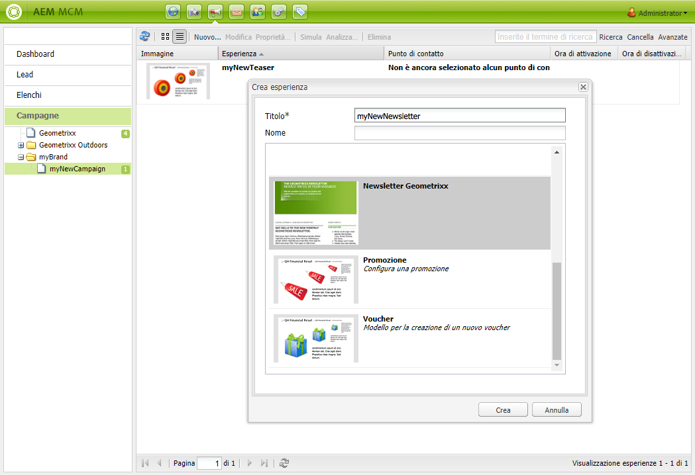

1. Fai clic su **Crea**.

1. Viene aperta immediatamente una nuova finestra di dialogo. Qui puoi inserire le proprietà della newsletter.

   La **Elenco destinatari predefiniti** è un campo obbligatorio in quanto costituisce il punto di contatto per la newsletter (consulta [Utilizzo degli elenchi](/help/sites-classic-ui-authoring/classic-personalization-campaigns.md#workingwithlists) per ulteriori informazioni sugli elenchi).

   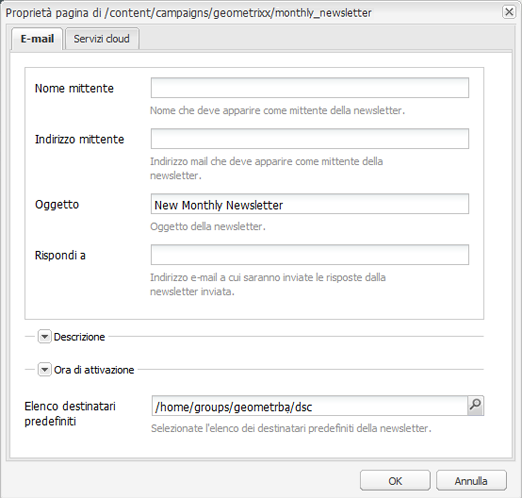

   * **Nome mittente**

      Nome che deve apparire come mittente della newsletter.

   * **Indirizzo mittente**

      Indirizzo mail che deve apparire come mittente della newsletter.

   * **Oggetto**

      Oggetto della newsletter.

   * **Rispondi a**

      Indirizzo e-mail a cui saranno inviate le risposte dalla newsletter inviata.

   * **Descrizione**

      Descrizione della newsletter.

   * **Ora di attivazione**

      Il tempo di attivazione per l’invio della newsletter.

   * **Elenco destinatari predefiniti**

      Elenco predefinito che deve ricevere la newsletter.
   Questi possono essere aggiornati in una fase successiva dalla **Proprietà...** finestra di dialogo.

1. Fai clic su **OK** da salvare.

## Aggiunta di contenuto alle newsletter {#adding-content-to-newsletters}

Nella newsletter puoi aggiungere contenuti, compresi contenuti dinamici, come faresti con qualsiasi componente AEM. In Geometrixx, il modello Newsletter dispone di alcuni componenti disponibili per aggiungere e modificare contenuti nelle newsletter.

1. In MCM, fai clic su **Campagne** fare doppio clic sulla newsletter a cui si desidera aggiungere contenuti o modificare. Viene visualizzata la newsletter.

1. Se i componenti non sono visibili, accedete alla vista Progettazione e attivate i componenti necessari (ad esempio, i componenti Newsletter) prima di iniziare la modifica.
1. Inserisci il testo, le immagini o altri componenti desiderati. Nell’Geometrixx sono disponibili 4 componenti: Testo, Immagine, Intestazione e 2 colonne. La newsletter può contenere più o meno componenti a seconda della modalità di configurazione.

   >[!NOTE]
   >
   >È possibile personalizzare le newsletter utilizzando le variabili. Nella newsletter Geometrixx, le variabili sono disponibili nel componente Testo . I valori delle variabili vengono ereditati dalle informazioni nel profilo utente.

   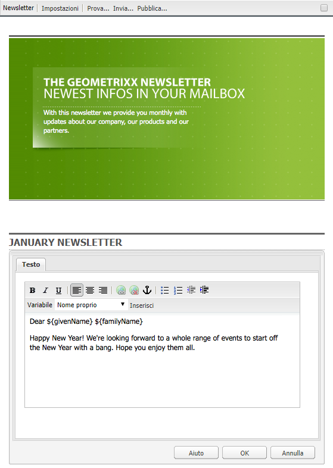

1. Per inserire una variabile, selezionala dall’elenco e fai clic su **Inserisci**. Le variabili vengono compilate dal profilo.

## Personalizzazione delle newsletter {#personalizing-newsletters}

È possibile personalizzare le newsletter inserendo variabili predefinite nel componente Testo delle newsletter in Geometrixx. I valori delle variabili vengono ereditati dalle informazioni nel profilo utente.

Puoi anche simulare come una newsletter viene personalizzata utilizzando il contesto del cliente e caricando un profilo.

Per personalizzare una newsletter e simularne l’aspetto risultante:

1. In MCM, apri la newsletter di cui desideri personalizzare le impostazioni.

1. Apri il componente Testo da personalizzare.

1. Posiziona il cursore nel punto in cui vuoi visualizzare la variabile e seleziona una variabile dall’elenco a discesa, quindi fai clic su **Inserisci**. Fai questo per tutte le variabili necessarie e fai clic su **OK**.

   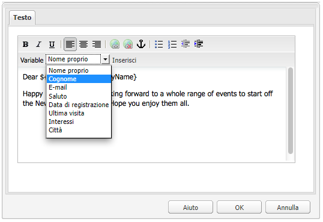

1. Per simulare l’aspetto della variabile quando inviata, premere CTRL+ALT+C per aprire il ClientContext e selezionare **Load**. Seleziona dall’elenco l’utente di cui desideri caricare il profilo e fai clic su **OK**.

   Le variabili vengono popolate con le informazioni del profilo caricato.

   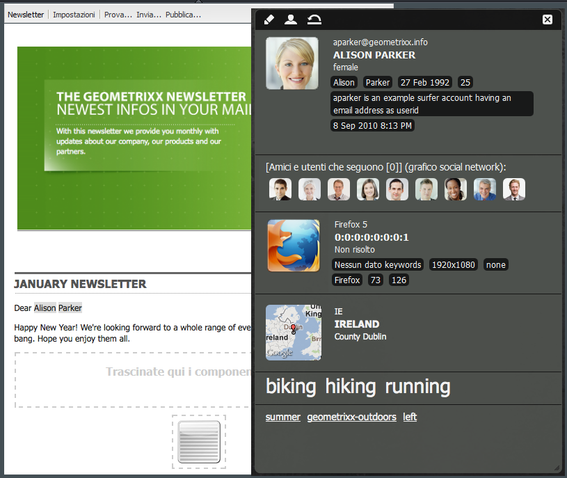

## Verifica delle newsletter in diversi client e-mail {#testing-newsletters-in-different-e-mail-clients}

>[!NOTE]
>
>Prima di inviare le newsletter, controlla la configurazione OSGi per Day CQ Link Externalizer all’indirizzo `http://localhost:4502/system/console/configMgr`.
>
>Per impostazione predefinita, il valore del parametro è `localhost:4502` impossibile completare l&#39;operazione se la porta per l&#39;esecuzione dell&#39;istanza viene modificata.

Passa ai diversi client e-mail più diffusi per vedere come la newsletter verrà visualizzata dai lead. Per impostazione predefinita, la newsletter viene aperta senza selezionare alcun client di posta elettronica.

Attualmente, è possibile visualizzare le newsletter nei seguenti client e-mail:

* Yahoo mail
* Gmail
* Hotmail
* Thunderbird
* Microsoft Outlook 2007
* Apple Mail

Per passare da un client all’altro, fai clic sull’icona corrispondente per visualizzare la newsletter nel client di posta elettronica:

1. In MCM, apri la newsletter di cui desideri personalizzare le impostazioni.

1. Fai clic su un client di posta elettronica nella barra superiore per visualizzare l’aspetto della newsletter in tale client.

   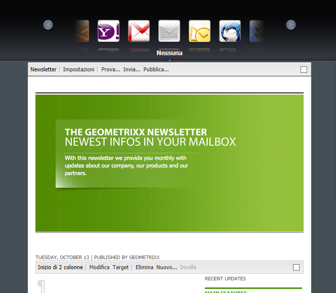

1. Ripetere questo passaggio per tutti i client di posta elettronica aggiuntivi che si desidera visualizzare.

   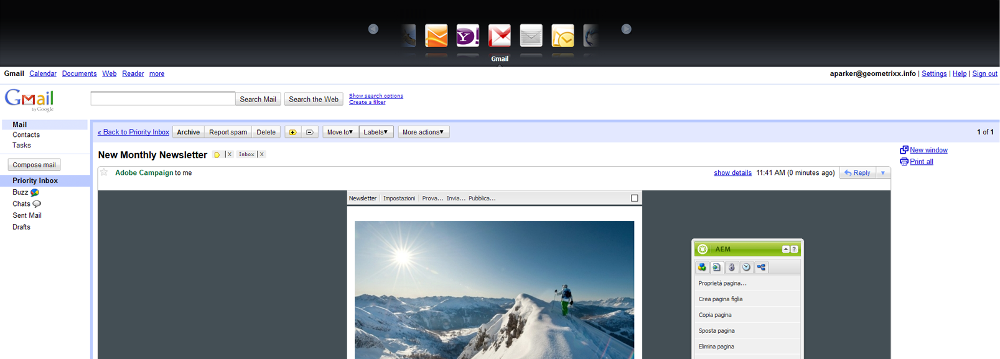

## Personalizzazione delle impostazioni della newsletter {#customizing-newsletter-settings}

Anche se solo gli utenti autorizzati possono inviare una newsletter, è necessario personalizzare quanto segue:

* L’oggetto, in modo che gli utenti desiderino aprire l’e-mail e anche per assicurarsi che la newsletter non venga contrassegnata come spam.
* L’indirizzo Da, ad esempio noreply@geometrixx.com, in modo che gli utenti ricevano e-mail da un indirizzo specifico.

Per personalizzare le impostazioni della newsletter:

1. In MCM, apri la newsletter di cui desideri personalizzare le impostazioni.

   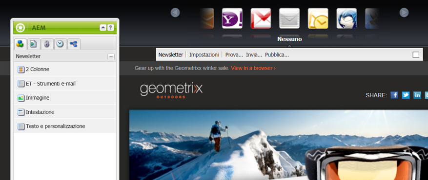

1. Nella parte superiore della newsletter, fai clic su **Impostazioni**.

   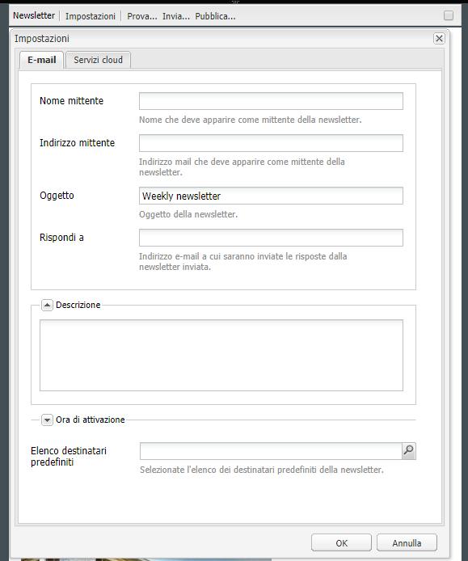

   1. Inserisci il **Da** indirizzo e-mail
   1. Modifica la **Oggetto** dell&#39;e-mail, se necessario.
   1. Seleziona una **Elenco destinatari predefiniti** dall’elenco a discesa.
   1. Fai clic su **OK**.

   Quando esegui il test o invii la newsletter, i destinatari riceveranno e-mail con l’indirizzo e-mail e l’oggetto specificati.

## Newsletter di prova del volo {#flight-testing-newsletters}

Anche se la prova rapida non è obbligatoria, prima di inviare una newsletter potrebbe essere utile verificarla per verificare che venga visualizzata nel modo desiderato.

La prova di volo consente di effettuare le seguenti operazioni:

* Visualizzare la newsletter in [tutti i clienti](#testing-newsletters-in-different-e-mail-clients).
* Verificare che il server di posta elettronica sia configurato correttamente.
* Determina se l’e-mail viene contrassegnata come spam. Accertati di includere te stesso nell’elenco dei destinatari.

>[!NOTE]
>
>Se aggiorni i provider di posta elettronica, fai una prova rapida o invia una newsletter, queste operazioni non riescono se la newsletter non viene pubblicata prima nell’istanza Pubblica o se l’istanza Pubblica non è disponibile. Assicurati di pubblicare la newsletter e che l’istanza Pubblica sia attiva e in esecuzione.

Per effettuare una prova rapida delle newsletter:

1. In MCM, apri la newsletter da verificare e inviare.

1. Nella parte superiore della newsletter, fai clic su **Test** per eseguire il test prima dell’invio.

   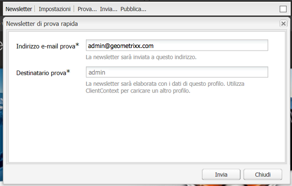

1. Immettere l&#39;indirizzo e-mail di prova in cui si desidera inviare la newsletter e fare clic su **Invia**. Se desideri modificare il profilo, carica un altro profilo nel contesto client. A tale scopo, premi CTRL+ALT+C e seleziona Carica e carica un profilo.

## Invio di newsletter {#sending-newsletters}

Potete inviare una newsletter dalla newsletter o dall’elenco. Entrambe le procedure sono descritte.

>[!NOTE]
>
>Prima di inviare le newsletter, controlla la configurazione OSGi per Day CQ Link Externalizer all’indirizzo `http://localhost:4502/system/console/configMgr`.
>
>Per impostazione predefinita, il valore del parametro è `localhost:4502` impossibile completare l&#39;operazione se la porta per l&#39;esecuzione dell&#39;istanza viene modificata.

>[!NOTE]
>
>Se aggiorni i provider di posta elettronica, fai una prova rapida o invia una newsletter, queste operazioni non riescono se la newsletter non viene pubblicata prima nell’istanza Pubblica o se l’istanza Pubblica non è disponibile. Assicurati di pubblicare la newsletter e che l’istanza Pubblica sia attiva e in esecuzione.

### Invio di newsletter da una campagna {#sending-newsletters-from-a-campaign}

Per inviare una newsletter dall’interno della campagna:

1. In MCM, apri la newsletter da inviare.

   >[!NOTE]
   >
   >Prima di inviarla, assicurati di aver personalizzato l’oggetto della newsletter e l’indirizzo e-mail del mittente per [personalizzazione delle impostazioni](#customizing-newsletter-settings).
   >
   >[Prova di volo](#flight-testing-newsletters) la newsletter prima dell’invio è consigliata.

1. Nella parte superiore della newsletter, fai clic su **Invia**. Viene visualizzata la procedura guidata Newsletter.

1. Nell’elenco dei destinatari, selezionate l’elenco a cui inviare la newsletter e fate clic su **Successivo**.

   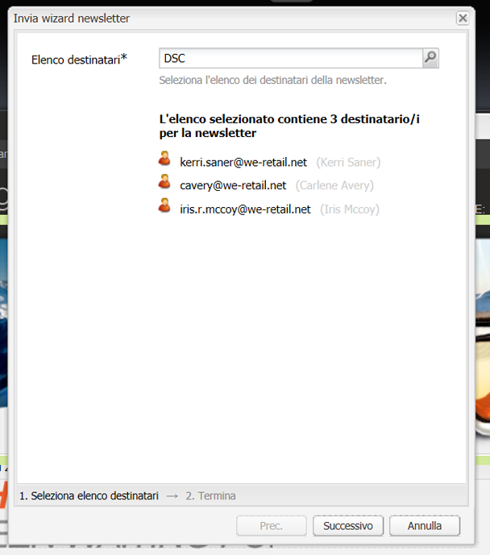

1. Il completamento dell&#39;installazione è confermato. Fai clic su **Invia** per inviare effettivamente la newsletter.

   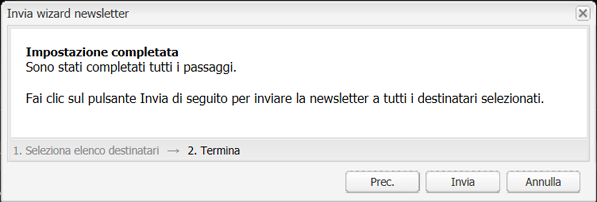

   >[!NOTE]
   >
   >Accertati di essere tra i destinatari, in modo da verificare che la newsletter sia stata ricevuta.

### Invio di newsletter da un elenco {#sending-newsletters-from-a-list}

Per inviare una newsletter da un elenco:

1. In MCM, fai clic su **Elenchi** nel riquadro a sinistra.

   >[!NOTE]
   >
   >Prima di inviarla, assicurati di aver personalizzato l’oggetto della newsletter e l’indirizzo e-mail del mittente per [personalizzazione delle impostazioni](#customizing-newsletter-settings). Non è possibile verificare una newsletter inviata dall’elenco; è possibile [prova di volo](#flight-testing-newsletters) se lo invii dalla newsletter.

1. Seleziona la casella accanto all’elenco dei lead a cui desideri inviare la newsletter.

1. In **Strumenti** menu, seleziona **Invia newsletter**. La **Invia newsletter** si apre la finestra.

   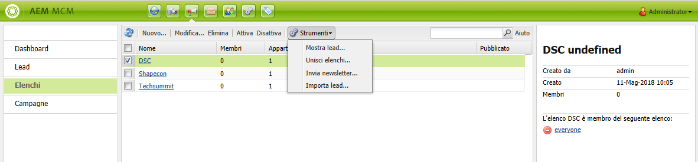

1. In **Newsletter** seleziona la newsletter da inviare e fai clic su **Successivo**.

   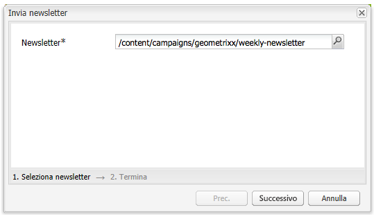

1. Il completamento dell&#39;installazione è confermato. Fai clic su **Invia** per inviare la newsletter selezionata all’elenco di lead specificato.

   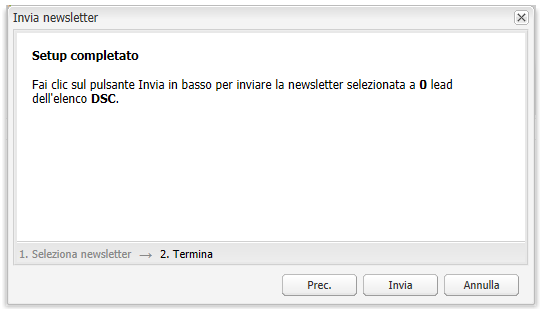

   La newsletter viene inviata ai destinatari selezionati.

## Iscrizione a una newsletter {#subscribing-to-a-newsletter}

Questa sezione descrive come effettuare l’iscrizione a una newsletter.

### Iscrizione a una newsletter {#subscribing-to-a-newsletter-1}

Per effettuare l’abbonamento a una newsletter (utilizzando come esempio il sito web Geometrixx):

1. Fai clic su **Siti Web** e naviga fino al Geometrixx **Barra degli strumenti** e aprilo.

   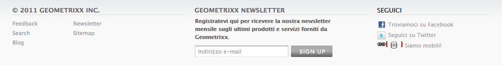

1. Nella newsletter Geometrixx **Iscriviti** immettere l&#39;indirizzo di posta elettronica e fare clic su **Iscriviti**. La newsletter è ora abbonata.
