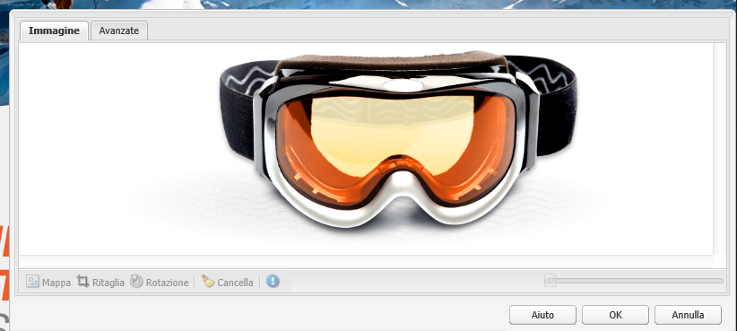

# Pagine di destinazione{#landing-pages}

>[!CAUTION]
>
>AEM 6.4 ha raggiunto la fine del supporto esteso e questa documentazione non viene più aggiornata. Per maggiori dettagli, consulta la nostra [periodi di assistenza tecnica](https://helpx.adobe.com/it/support/programs/eol-matrix.html). Trova le versioni supportate [qui](https://experienceleague.adobe.com/docs/).

La funzione Pagine di destinazione consente di importare rapidamente una progettazione e un contenuto direttamente in una pagina AEM. Uno sviluppatore web può preparare HTML e risorse aggiuntive che possono essere importate come pagina completa o solo come parte di una pagina. Questa funzionalità è utile per creare pagine di destinazione di marketing che sono attive solo per un periodo di tempo limitato e devono essere create rapidamente.

Questa pagina descrive quanto segue:

* Aspetto delle pagine di destinazione in AEM inclusi i componenti disponibili
* come creare una pagina di destinazione e come importare un pacchetto di progettazione
* come utilizzare le pagine di destinazione in AEM
* come impostare pagine di destinazione per dispositivi mobili

La preparazione del pacchetto di progettazione per l&#39;importazione è trattata in [Estensione e configurazione di Importazione progettazione](/help/sites-administering/extending-the-design-importer-for-landingpages.md). L’integrazione con Adobe Analytics è descritta in [Integrazione delle pagine di destinazione con Adobe Analytics.](/help/sites-administering/integrating-landing-pages-with-adobe-analytics.md)

## Cosa sono le pagine di destinazione? {#what-are-landing-pages}

Le pagine di destinazione sono siti a pagina singola o multipagina che costituiscono il &quot;punto finale&quot; di un’attività di marketing, ad esempio con e-mail, annunci o banner, social media. Una pagina di destinazione può essere utile per diversi scopi, ma ha tutti una cosa in comune: il visitatore deve svolgere un’attività che definisce il successo di una pagina di destinazione.

La funzione Pagine di destinazione in AEM consente agli esperti di marketing di lavorare con i web designer presso agenzie o team creativi interni per creare pagine che possono essere facilmente importate in AEM e possono essere comunque modificate dagli addetti al marketing e pubblicate con la stessa governance del resto dei siti basati su AEM.

In AEM, puoi creare pagine di destinazione eseguendo le seguenti operazioni:

1. Crea una pagina in AEM che contiene l’area di lavoro delle pagine di destinazione. AEM navi con un campione denominato **Pagina Importazione**.

1. [Prepara HTML e le risorse.](/help/sites-administering/extending-the-design-importer-for-landingpages.md)
1. Crea un pacchetto con le risorse in un file ZIP al quale si fa riferimento come pacchetto di progettazione.
1. Importa il pacchetto di progettazione nella pagina di importazione.
1. Modifica e pubblica la pagina.

### Pagine di destinazione desktop {#desktop-landing-pages}

Di seguito è riportato un esempio di pagina di destinazione in AEM:

### Pagine di destinazione per dispositivi mobili {#mobile-landing-pages}

Una pagina di destinazione può anche avere una versione mobile della pagina. Per disporre di una versione mobile separata della pagina di destinazione, la progettazione di importazione deve disporre di due file html: *index.htm(l)* e *mobile.index.htm(l)*.

La procedura di importazione della pagina di destinazione è identica a quella di una normale pagina di destinazione; la progettazione della pagina di destinazione dispone di un file html aggiuntivo corrispondente alla pagina di destinazione per dispositivi mobili. Anche questo file HTML deve avere un’area di lavoro `div` con `id=cqcanvas` proprio come l’HTML della pagina di destinazione desktop e supporta tutti i componenti modificabili descritti per la pagina di destinazione desktop.

La pagina di destinazione per dispositivi mobili viene creata come pagina figlia della pagina di destinazione desktop. Per aprirla, passa alla pagina di destinazione in Siti web e apri la pagina figlia.

>[!NOTE]
>
>Se la pagina di destinazione desktop viene eliminata o disattivata, viene eliminata/disattivata insieme alla pagina di destinazione desktop.

## Componenti della pagina di destinazione {#landing-page-components}

Per rendere modificabili parti di HTML importate all’interno di AEM, puoi mappare direttamente i contenuti all’interno di HTML delle pagine di destinazione in AEM componenti. Importazione progettazione riconosce per impostazione predefinita i seguenti componenti:

* Testo, per qualsiasi testo
* Titolo, per contenuti con tag H1-H6
* Immagine, per immagini che devono essere scambiabili
* Invito alle azioni:

   * Collegamento ClickThrough
   * Collegamento grafico

* Modulo lead CTA, per acquisire informazioni utente
* Sistema paragrafo (Parsys), per consentire l’aggiunta di qualsiasi componente o la conversione del componente precedente

Inoltre, è possibile estenderlo e supportare componenti personalizzati. Questa sezione descrive i componenti in dettaglio.

### Testo {#text}

Il componente Testo consente di inserire un blocco di testo utilizzando un editor WYSIWYG. Vedi [Componente testo](/help/sites-authoring/default-components.md#text) per ulteriori informazioni.

Esempio di un componente testo in una pagina di destinazione:

### Titolo {#title}

Il componente titolo consente di visualizzare un titolo e di configurarne la dimensione (h1-h6). Vedi [Componente titolo](/help/sites-authoring/default-components.md#title) per ulteriori informazioni.

Di seguito è riportato un esempio di componente titolo in una pagina di destinazione:

### Immagine {#image}

Il componente Immagine visualizza un’immagine che puoi trascinare dal Content Finder o fare clic per caricarla. Vedi [componente immagine](/help/sites-authoring/default-components.md) per ulteriori informazioni.

Esempio di un componente immagine in una pagina di destinazione:

### Invito all&#39;azione {#call-to-action-cta}

Una progettazione di una pagina di destinazione può contenere diversi collegamenti, alcuni dei quali possono essere intesi come &quot;Invito all’azione&quot;.

L’invito all’azione (CTA) viene utilizzato per indurre il visitatore ad intervenire immediatamente sulla pagina di destinazione, ad esempio &quot;Iscriviti ora&quot;, &quot;Guarda questo video&quot;, &quot;Solo tempo limitato&quot; e così via.

* Collegamento Click-through : consente di aggiungere un collegamento di testo su cui il visitatore può fare clic per passare all’URL di destinazione.
* Collegamento grafico : consente di aggiungere un’immagine su cui il visitatore può fare clic per passare all’URL di destinazione.

Entrambi i componenti CTA hanno opzioni simili. Per il collegamento ClickThrough sono disponibili ulteriori opzioni di testo RTF. I componenti sono descritti in dettaglio nei paragrafi seguenti.

### Collegamento ClickThrough {#click-through-link}

Questo componente CTA può essere utilizzato per aggiungere un collegamento di testo alla pagina di destinazione. Fai clic su tale collegamento per indirizzare l’utente all’URL di destinazione specificato nelle proprietà del componente. Fa parte del gruppo &quot;Invito all&#39;azione&quot;.

**Etichetta** Testo visualizzato dagli utenti. È possibile modificare la formattazione con l’editor Rich Text.

**URL di destinazione** Inserisci l’URI che gli utenti visitano se fanno clic sul testo.

**Opzioni di rendering** Descrive le opzioni di rendering. Puoi scegliere tra le seguenti opzioni:

* Carica pagina in una nuova finestra browser
* Carica pagina nella finestra corrente
* Carica la pagina nel frame principale
* Annulla tutti i frame e carica la pagina nella finestra del browser completa

**CSS** Nella scheda Stile, immetti un percorso al foglio di stile CSS.

**ID** Nella scheda Stile , inserisci un ID con cui identificare il componente in modo univoco.

Esempio di collegamento click-through :

### Collegamento grafico {#graphical-link}

Questo componente CTA può essere utilizzato per aggiungere qualsiasi immagine grafica con un collegamento sulla pagina di destinazione. L&#39;immagine può essere un semplice pulsante o un&#39;immagine grafica come sfondo. Quando fai clic sull’immagine, l’utente viene portato all’URL di destinazione specificato nelle proprietà del componente. È una parte del **Invito all&#39;azione** gruppo.

**Etichetta** Testo visualizzato dagli utenti nell’immagine. È possibile modificare la formattazione con l’editor Rich Text.

**URL di destinazione** Inserisci l’URI che gli utenti visiteranno se fanno clic sull’immagine.

**Opzioni di rendering** Descrive le opzioni di rendering. Puoi scegliere tra le seguenti opzioni:

* Carica pagina in una nuova finestra browser
* Carica pagina nella finestra corrente
* Carica la pagina nel frame principale
* Annulla tutti i frame e carica la pagina nella finestra del browser completa

**CSS** Nella scheda Stile, immetti un percorso al foglio di stile CSS.

**ID** Nella scheda Stile , inserisci un ID con cui identificare il componente in modo univoco.

Ecco un esempio di collegamento grafico:

## Modulo lead Invito all’azione {#call-to-action-cta-lead-form}

Un modulo lead è un modulo utilizzato per raccogliere le informazioni sul profilo di un visitatore/lead. Queste informazioni possono essere memorizzate e utilizzate in un secondo momento per eseguire un marketing efficace basato sulle informazioni. Queste informazioni includono generalmente titolo, nome, e-mail, data di nascita, indirizzo, interesse e così via. È una parte del **Modulo lead CTA** gruppo.

Esempio di modulo lead CTA:

I moduli lead CTA sono composti da diversi componenti diversi:

* **Modulo lead**
Il componente Modulo lead definisce l’inizio e la fine di un nuovo modulo per lead sulla pagina. È quindi possibile inserire altri componenti tra questi elementi, ad esempio ID e-mail, Nome e così via.

* **Campi ed elementi modulo**
I campi e gli elementi modulo possono includere caselle di testo, pulsanti di scelta, immagini e così via. L’utente spesso completa un’azione in un campo modulo, ad esempio digita del testo. Per ulteriori informazioni, consulta la sezione sui singoli elementi del modulo .

* **Componenti del profilo**
I componenti profilo si riferiscono ai profili dei visitatori utilizzati per collaborazione social e altre aree in cui è richiesta la personalizzazione in base al visitatore.

L’esempio precedente mostra un modulo di esempio; è costituito da **Modulo lead** componente (inizio e fine), con **Nome** e **ID e-mail** campi utilizzati per l’input e **Invia** field

Dalla barra laterale sono disponibili i seguenti componenti per Modulo lead CTA:

### Impostazioni comuni a molti componenti per modulo lead {#settings-common-to-many-lead-form-components}

Sebbene ciascuno dei componenti per modulo lead abbia uno scopo diverso, molti di essi sono composti da opzioni e parametri simili.

Quando si configura un componente modulo, nella finestra di dialogo sono disponibili le seguenti schede:

* **Titolo e testo**
Qui si specificano le informazioni di base, ad esempio il titolo del componente ed eventuale testo di accompagnamento. Se appropriato, ti consente anche di definire altre informazioni chiave, ad esempio se il campo è selezionabile in più elementi e se gli elementi sono disponibili per la selezione.

* **Valori iniziali**
Consente di specificare un valore predefinito.

* **Vincoli**
Qui è possibile specificare se un campo è obbligatorio ed eventuali vincoli associati al campo (ad esempio se il valore deve essere numerico e così via).

* **Stile**
Indica la dimensione e lo stile dei campi.

>[!NOTE]
>
>I campi disponibili variano a seconda del singolo componente.
>
>Non tutte le opzioni sono disponibili per tutti i componenti per modulo lead. Per ulteriori informazioni, consulta Forms . [impostazioni comuni](/help/sites-authoring/default-components.md#formsgroup).

#### Componenti per moduli lead {#lead-form-components}

Nella sezione seguente sono descritti i componenti disponibili per i moduli lead Invito all’azione.

**Informazioni** Consente agli utenti di aggiungere informazioni.

**Campo indirizzo** Consente agli utenti di inserire le informazioni relative all’indirizzo. Quando configuri questo componente, devi immettere il Nome elemento nella finestra di dialogo. Il Nome elemento è il nome dell’elemento modulo. Indica la posizione di memorizzazione dei dati nel repository.

**Data di nascita** Gli utenti possono inserire la data di nascita.

**ID e-mail** Consente agli utenti di inserire un indirizzo e-mail (identificazione).

**Nome** Fornisce un campo in cui gli utenti possono immettere il proprio nome.

**Genere** Gli utenti possono selezionare il proprio genere da un elenco a discesa.

**Cognome** Gli utenti possono immettere le informazioni sul cognome.

**Modulo lead** Aggiungi questo componente per aggiungere un modulo per lead alla pagina di destinazione. Un modulo lead contiene automaticamente i campi Inizio del modulo lead e Fine del modulo lead . Nel mezzo, aggiungete i componenti Modulo lead descritti in questa sezione.

Il componente Modulo lead definisce sia l’inizio che la fine di un modulo utilizzando **Inizio modulo** e **Fine modulo** elementi. Sono sempre associati per garantire la corretta definizione del modulo.

Dopo aver aggiunto il modulo lead, è possibile configurare l’inizio o la fine del modulo facendo clic su **Modifica** nella barra corrispondente.

**Inizio del modulo lead**

Sono disponibili due schede per la configurazione **Modulo** e **Avanzate**:

**Pagina di ringraziamento** Pagina a cui fare riferimento per ringraziare i visitatori dopo aver fornito il proprio input. Se viene lasciato vuoto, dopo l’invio viene nuovamente visualizzato il modulo.

**Avvia flusso di lavoro** Determina il flusso di lavoro che viene attivato dopo l’invio del modulo per lead.

**Opzioni post** Sono disponibili le seguenti opzioni di pubblicazione:

* Crea lead
* Servizio e-mail: Crea utente con sottoscrizione e aggiungi all&#39;elenco - Utilizza questa opzione se utilizzi un provider di servizi e-mail come ExactTarget.
* Servizio e-mail: Invia e-mail di risposta automatica: da utilizzare se utilizzi un provider di servizi e-mail come ExactTarget.
* Servizio e-mail: Annulla sottoscrizione a mailing list - Utilizza questa opzione se utilizzi un provider di servizi e-mail come ExactTarget.
* Annulla sottoscrizione utente

**Identificatore modulo** L’identificatore del modulo identifica il modulo per lead in modo univoco. Utilizzare l’identificatore del modulo se sono presenti più moduli su una singola pagina; assicurati che abbiano identificatori diversi.

**Percorso di caricamento** Percorso delle proprietà nodo utilizzato per caricare valori predefiniti nei campi del modulo per lead.

Questo è un campo facoltativo che specifica il percorso di un nodo nel repository. Quando le proprietà di questo nodo corrispondono ai nomi dei campi, i campi appropriati del modulo vengono precaricati con il valore di tali proprietà. Se non esiste alcuna corrispondenza, il campo contiene il valore predefinito.

**Convalida client** Indica se il modulo richiede la convalida client (la convalida server viene sempre eseguita). Questo può essere ottenuto in combinazione con il componente Forms Captcha.

**Tipo di risorsa convalida** Definisce il tipo di risorsa per la convalida del modulo se si desidera convalidare l’intero modulo per lead (anziché i singoli campi).

Se si convalida l’intero modulo, includere anche uno dei seguenti elementi:

* Uno script per la convalida client:

   ` /apps/<myApp>/form/<myValidation>/formclientvalidation.jsp`

* Uno script per la convalida sul lato server:

   ` /apps/<myApp>/form/<myValidation>/formservervalidation.jsp`

**Configurazione azione** A seconda della selezione in Opzioni post, la Configurazione azione cambia. Ad esempio, quando selezionate Crea lead, potete configurare l’elenco a cui aggiungere il lead.

* **Mostra pulsante Invia**
Indica se mostrare o meno un pulsante Invia.

* **Nome invio**
Identificatore, se si utilizzano più pulsanti Invia in un modulo.

* **Titolo invio**
Nome visualizzato sul pulsante, ad esempio Invia.

* **Mostra pulsante Ripristina**
Selezionare la casella di controllo per rendere visibile il pulsante Ripristina.

* **Ripristina titolo**
Nome visualizzato sul pulsante Ripristina.

* **Descrizione**
Informazioni visualizzate sotto il pulsante.

## Creazione di una pagina di destinazione {#creating-a-landing-page}

Quando crei una pagina di destinazione, devi eseguire tre passaggi:

1. Crea una pagina di importazione.
1. [Prepara il HTML per l’importazione.](/help/sites-administering/extending-the-design-importer-for-landingpages.md)
1. Importa il pacchetto di progettazione.

### Creazione di una pagina Importazione {#creating-an-importer-page}

Prima di importare la progettazione della pagina di destinazione, è necessario creare una pagina di importazione, ad esempio in una campagna. Il modello Pagina di importazione consente di importare la pagina di destinazione completa di HTML. La pagina contiene una casella di rilascio in cui è possibile importare il pacchetto di progettazione della pagina di destinazione mediante trascinamento.

>[!NOTE]
>
>Per impostazione predefinita, è possibile creare una pagina di importazione solo sotto le campagne, ma è anche possibile sovrapporre questo modello per creare una pagina di destinazione in `/content/mysite.`

Per creare una nuova pagina di destinazione:

1. Vai a **Siti Web** console.
1. Seleziona la campagna nel riquadro a sinistra.
1. Fai clic su **Nuovo** per aprire la finestra** Crea pagina **.
1. Seleziona la **Pagina Importazione** e aggiungere un titolo ed eventualmente un nome, quindi fare clic su **Crea**.

   

   Viene visualizzata la nuova pagina di importazione.

### Preparazione di HTML per l’importazione {#preparing-the-html-for-import}

Prima di importare il pacchetto di progettazione, è necessario preparare HTML. Vedi [Estensione e configurazione dell’importazione di progettazione](/help/sites-administering/extending-the-design-importer-for-landingpages.md) per ulteriori informazioni.

### Importazione del pacchetto di progettazione {#importing-the-design-package}

Dopo aver creato una pagina di importazione, puoi importare un pacchetto di progettazione al suo interno. I dettagli sulla creazione del pacchetto di progettazione e della sua struttura consigliata sono illustrati in [Estensione e configurazione dell’importazione di progettazione](/help/sites-administering/extending-the-design-importer-for-landingpages.md).

Presupponendo che il pacchetto di progettazione sia pronto, i passaggi seguenti descrivono come importare il pacchetto di progettazione in una pagina di importazione.

1. Apri la pagina di importazione [creato in precedenza](#creatingablankcanvaspage). Viene visualizzata una casella di rilascio con il testo che dice **ZIP**.

   

1. Trascina e rilascia il pacchetto di progettazione nella casella di rilascio. Notare che la freccia cambia direzione quando un pacchetto viene trascinato sopra di essa.
1. A seguito del trascinamento, la pagina di destinazione viene visualizzata al posto della pagina di importazione. La pagina di destinazione di HTML è stata importata correttamente.

   

>[!NOTE]
>
>In caso di problemi durante l&#39;importazione del pacchetto di progettazione, consulta [Risoluzione dei problemi](/help/sites-administering/extending-the-design-importer-for-landingpages.md#troubleshooting).

## Utilizzo delle pagine di destinazione {#working-with-landing-pages}

La progettazione e le risorse di una pagina di destinazione vengono in genere create da un designer, eventualmente presso un’agenzia, in strumenti utilizzati come Adobe Photoshop o Adobe Dreamweaver. Al termine della progettazione, il designer invia un file zip con tutte le risorse al reparto marketing. Il contatto in marketing è quindi responsabile del rilascio del file zip in AEM e della pubblicazione del contenuto.

Inoltre, potrebbe essere necessario apportare modifiche alla pagina di destinazione dopo l’importazione, modificando o eliminando il contenuto e configurando i componenti di invito all’azione. Infine, l’addetto al marketing desidera visualizzare in anteprima la pagina di destinazione e quindi attivare la campagna per pubblicare la pagina di destinazione.

Questa sezione descrive come effettuare le seguenti operazioni:

* Eliminare una pagina di destinazione
* Scarica il pacchetto di progettazione
* Visualizza informazioni di importazione
* Reimpostare una pagina di destinazione
* [Configura i componenti CTA e aggiungi contenuto alla pagina](#call-to-action-cta)
* Visualizzare l’anteprima della pagina di destinazione
* Attivare/pubblicare una pagina di destinazione

Quando importi il pacchetto di progettazione, la seguente barra degli strumenti è disponibile nella parte superiore della pagina di destinazione:

### Download del pacchetto di progettazione importato {#downloading-the-imported-design-package}

Il download del file zip consente di registrare quale file ZIP è stato importato con una particolare pagina di destinazione. Le modifiche apportate a una pagina non vengono aggiunte al file ZIP.

Per scaricare il pacchetto di progettazione importato, fai clic su **Scarica ZIP** nella barra degli strumenti Pagina di destinazione.

### Visualizzazione delle informazioni di importazione {#viewing-import-information}

In qualsiasi momento, puoi visualizzare le informazioni sull’ultima importazione facendo clic sul punto esclamativo blu nella parte superiore della pagina di destinazione nell’interfaccia utente classica.

Nel caso in cui il pacchetto di progettazione importato presenti alcuni problemi, ad esempio se si riferisce a immagini/script che non esistono nel pacchetto e così via, Importazione progettazione visualizza tali problemi sotto forma di un elenco. Per visualizzare l’elenco dei problemi, nell’interfaccia utente classica fai clic sul collegamento dei problemi nella barra degli strumenti Pagina di destinazione. Nell’immagine seguente, fai clic su **Problemi** apre la finestra Problemi di importazione.

### Reimpostazione di una pagina di destinazione {#resetting-a-landing-page}

Se desideri reimportare il pacchetto di progettazione della pagina di destinazione dopo aver apportato alcune modifiche, puoi &quot;cancellare&quot; la pagina di destinazione facendo clic su **Cancella** nella parte superiore della pagina di destinazione nell’interfaccia utente classica o fai clic su Cancella nel menu impostazioni nell’interfaccia utente touch. In questo modo viene eliminata la pagina di destinazione importata e viene creata una pagina di importazione vuota.

Quando cancelli la pagina di destinazione, puoi rimuovere le modifiche al contenuto. Se fai clic su **No**, quindi le modifiche al contenuto vengono mantenute, ovvero la struttura sotto `jcr:content/importer`viene mantenuto e solo il componente della pagina di importazione e le risorse in `etc/design` vengono rimossi. Considerando che, se fai clic su **Sì**, `jcr:content/importer` viene rimosso anche .

>[!NOTE]
>
>Se decidi di rimuovere le modifiche al contenuto, tutte le modifiche apportate alla pagina di destinazione importata e tutte le proprietà della pagina andranno perse quando fai clic su **Cancella**.

### Modifica e aggiunta di componenti in una pagina di destinazione {#modifying-and-adding-components-on-a-landing-page}

Per modificare i componenti della pagina di destinazione, fai doppio clic su di essi per aprirli e modificarli come faresti con qualsiasi altro componente.

Per aggiungere componenti alla pagina di destinazione, trascina e rilascia i componenti nella pagina di destinazione, dalla barra laterale nell’interfaccia utente classica o dal riquadro Componenti nell’interfaccia utente touch, e modificali come appropriato.

>[!NOTE]
>
>Se non è possibile modificare un componente della pagina di destinazione, è necessario reimportare il file zip dopo [modifica del file HTML.](/help/sites-administering/extending-the-design-importer-for-landingpages.md) Ciò significa che durante l’importazione le parti non modificabili non sono state convertite in componenti AEM.

### Eliminazione di una pagina di destinazione {#deleting-a-landing-page}

Eliminare una pagina di destinazione è come eliminare una pagina AEM normale.

L’unica eccezione è che quando elimini una pagina di destinazione desktop, elimina anche la pagina di destinazione mobile corrispondente (se presente) ma non viceversa.

### Pubblicazione di una pagina di destinazione {#publishing-a-landing-page}

Puoi pubblicare la pagina di destinazione e tutte le relative dipendenze esattamente come per la pubblicazione di una pagina normale.

>[!NOTE]
>
>Quando si pubblica una pagina di destinazione desktop, viene pubblicata anche la versione mobile corrispondente (se presente). Tuttavia, la pubblicazione di una pagina di destinazione per dispositivi mobili non pubblica la versione desktop.
