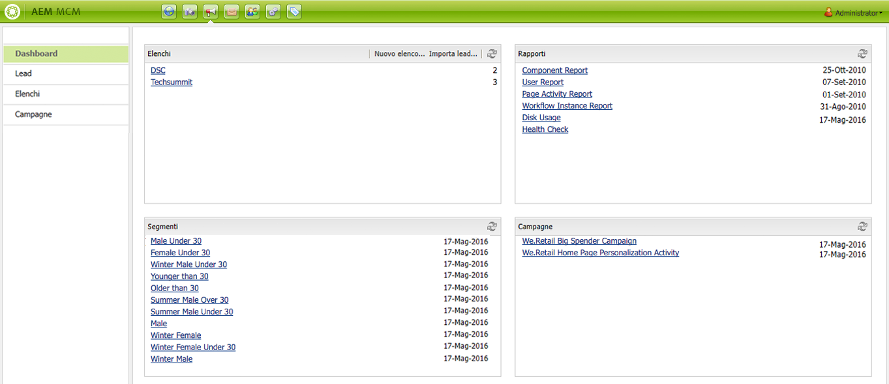
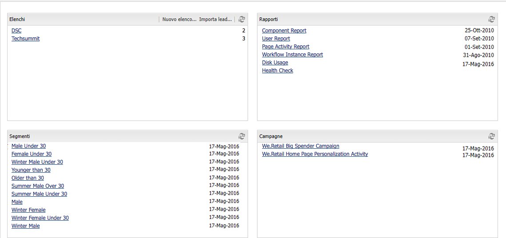
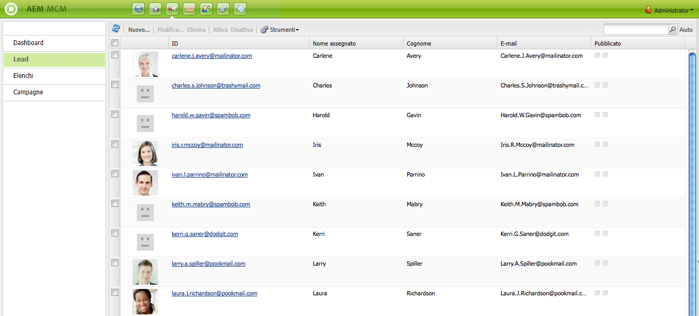
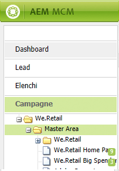
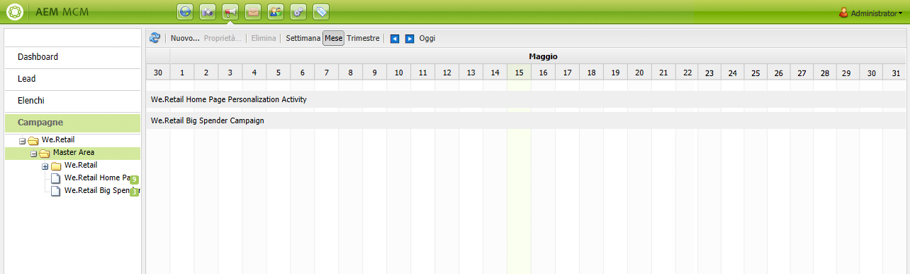
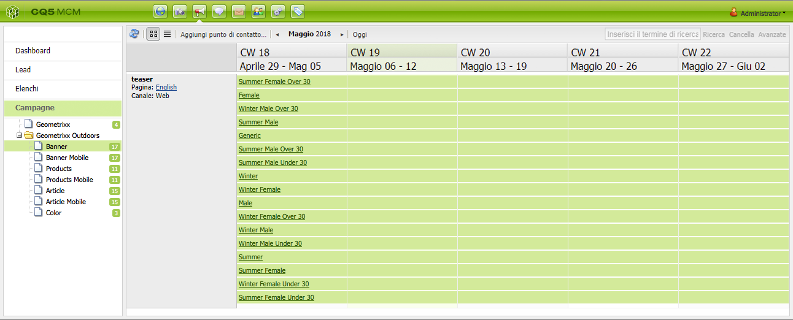
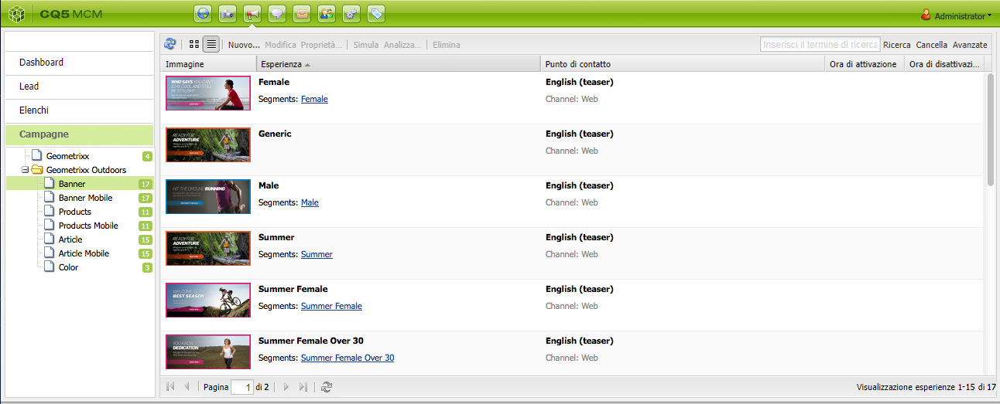
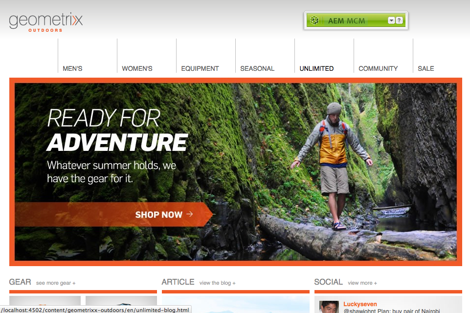
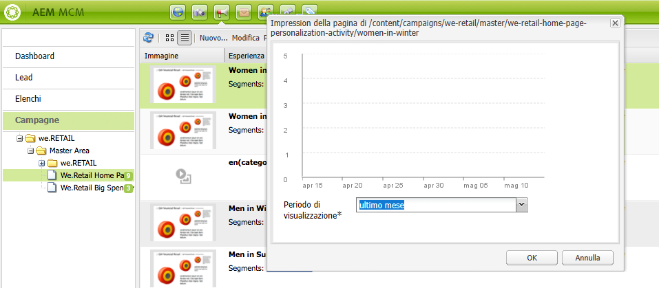

# Utilizzo di Marketing Campaign Manager{#working-with-the-marketing-campaign-manager}

>[!CAUTION]
>
>AEM 6.4 ha raggiunto la fine del supporto esteso e questa documentazione non viene più aggiornata. Per maggiori dettagli, consulta la nostra [periodi di assistenza tecnica](https://helpx.adobe.com/it/support/programs/eol-matrix.html). Trova le versioni supportate [qui](https://experienceleague.adobe.com/docs/).

In AEM, Marketing Campaign Manager (MCM) è una console per la gestione di campagne multicanale. Con questo software di automazione del marketing puoi gestire tutti i tuoi marchi, campagne ed esperienze insieme ai relativi segmenti, elenchi, lead e rapporti.

MCM è accessibile da varie località di AEM; ad esempio, la schermata introduttiva, utilizzando l’icona Campagne o con l’URL:

`https://<hostname>:<port>/libs/mcm/content/admin.html`

Ad esempio:

`http://localhost:4502/libs/mcm/content/admin.html`

Da MCM è possibile accedere a:

* **[Dashboard](#dashboard)**
È suddiviso in quattro riquadri:

   * [Elenchi](#lists)

      Questo riquadro mostra gli elenchi già creati, insieme al numero di lead in tale elenco. Da questo riquadro è possibile creare un nuovo elenco direttamente oppure importare i lead per creare un nuovo elenco.

      Quando si seleziona un elenco specifico, si passa alla [Elenchi](#lists) sezione che mostra i dettagli dell’elenco.

   * [Segmenti](/help/sites-classic-ui-authoring/classic-personalization-campaigns.md#anoverviewofsegmentation)

      Questo riquadro mostra i segmenti definiti dall&#39;utente. I segmenti ti consentono di caratterizzare una raccolta di visitatori che condividono alcune caratteristiche.

      Quando si seleziona un segmento, viene aperta la pagina di definizione del segmento.

   * [Rapporti](/help/sites-administering/reporting.md)\
      AEM fornisce rapporti diversi per analizzare e monitorare lo stato dell’istanza. In questo riquadro di MCM sono elencati i report.

      Quando si seleziona un rapporto, viene aperta la pagina del rapporto.

   * [Campagne](#campaigns)

      In questo riquadro sono elencate le esperienze di campagna come [newsletter](/help/sites-classic-ui-authoring/classic-personalization-campaigns.md#newsletters) e [teaser](/help/sites-classic-ui-authoring/classic-personalization-campaigns.md#teasers).

* **[Lead](#leads)**

   Qui puoi gestire i lead. Puoi creare o importare i lead, modificare dettagli specifici per singoli lead o eliminarli quando non sono più necessari. È inoltre possibile inserire i lead in diversi gruppi, o Elenchi . **Nota:** Adobe non prevede ulteriori miglioramenti di questa funzionalità.

   Si raccomanda di [sfruttare Adobe Campaign e l’integrazione con AEM](/help/sites-administering/campaign.md).

* **[Elenchi](#lists)**

   Qui puoi gestire gli elenchi (di lead).**Nota:** Adobe non prevede ulteriori miglioramenti di questa funzionalità.

   Si raccomanda di [sfruttare Adobe Campaign e l’integrazione con AEM](/help/sites-administering/campaign.md).

* **[Campagne](#campaigns)**
Qui puoi gestire i tuoi marchi, campagne ed esperienze.

## Dashboard {#dashboard}

Il dashboard presenta quattro riquadri che forniscono una panoramica degli elenchi (di lead), dei segmenti, dei rapporti e delle campagne. L’accesso alle funzionalità di base è disponibile anche qui.

## Lead {#leads}

>[!NOTE]
>
>Adobe non prevede ulteriori miglioramenti di questa funzionalità (Gestione dei lead).\
>Consigli di sfruttare [Adobe Campaign e l’integrazione con AEM](/help/sites-administering/campaign.md).

In AEM MCM è possibile organizzare e aggiungere i lead immettendoli manualmente o importando un elenco separato da virgole; ad esempio, una mailing list. I lead possono inoltre essere generati dalle registrazioni a newsletter o community (se configurate, queste possono avviare un flusso di lavoro per la compilazione automatica dei lead). I lead sono in genere organizzati per categorie e inseriti in un elenco in modo da consentire successive operazioni su tutto l’elenco; ad esempio, l’invio di un’e-mail personalizzata a un determinato elenco.

Sotto **Lead** nel riquadro a sinistra puoi creare, importare, modificare ed eliminare i lead, quindi attivarli o disattivarli secondo necessità. È possibile aggiungere un lead a un elenco o vedere a quali elenchi appartiene.

>[!NOTE]
>
>Vedi [Utilizzo dei lead](/help/sites-classic-ui-authoring/classic-personalization-campaigns.md#workingwithleads) per informazioni dettagliate su attività specifiche.

## Elenchi {#lists}

>[!NOTE]
>
>Adobe non prevede ulteriori miglioramenti di questa funzionalità (Gestione degli elenchi).\
>Consigli di sfruttare [Adobe Campaign e l’integrazione con AEM](/help/sites-administering/campaign.md).

Gli elenchi consentono di organizzare i lead in gruppi. Con gli elenchi, è possibile indirizzare le campagne di marketing a un gruppo selezionato di persone; ad esempio, puoi inviare una newsletter di destinazione a un elenco.

Sotto **Elenchi**, è possibile gestire gli elenchi creando, importando, modificando, unendo ed eliminando gli elenchi che è quindi possibile attivare o disattivare in base alle esigenze. È inoltre possibile visualizzare i lead all’interno dell’elenco, verificare se l’elenco è membro di un altro elenco o visualizzarne la descrizione.

>[!NOTE]
>
>Vedi [Utilizzo degli elenchi](/help/sites-classic-ui-authoring/classic-personalization-campaigns.md#workingwithlists) per informazioni dettagliate su attività specifiche.

### Campagne {#campaigns}

>[!NOTE]
>
>Vedi [Teaser e strategie](/help/sites-classic-ui-authoring/classic-personalization-campaigns.md#workingwithlists), [Configurazione della campagna](/help/sites-classic-ui-authoring/classic-personalization-campaigns.md#settingupyourcampaign) e [Newsletter](/help/sites-classic-ui-authoring/classic-personalization-campaigns.md#newsletters) per informazioni dettagliate su attività specifiche.

Per accedere a campagne esistenti, in MCM fai clic su **Campagne**.

* **Nel riquadro a sinistra**:

   C&#39;è un elenco di tutti i marchi e le campagne.

   Fai clic su un marchio per:

   * espandere l’elenco per visualizzare tutte le campagne correlate nel riquadro a sinistra; questo elenco mostra anche il numero di esperienze esistenti per ogni campagna.
   * apri la panoramica del marchio nel riquadro a destra.

* **Nel riquadro a destra**:

   Per ogni marchio vengono visualizzate icone (le campagne storiche non vengono visualizzate).

   Puoi fare doppio clic su di essi per aprire la panoramica del marchio.

#### Panoramica del marchio {#brand-overview}

Da qui puoi:

* Visualizza il numero di campagne ed esperienze (numero mostrato nel riquadro a sinistra) esistenti per questo marchio.
* Crea un **Nuovo...** campagna per questo marchio.

* Modificare l’intervallo di tempo visualizzato; select **Settimana**, **Mese** o **Trimestre**, utilizza le frecce per selezionare periodi specifici o per tornare a **Oggi**.

* Seleziona una campagna (nel riquadro a destra) per:

   * Modifica le **Proprietà...**
   * **Elimina** la campagna.

* Apri la panoramica della campagna (fai doppio clic su una campagna nel riquadro a destra o fai clic nel riquadro a sinistra).

#### Panoramica della campagna {#campaign-overview}

Per le singole campagne sono disponibili due visualizzazioni:

1. **Vista calendario**

   Utilizza l’icona :

   

   Viene presentato un elenco di tutti i punti di contatto (grigio) con un arco temporale orizzontale delle esperienze (verde) collegate a tale punto di contatto:

   

   Da qui puoi:

   * Modificare l’intervallo temporale visualizzato utilizzando le frecce o tornare a **Oggi**.
   * Utilizzo **Aggiungi punto di contatto...** per aggiungere un nuovo punto di contatto a un’esperienza esistente.
   * Fai clic su un teaser (nel riquadro a destra) per impostare **Ora di attivazione** e **Ora di disattivazione**.

1. **Vista a elenco**

   Utilizza l’icona :

   

   Vengono elencate tutte le esperienze (ad esempio teaser e newsletter) per la campagna selezionata:

   

   Da qui puoi:

   * Crea un **Nuovo...** esperienza; ad esempio, offerte Adobe Target, teaser e newsletter.
   * **Modifica** i dettagli di una pagina teaser o newsletter specifica (è possibile fare doppio clic).
   * Definisci la **Proprietà...** per una pagina teaser o una newsletter specifica.
   * **Simula** l’aspetto di un’esperienza (pagina teaser o newsletter).

      Quando la pagina simulata è aperta è possibile aprire la barra laterale per passare alla modalità di modifica per quella pagina.

   * **Analizza...** le impression generate per una pagina.
   * **Elimina** articoli quando non sono più necessari.
   * **Ricerca** per il testo (la ricerca verrà eseguita nel campo Titolo dell’esperienza).
   * Utilizzo **Avanzate** per applicare filtri alla ricerca.

### Simulazione delle esperienze della campagna {#simulating-your-campaign-experiences}

In MCM, fai clic su **Campagne**. Accertati che sia attiva la vista Elenco , quindi seleziona l’esperienza di campagna desiderata e fai clic su **Simula**. Viene aperto il punto di contatto (pagina teaser o newsletter) per mostrare l’esperienza selezionata, così come verrà visualizzata dal visitatore.

Da qui puoi anche aprire la barra laterale (fai clic sulla freccia rivolta verso il basso) per passare alla modalità di modifica e aggiornare la pagina.

### Analisi delle esperienze della campagna {#analyzing-your-campaign-experiences}

In MCM, fai clic su **Campagne**. Accertati che sia attiva la vista Elenco , quindi seleziona l’esperienza di campagna desiderata e seleziona **Analizza...**. Viene visualizzato un grafico delle impression della pagina nel tempo.

