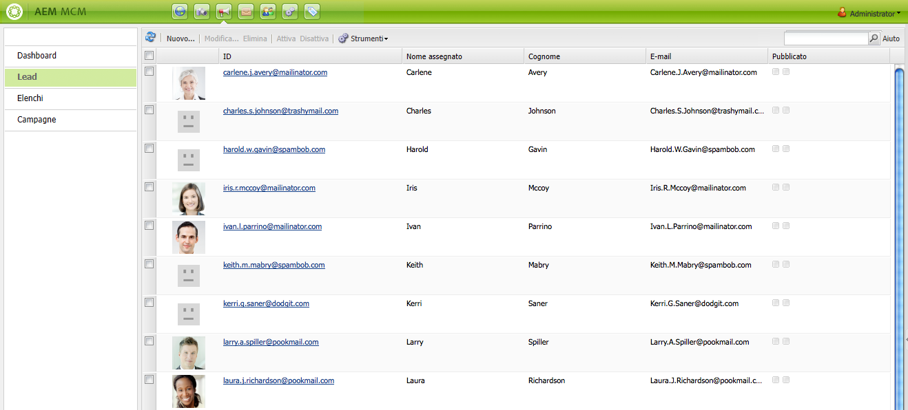
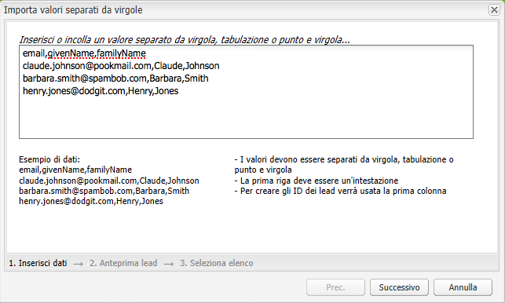

# Impostazione della campagna{#setting-up-your-campaign}

>[!CAUTION]
>
>AEM 6.4 ha raggiunto la fine del supporto esteso e questa documentazione non viene più aggiornata. Per maggiori dettagli, consulta la nostra [periodi di assistenza tecnica](https://helpx.adobe.com/it/support/programs/eol-matrix.html). Trova le versioni supportate [qui](https://experienceleague.adobe.com/docs/).

L&#39;impostazione di una nuova campagna include i seguenti passaggi (generici):

1. [Creare un marchio](#creating-a-new-brand) per gestire le campagne.
1. Se necessario, è possibile [definire le proprietà del nuovo brand](#defining-the-properties-for-your-new-brand).
1. [Creare una campagna](#creating-a-new-campaign) tenere esperienze; ad esempio pagine teaser o newsletter.
1. Se necessario, è possibile [definire le proprietà per la nuova campagna](#defining-the-properties-for-your-new-campaign).

Quindi, a seconda del tipo di esperienze che stai creando, dovrai [creare un’esperienza](#creating-a-new-experience). I dettagli dell’esperienza e le azioni che ne seguono la creazione dipendono dal tipo di esperienza che desideri creare:

* Per la creazione di un teaser:

   1. [Creare un’esperienza teaser](/help/sites-classic-ui-authoring/classic-personalization-campaigns.md#creatingateaserexperience).
   1. [Aggiungere contenuti al teaser](/help/sites-classic-ui-authoring/classic-personalization-campaigns.md#addingcontenttoyourteaser).
   1. [Creare un punto di contatto per il teaser](/help/sites-classic-ui-authoring/classic-personalization-campaigns.md#creatingatouchpointforyourteaser) (aggiungi il teaser a una pagina di contenuto).

* Per la creazione di una newsletter:

   1. [Creare un’esperienza newsletter](/help/sites-classic-ui-authoring/classic-personalization-campaigns.md#creatinganewsletterexperience).
   1. [Aggiungi contenuti alla newsletter.](/help/sites-classic-ui-authoring/classic-personalization-campaigns.md#addingcontenttonewsletters)
   1. [Personalizza la newsletter.](/help/sites-classic-ui-authoring/classic-personalization-campaigns.md#personalizingnewsletters)
   1. [Creare una pagina di destinazione accattivante per la newsletter](/help/sites-classic-ui-authoring/classic-personalization-campaigns.md#settingupanewsletterlandingpage).
   1. [Invia newsletter](/help/sites-classic-ui-authoring/classic-personalization-campaigns.md#sendingnewsletters) agli abbonati o ai lead.

* Per la creazione di un’offerta Adobe Target (precedentemente Test&amp;Target):

   1. [Creare un’esperienza di offerta Adobe Target](/help/sites-classic-ui-authoring/classic-personalization-campaigns.md#creatingatesttargetofferexperience).
   1. [Procedi all’integrazione con Adobe Target](/help/sites-classic-ui-authoring/classic-personalization-campaigns.md#integratewithadobetesttarget)

>[!NOTE]
>
>Vedi [Segmentazione](/help/sites-administering/campaign-segmentation.md) per istruzioni dettagliate sulla definizione dei segmenti.

## Creazione di un nuovo marchio {#creating-a-new-brand}

Per creare un nuovo marchio:

1. Apri **MCM** e seleziona **Campagne** nel riquadro a sinistra.

1. Seleziona **Nuovo...** per accedere al **Titolo** e **Nome** e modello da utilizzare per il nuovo marchio:

   

1. Fai clic su **Crea**. Il nuovo marchio verrà visualizzato in MCM (con un’icona predefinita).

### Definizione delle proprietà del nuovo marchio {#defining-the-properties-for-your-new-brand}

1. Da **Campagne** nel riquadro a sinistra, seleziona la nuova icona del marchio nel riquadro a destra e fai clic su **Proprietà...**

   È possibile immettere un **Titolo**, **Descrizione** e un’immagine da utilizzare come icona.

   

1. Fai clic su **OK** da salvare.

## Creazione di una nuova campagna {#creating-a-new-campaign}

Per creare una nuova campagna:

1. Da **Campagne**, seleziona il nuovo marchio nel riquadro a sinistra o fai doppio clic sull’icona nel riquadro a destra.

   Viene visualizzata la panoramica (vuota, se il marchio è nuovo).

1. Fai clic su **Nuovo...** e specifica **Titolo**, **Nome** e modello da utilizzare per la nuova campagna.

   

1. Fai clic su **Crea**. La nuova campagna verrà visualizzata in MCM.

### Definizione delle proprietà per la nuova campagna {#defining-the-properties-for-your-new-campaign}

Configura le proprietà della campagna che controllano il comportamento:

* **Priorità:** La priorità di questa campagna rispetto ad altre campagne. Quando sono attive più campagne simultaneamente, la campagna con la priorità più elevata controlla l’esperienza del visitatore.
* **Ora di attivazione e disattivazione:** Queste proprietà controllano il periodo di tempo in cui la campagna controlla l&#39;esperienza del visitatore. La proprietà On Time controlla l&#39;ora in cui la campagna inizia a controllare l&#39;esperienza. La proprietà Ora di disattivazione controlla quando le campagne smettono di controllare l&#39;esperienza.
* **Immagine:** Immagine che rappresenta la campagna in AEM.
* **Cloud Services:** Configurazioni del Cloud Service con cui la campagna è integrata. (Vedi [Integrazione con Adobe Marketing Cloud](/help/sites-administering/marketing-cloud.md).)

* **Adobe Target:** Proprietà che configurano campagne integrate con Adobe Target. (Vedi [Integrazione con Adobe Target](/help/sites-administering/target.md).)

1. Da **Campagne**, seleziona il tuo marchio. Nel riquadro a destra, seleziona la campagna e fai clic su **Proprietà**.

   È possibile immettere varie proprietà, tra cui una **Titolo**, **Descrizione** e **Cloud Services** volete.

   

1. Fai clic su **OK** da salvare.

## Creazione di una nuova esperienza {#creating-a-new-experience}

La procedura per creare una nuova esperienza dipende dal tipo di esperienza:

* [Creazione di un teaser](/help/sites-classic-ui-authoring/classic-personalization-campaigns.md#creatingateaser)
* [Creazione di una newsletter](/help/sites-classic-ui-authoring/classic-personalization-campaigns.md#creatinganewsletter)
* [Creazione di un’offerta Adobe Target](/help/sites-classic-ui-authoring/classic-personalization-campaigns.md#creatingatesttargetoffer)

>[!NOTE]
>
>Come con le versioni precedenti, è ancora possibile creare l’esperienza come una pagina nel **Siti Web** console (e tutte le pagine create nelle versioni precedenti sono ancora completamente supportate).
>
>È ora consigliabile utilizzare MCM per creare esperienze.

## Configurazione della nuova esperienza {#configuring-your-new-experience}

Dopo aver creato lo scheletro di base per l’esperienza, è necessario continuare con le azioni seguenti, a seconda del tipo di esperienza:

* [Teaser](/help/sites-classic-ui-authoring/classic-personalization-campaigns.md#teasers):

   * [Collega la pagina teaser ai segmenti di visitatori.](/help/sites-classic-ui-authoring/classic-personalization-campaigns.md#applyingasegmenttoyourteaser)
   * [Creare un punto di contatto per il teaser](/help/sites-classic-ui-authoring/classic-personalization-campaigns.md#creatingatouchpointforyourteaser) (aggiungi il teaser a una pagina di contenuto).

* [Newsletter](/help/sites-classic-ui-authoring/classic-personalization-campaigns.md#newsletters):

   * [Aggiungi contenuti alla newsletter.](/help/sites-classic-ui-authoring/classic-personalization-campaigns.md#addingcontenttonewsletters)
   * [Personalizza la newsletter.](/help/sites-classic-ui-authoring/classic-personalization-campaigns.md#personalizingnewsletters)
   * [Invia newsletter](/help/sites-classic-ui-authoring/classic-personalization-campaigns.md#sendingnewsletters) agli abbonati o ai lead.
   * [Creare una pagina di destinazione accattivante per la newsletter](/help/sites-classic-ui-authoring/classic-personalization-campaigns.md#settingupanewsletterlandingpage).

* [Offerta Adobe Target](/help/sites-classic-ui-authoring/classic-personalization-campaigns.md#testtargetoffers):

   * [Procedi all’integrazione con Adobe Target](/help/sites-administering/target.md)

### Aggiunta di un nuovo punto di contatto {#adding-a-new-touchpoint}

Se disponi di esperienze esistenti, puoi aggiungere un punto di contatto direttamente dalla vista Calendario di MCM:

1. Seleziona la vista Calendario per la campagna.

1. Fai clic su **Aggiungi punto di contatto...** per aprire la finestra di dialogo. Specifica l’esperienza da aggiungere:

   

1. Fai clic su **OK** da salvare.

## Utilizzo dei lead {#working-with-leads}

>[!NOTE]
>
>Adobe non prevede ulteriori miglioramenti di questa funzionalità (Gestione dei lead).\
>Si raccomanda di [sfruttare Adobe Campaign e l’integrazione con AEM](/help/sites-administering/campaign.md).

In AEM MCM è possibile organizzare e aggiungere i lead inserendoli manualmente o importando un elenco separato da virgole, ad esempio una mailing list. I lead possono inoltre essere generati dalle registrazioni a newsletter o community (se configurate, queste possono attivare un flusso di lavoro per la compilazione automatica dei lead).

In genere i lead sono organizzati per categorie e inseriti in un elenco in modo da consentire successive operazioni, ad esempio l’invio di e-mail personalizzate a un determinato elenco.

Nel dashboard, puoi accedere a tutti i lead facendo clic su **Lead** dal riquadro a sinistra. È inoltre possibile accedere ai lead dal **Elenchi** riquadro.

>[!NOTE]
>
>Per aggiungere o modificare gli avatar degli utenti, apri il clickstream cloud (Ctrl+Alt+C), carica il profilo e fai clic su **Modifica**.

### Creazione di nuovi lead {#creating-new-leads}

Dopo aver creato nuovi lead, assicurati di [attivarli](#activating-or-deactivating-leads) in modo da poter tenere traccia della loro attività sull’istanza di pubblicazione e personalizzare la loro esperienza.

Per creare manualmente un nuovo lead:

1. In AEM, accedi a MCM. Nel dashboard, fai clic su **Lead**.
1. Fai clic su **Nuovo**. La **Crea nuovo** si apre la finestra.

   

1. Immetti le informazioni nei campi, a seconda dei casi. Fai clic sul pulsante **Indirizzo** scheda .

   

1. Inserisci le informazioni relative all’indirizzo, a seconda dei casi. Fai clic su **Salva** per salvare il lead. Per aggiungere altri lead, fai clic su** Salva e nuovo**.

   Il nuovo lead viene visualizzato nel riquadro Lead. Quando fai clic sulla voce, nel riquadro a destra vengono visualizzate tutte le informazioni inserite. Dopo aver creato un lead, è possibile aggiungerlo a un elenco.

   

### Attivazione o disattivazione dei lead {#activating-or-deactivating-leads}

L’attivazione dei lead consente di tenere traccia della loro attività nell’istanza di pubblicazione e di personalizzarne l’esperienza di utilizzo. Se non desideri più tenere traccia della loro attività, puoi disattivarla.

Per attivare o disattivare i lead:

1. In AEM, accedi a MCM e fai clic su **Lead**.

1. Seleziona i lead da attivare o disattivare e fai clic su **Attiva** o **Disattiva**.

   

   Come per le pagine AEM, lo stato di pubblicazione è indicato nella **Pubblicato** colonna.

   

### Importazione di nuovi lead {#importing-new-leads}

Quando si importano nuovi lead, è possibile aggiungerli automaticamente a un elenco esistente oppure crearne uno nuovo in cui includerli.

Per importare i lead da un elenco separato da virgole:

1. In AEM, accedi a MCM e fai clic su **Lead**.

   >[!NOTE]
   >
   >In alternativa, è possibile importare i lead effettuando una delle seguenti operazioni:
   >
   >* Nel dashboard, fai clic su **Importa lead** in **Elenchi** riquadro
   >* Fai clic su **Elenchi** e **Strumenti** menu, seleziona **Importa lead**.

1. In **Strumenti** menu, seleziona **Importa lead**.
1. Immetti le informazioni come descritto in Dati di esempio. È possibile importare i campi seguenti: email,familyName,givenName,gender,aboutMe,city,country,phoneNumber,postalCode,region,streetAddress

   >[!NOTE]
   >
   >La prima riga nell’elenco CSV è costituita da etichette predefinite che devono essere scritte esattamente come nell’esempio:
   >
   >`email,givenName,familyName` - se scritto come `givenname`, ad esempio, il sistema non lo riconoscerà.

   

1. Fai clic su **Avanti**. Qui puoi visualizzare in anteprima i lead per verificarne l’accuratezza.

   

1. Fai clic su **Avanti**. Seleziona l’elenco a cui desideri inserire i lead. Se non desideri che appartengano a un elenco, elimina le informazioni presenti nel campo . Per impostazione predefinita, AEM crea un nome di elenco che include la data e l’ora. Fai clic su **Importa**.

   

   Il nuovo lead viene visualizzato nel riquadro Lead. Se si fa clic sulla voce, nel riquadro a destra vengono visualizzate tutte le informazioni inserite. Dopo aver creato un lead, è possibile aggiungerlo a un elenco.

### Aggiunta di lead agli elenchi {#adding-leads-to-lists}

Per aggiungere i lead a elenchi preesistenti:

1. In MCM, fai clic su **Lead** per visualizzare tutti i lead disponibili.

1. Selezionate i lead da aggiungere a un elenco selezionando la casella accanto al lead. Puoi aggiungere quanti lead desideri.

   

1. In **Strumenti** menu, seleziona **Aggiungi all&#39;elenco....** Viene visualizzata la finestra **Aggiungi all’elenco **.

   

1. Selezionare l’elenco a cui si desidera aggiungere i lead e fare clic su **OK**. I lead vengono aggiunti agli elenchi appropriati.

### Visualizzazione delle informazioni sui lead {#viewing-lead-information}

Per visualizzare le informazioni sui lead, in MCM fai clic sulla casella di controllo accanto al lead e viene visualizzato un riquadro a destra con tutte le informazioni relative al lead, inclusa l’appartenenza all’elenco.

### Modifica dei lead esistenti {#modifying-existing-leads}

Per modificare le informazioni del lead esistenti:

1. In MCM, fai clic su **Lead**. Dall’elenco dei lead, seleziona la casella di controllo accanto al lead da modificare. Tutte le informazioni sul lead vengono visualizzate nel riquadro a destra.

   

   >[!NOTE]
   >
   >È possibile modificare un solo lead alla volta. Se è necessario modificare i lead che fanno parte dello stesso elenco, è possibile modificarlo.

1. Fai clic su **Modifica**. La **Modifica lead** si apre la finestra.

   

1. Apporta le modifiche necessarie e fai clic su **Salva** per salvare le modifiche.

   >[!NOTE]
   >
   >Per cambiare l’avatar del lead, passa al profilo utente . Per caricare il profilo nel cloud di clickstream, premere CTRL+ALT+C e fare clic su **Load**, quindi seleziona il profilo.

### Eliminazione dei lead esistenti {#deleting-existing-leads}

Per eliminare i lead esistenti in MCM, seleziona la casella di controllo accanto al lead e fai clic su **Elimina**. Il lead viene rimosso dall’elenco dei lead e da tutti gli elenchi associati.

>[!NOTE]
>
>Prima di eliminare, AEM conferma di voler eliminare il lead esistente. Una volta eliminato, non può essere recuperato.

## Utilizzo degli elenchi {#working-with-lists}

>[!NOTE]
>
>Adobe non prevede ulteriori miglioramenti di questa funzionalità (gestione degli elenchi).\
>Si raccomanda di [sfruttare Adobe Campaign e l’integrazione con AEM](/help/sites-administering/campaign.md).

Gli elenchi consentono di organizzare i lead in gruppi. Con gli elenchi, puoi indirizzare le campagne di marketing a un gruppo selezionato di persone, ad esempio puoi inviare una newsletter mirata a un elenco. Gli elenchi sono visibili in MCM, nella dashboard o facendo clic su **Elenchi**. Entrambi forniscono il nome dell’elenco e il numero di membri.

Se fai clic su **Elenchi**, è inoltre possibile visualizzare se l’elenco è membro di un altro elenco e visualizzarne una descrizione.

### Creazione di nuovi elenchi {#creating-new-lists}

Per creare un nuovo elenco (gruppo):

1. Nel dashboard di MCM, fai clic su **Nuovo elenco ...** o **Elenchi**, fai clic su **Nuovo** ... Viene visualizzata la finestra Crea elenco .

   

1. Immetti un nome (obbligatorio) e, se desiderato, una descrizione e fai clic su **Salva**. L&#39;elenco viene visualizzato nella **Elenchi** riquadro.

   

### Modifica di elenchi esistenti {#modifying-existing-lists}

Per modificare un elenco esistente:

1. In MCM, fai clic su **Elenchi**.

1. Dall’elenco, seleziona la casella accanto all’elenco da modificare e fai clic su **Modifica**. La **Modifica elenco** si apre la finestra.

   

   >[!NOTE]
   >
   >È possibile modificare un solo elenco alla volta.

1. Apporta le modifiche necessarie e fai clic su **Salva** per salvare le modifiche.

### Eliminazione di elenchi esistenti {#deleting-existing-lists}

Per eliminare gli elenchi esistenti, in MCM selezionare la casella di controllo accanto all’elenco e fare clic su **Elimina**. L’elenco viene rimosso. I lead associati all’elenco non vengono rimossi, ma viene eliminata solo l’affiliazione all’elenco.

>[!NOTE]
>
>Prima di eliminare, AEM conferma di voler eliminare gli elenchi esistenti. Una volta eliminato, non può essere recuperato.

### Unione di elenchi {#merging-lists}

È possibile unire un elenco esistente a un altro elenco. In questo modo, l’elenco da unire diventa membro dell’altro elenco. Esiste ancora come entità separata e non deve essere eliminato.

È possibile unire gli elenchi se si dispone della stessa conferenza in due posizioni diverse e si desidera unirli in un elenco dei partecipanti di tutte le conferenze.

Per unire gli elenchi esistenti:

1. In MCM, fai clic su **Elenchi**.

1. Selezionare l’elenco a cui si desidera unire un altro elenco selezionando la casella di controllo accanto.

1. In **Strumenti** menu, seleziona **Unisci elenco**.

   >[!NOTE]
   >
   >È possibile unire un solo elenco alla volta.

1. In **Unisci elenco** selezionare l&#39;elenco con cui si desidera eseguire l&#39;unione e fare clic su **OK**.

   

   L&#39;elenco unito dovrebbe aumentare di un membro. Per verificare che l’elenco sia stato unito, seleziona l’elenco che hai unito e **Strumenti** menu, seleziona **Mostra lead**.

1. Ripetere il passaggio per tutti gli elenchi da unire.

   

>[!NOTE]
>
>La rimozione di un elenco unito dall’appartenenza è identica alla rimozione di un lead da un elenco. Apri **Elenchi** selezionare l&#39;elenco che include l&#39;elenco unito e rimuovere l&#39;iscrizione facendo clic sul cerchio rosso accanto all&#39;elenco.

### Visualizzazione dei lead negli elenchi {#viewing-leads-in-lists}

In qualsiasi momento, è possibile visualizzare quali lead appartengono a un elenco specifico navigando o ricercando i membri.

Per visualizzare i lead che appartengono a un elenco:

1. In MCM, fai clic su **Elenchi**.

1. Selezionare la casella di controllo accanto all&#39;elenco di cui si desidera visualizzare i membri.

1. In **Strumenti** menu, seleziona **Mostra lead**. AEM visualizza i lead che fanno parte dell’elenco. È possibile sfogliare l’elenco o cercare i membri.

   >[!NOTE]
   >
   >È inoltre possibile eliminare i lead da un elenco selezionandoli e facendo clic su **Rimuovi appartenenza**.

   

1. Fai clic su **Chiudi** per tornare a MCM.
