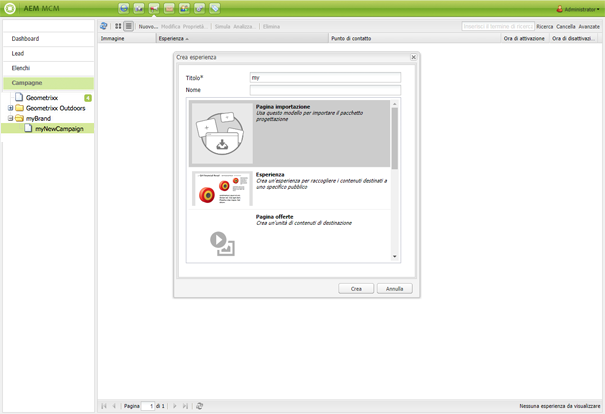

# Offerte Target{#target-offers}

>[!CAUTION]
>
>AEM 6.4 ha raggiunto la fine del supporto esteso e questa documentazione non viene più aggiornata. Per maggiori dettagli, consulta la nostra [periodi di assistenza tecnica](https://helpx.adobe.com/it/support/programs/eol-matrix.html). Trova le versioni supportate [qui](https://experienceleague.adobe.com/docs/).

## Creazione di un’esperienza di offerta Test&amp;Target {#creating-a-test-target-offer-experience}

1. Seleziona la nuova campagna nel riquadro a sinistra o fai doppio clic nel riquadro a destra.
1. Seleziona la vista a elenco utilizzando l’icona :

   

1. Fai clic su **Nuovo ...**
1. Puoi specificare la **Titolo**, **Nome** e tipo di esperienza da creare; in questo caso, Offerta Test&amp;Target.

   

1. Fai clic su **Crea**.

   >[!NOTE]
   >
   >Le esperienze Test&amp;Target non sono attualmente elencate in MCM. Sono accessibili dal **Siti Web** in Campagne.

## Integrazione con Adobe Target {#integrating-with-adobe-target}

Vedi [Integrare con Adobe](/help/sites-administering/target.md) [Target](/help/sites-administering/target.md) per informazioni complete.
