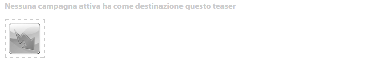
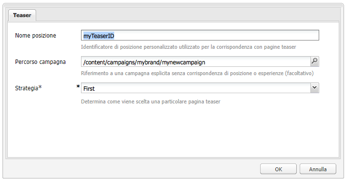
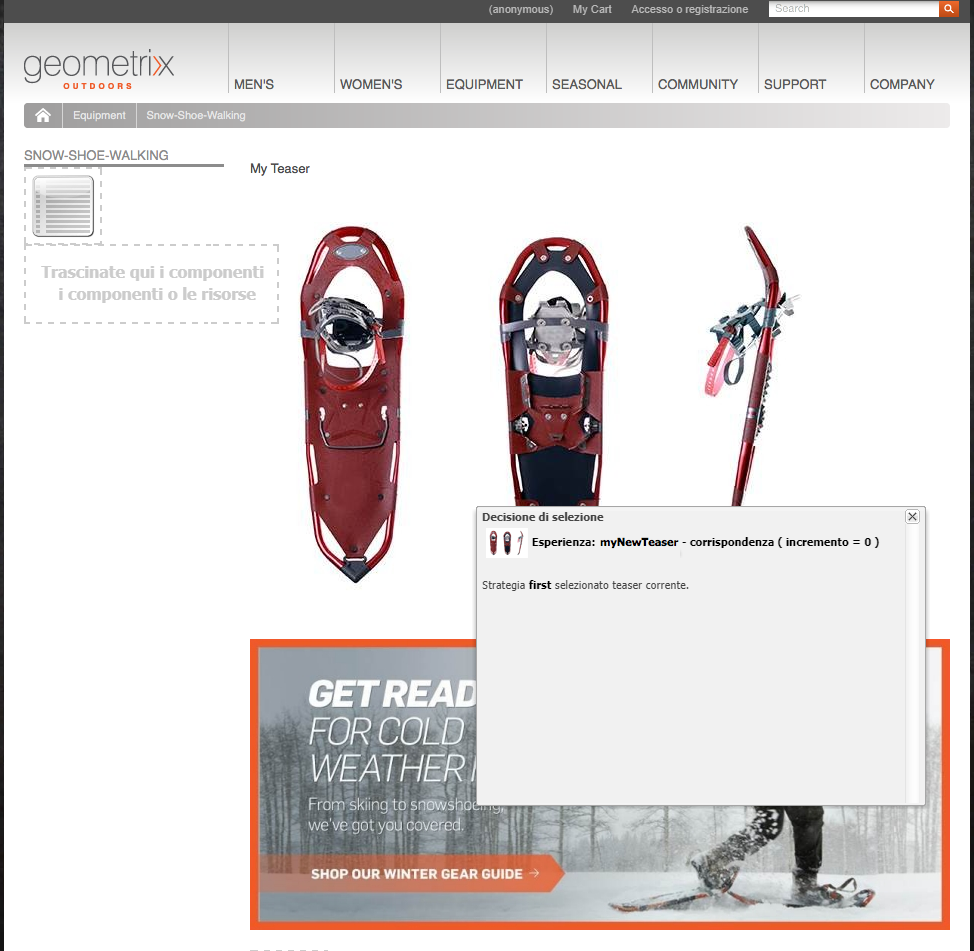
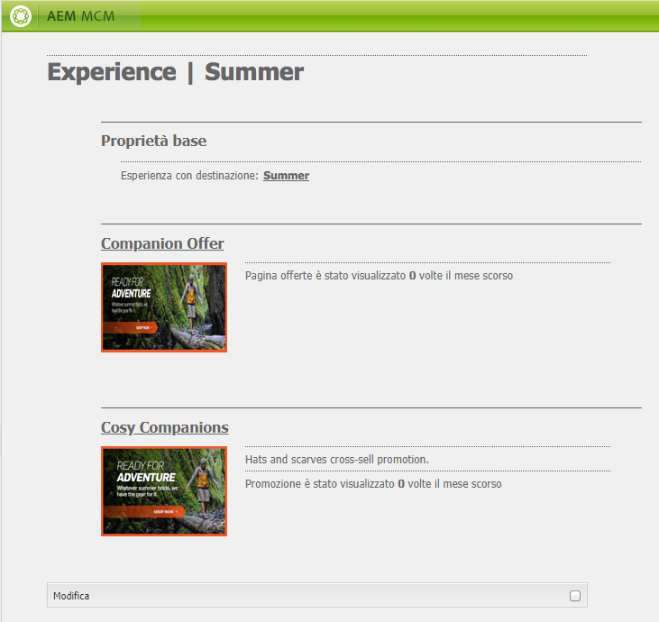

# Teaser e strategie{#teasers-and-strategies}

>[!CAUTION]
>
>AEM 6.4 ha raggiunto la fine del supporto esteso e questa documentazione non viene più aggiornata. Per maggiori dettagli, consulta la nostra [periodi di assistenza tecnica](https://helpx.adobe.com/it/support/programs/eol-matrix.html). Trova le versioni supportate [qui](https://experienceleague.adobe.com/docs/).

Le campagne utilizzano spesso i teaser come meccanismo per veicolare uno specifico segmento di visitatori verso contenuti pertinenti in base ai loro interessi. Uno o più teaser sono definiti per una campagna specifica.

>[!NOTE]
>
>Il componente Teaser è stato dichiarato obsoleto in AEM 6.2.

* **Pagine dei marchi** sono memorizzate nella sezione Campagne del sito web. Un marchio contiene le singole campagne.

* **Pagine di Campaign** sono memorizzate nella sezione Campagne del sito web. Ogni campagna ha una singola pagina, in cui vengono conservate le definizioni del teaser. La pagina contenitore, o panoramica, contiene anche alcune informazioni e statistiche relative alle singole pagine teaser.

I teaser in AEM sono composti di diverse parti:

* **Pagine teaser** sono memorizzati nella pagina della campagna appropriata e contengono le definizioni dei paragrafi teaser disponibili per ogni campagna specifica. Queste definizioni vengono utilizzate per visualizzare i paragrafi teaser; tra cui le varianti di contenuto, il segmento da utilizzare per selezionare una variante e un fattore di incremento.
* La **Componente teaser** è disponibile come standard e consente di creare un’istanza del paragrafo teaser in una pagina di contenuto. Potete trascinare il componente teaser dalla barra laterale, quindi specificare la definizione del teaser per creare un paragrafo teaser. **Nota:** Il componente Teaser è stato dichiarato obsoleto in AEM 6.2.

* **Paragrafi teaser** sono istanze effettive del teaser in una pagina di contenuto. Questi coinvolgono un segmento di visitatori verso contenuti incentrati sui loro interessi.
* Pagine che contengono il contenuto della campagna per un segmento di visitatore specifico. In genere, i paragrafi teaser conducono il visitatore a tali pagine.

## Strategie {#strategies}

Quando si aggiunge un paragrafo teaser a una pagina, è necessario definire la **Strategia**.

Questo accade nel caso in cui diversi teaser siano disponibili per la selezione, in quanto i segmenti assegnati vengono risolti con successo. La **Strategia** specifica quindi un ulteriore criterio utilizzato per selezionare il teaser visualizzato:

* **Punteggio clickstream**, si basa sui tag e sugli hit tag correlati presenti nel contesto client del visitatore (mostra la frequenza con cui un visitatore ha fatto clic su pagine contenenti il relativo tag). Vengono confrontate le percentuali di hit per i tag definiti nella pagina teaser.
* **Casuale**, per una selezione &quot;casuale&quot;; utilizza il fattore casuale generato per una pagina, visibile con [contesto client](/help/sites-administering/client-context.md).

* **Primo** nell’elenco dei segmenti risolti. L’ordine è quello dei teaser nella pagina contenitore della campagna.

La [Fattore di incremento](/help/sites-administering/campaign-segmentation.md#boost-factor) del segmento ha anche un impatto sulla selezione. Questo è un fattore di ponderazione aggiunto alla definizione di un segmento per aumentare/diminuire la probabilità relativa che venga selezionato.

Il processo e le interrelazioni dei vari criteri di selezione sono illustrati in modo più accurato con un esempio (un metodo che può essere utilizzato anche per garantire che i teaser raggiungano il pubblico richiesto).

Se i seguenti segmenti sono già stati creati e a cui è stato assegnato il rispettivo fattore di incremento:

| Segmento | Fattore di incremento |
|---|---|
| S1 | 0 |
| S2 | 0 |
| S3 | 10 |
| S4 | 30 |
| S5 | 0 |
| S6 | 100 |

E utilizziamo le seguenti definizioni dei teaser:

<table> 
 <tbody> 
  <tr> 
   <td>Campaign</td> 
   <td>Teaser</td> 
   <td>Segmenti assegnati</td> 
   <td>Tag assegnati </td> 
  </tr> 
  <tr> 
   <td>C1</td> 
   <td>T1</td> 
   <td>S1, S2</td> 
   <td>Business, marketing</td> 
  </tr> 
  <tr> 
   <td>C1</td> 
   <td>T2 </td> 
   <td>S1</td> 
   <td>  </td> 
  </tr> 
  <tr> 
   <td>C1 </td> 
   <td>T3</td> 
   <td>S3, S4</td> 
   <td>  </td> 
  </tr> 
  <tr> 
   <td>C1 </td> 
   <td>T4</td> 
   <td>S2, S5</td> 
   <td>  </td> 
  </tr> 
  <tr> 
   <td>C1 </td> 
   <td>T5</td> 
   <td>S1, S2, S6</td> 
   <td>Marketing</td> 
  </tr> 
  <tr> 
   <td>C1 </td> 
   <td>T6</td> 
   <td>S6</td> 
   <td>Economia  </td> 
  </tr> 
 </tbody> 
</table>

Quindi, se lo applichiamo a un visitatore in cui:

* **S1**, **S2** e **S6** risolvere

* il tag **marketing** ha 3 hit
* il tag **business** ha 6 hit

Possiamo vedere il risultato:

* corrispondenza con successo : i segmenti assegnati al teaser vengono risolti per il visitatore corrente?
* fattore di incremento: fattore di incremento maggiore di tutti i segmenti applicabili
* punteggio clickstream: il totale cumulativo per tutti gli hit di tag applicabili

calcolati prima di applicare la strategia appropriata:

<table> 
 <tbody> 
  <tr> 
   <td>Campaign</td> 
   <td>Teaser</td> 
   <td>Segmenti assegnati</td> 
   <td>Tag </td> 
   <td>Corrispondenza riuscita?</td> 
   <td>Fattore di incremento risultante</td> 
   <td>Punteggio clickstream risultante </td> 
  </tr> 
  <tr> 
   <td>C1</td> 
   <td>T1</td> 
   <td>S1, S2</td> 
   <td>Business, marketing</td> 
   <td>Sì</td> 
   <td>0</td> 
   <td>9</td> 
  </tr> 
  <tr> 
   <td>C1</td> 
   <td>T2 </td> 
   <td>S1</td> 
   <td>  </td> 
   <td>Sì</td> 
   <td>0</td> 
   <td>  </td> 
  </tr> 
  <tr> 
   <td>C1 </td> 
   <td>T3</td> 
   <td>S3, S4</td> 
   <td>  </td> 
   <td>No</td> 
   <td>  </td> 
   <td>  </td> 
  </tr> 
  <tr> 
   <td>C1 </td> 
   <td>T4</td> 
   <td>S2, S5</td> 
   <td>  </td> 
   <td>Sì  </td> 
   <td>0  </td> 
   <td>  </td> 
  </tr> 
  <tr> 
   <td>C1 </td> 
   <td>T5</td> 
   <td>S1, S2, S6</td> 
   <td>Marketing</td> 
   <td>Sì</td> 
   <td>100</td> 
   <td>3</td> 
  </tr> 
  <tr> 
   <td>C1 </td> 
   <td>T6</td> 
   <td>S6</td> 
   <td>Economia</td> 
   <td>Sì</td> 
   <td>100</td> 
   <td>6 </td> 
  </tr> 
 </tbody> 
</table>

Questi valori vengono utilizzati per determinare i teaser che verranno visualizzati dal visitatore, a seconda dei **Strategia** applicato al paragrafo teaser:

<table> 
 <tbody> 
  <tr> 
   <td>Strategia</td> 
   <td>Teaser risultante</td> 
   <td>Commenti</td> 
  </tr> 
  <tr> 
   <td>Primo</td> 
   <td>T5</td> 
   <td>Vengono considerati solo T5 e T6 perché tutti i loro segmenti vengono risolti <i>e</i> hanno il fattore di incremento più alto. L'elenco restituito è nell'ordine T5, T6; quindi T5 viene selezionato e visualizzato.</td> 
  </tr> 
  <tr> 
   <td>Casuale</td> 
   <td>T5 o T6</td> 
   <td>Entrambi i teaser hanno segmenti che vengono risolti e lo stesso fattore di incremento. Pertanto, i due teaser vengono visualizzati in proporzione uguale.</td> 
  </tr> 
  <tr> 
   <td>Punteggio clickstream</td> 
   <td>T6</td> 
   <td>
I segmenti T1, T4, T5 e T6 vengono tutti risolti per il visitatore. I fattori di incremento più elevati di T5 e T6 escludono quindi T1 e T4. Infine, il punteggio clickstream maggiore di T6 ne determina la selezione.
 </td> 
  </tr> 
 </tbody> 
</table>

>[!NOTE]
>
>Se, dopo le tecniche di risoluzione di cui sopra, sono disponibili per la selezione più teaser, una selezione interna (casuale) selezionerà un singolo teaser da visualizzare.
>
>Ad esempio, se la strategia era Punteggio clickstream e T5 aveva lo stesso Punteggio clickstream di T6 (cioè 6 invece di 3), la selezione interna (casuale) verrebbe utilizzata per selezionare uno di questi due.

Le pagine o i paragrafi teaser vengono utilizzati per indirizzare alcuni segmenti di visitatori verso contenuti pertinenti in base ai loro interessi. Possono presentare al visitatore una serie di opzioni tra cui scegliere o mostrare un solo paragrafo teaser in base al segmento di visitatori specifico; ad esempio, il paragrafo teaser visualizzato potrebbe dipendere dall’età del visitatore.

In genere, una pagina teaser è un’azione temporanea che durerà per un determinato periodo di tempo, fino a quando non viene sostituita dalla pagina teaser successiva.

Dopo aver creato il marchio e la campagna, puoi creare e impostare l’esperienza teaser.

## Creazione di un punto di contatto per il teaser {#creating-a-touchpoint-for-your-teaser}

>[!NOTE]
>
>Il componente Teaser è stato dichiarato obsoleto in AEM 6.2.

1. Passa alla pagina del contenuto in cui desideri inserire il paragrafo teaser che porterà l’utente alla pagina della campagna.
1. Aggiungi un **Teaser** (disponibile nella **Personalizzazione** nella posizione desiderata. Al momento della creazione, il percorso della campagna non è ancora configurato:

   

1. Modificate il componente teaser per aggiungere:

   * **Percorso campagna**
Percorso della pagina della campagna contenente la singola pagina teaser; i segmenti determinano esattamente quale teaser viene visualizzato.
   * **[Strategia](/help/sites-classic-ui-authoring/classic-personalization-campaigns.md#strategies)**
Metodo utilizzato per la selezione quando più segmenti vengono risolti correttamente.
   

1. Fai clic su **OK** da salvare. A seconda dei segmenti impostati sul teaser e del profilo dell’utente attualmente connesso, verrà visualizzato il contenuto appropriato:

   

1. Passate il puntatore del mouse sul paragrafo teaser per visualizzare l’icona del punto interrogativo (nell’angolo in basso a destra del componente). Fai clic su questo pulsante per visualizzare i segmenti applicati e se vengono attualmente risolti.

   

## Panoramica del teaser {#teaser-overview}

Oltre alla visualizzazione della campagna in MCM, la pagina della campagna fornisce anche informazioni sui teaser ad essa collegati:

1. Da **Siti Web** , apri la pagina della campagna; ad esempio:

   `http://localhost:4502/content/campaigns/geometrixx-outdoors/storefront/summer.html`

   Viene visualizzata una panoramica delle definizioni del teaser e delle statistiche di visualizzazione:

   
