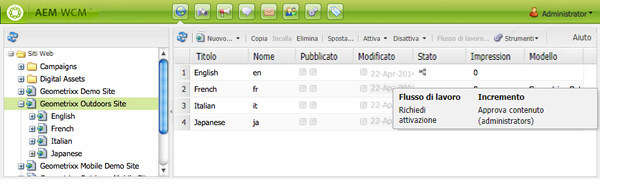

# Applicazione dei flussi di lavoro alle pagine{#applying-workflows-to-pages}

>[!CAUTION]
>
>AEM 6.4 ha raggiunto la fine del supporto esteso e questa documentazione non viene più aggiornata. Per maggiori dettagli, consulta la nostra [periodi di assistenza tecnica](https://helpx.adobe.com/it/support/programs/eol-matrix.html). Trova le versioni supportate [qui](https://experienceleague.adobe.com/docs/).

Quando applichi il flusso di lavoro, specifica le seguenti informazioni:

* Flusso di lavoro da applicare.

   Puoi utilizzare qualsiasi flusso di lavoro a cui hai accesso, secondo quanto assegnato dall’amministratore AEM.
* Facoltativamente:

   * Un commento che fornisce informazioni sul motivo per cui hai avviato il flusso di lavoro.
   * Titolo che consente di identificare l’istanza del flusso di lavoro nella casella in entrata di un utente.

>[!NOTE]
>
>AEM gli amministratori possono avviare i flussi di lavoro utilizzando [diversi altri metodi](/help/sites-administering/workflows-starting.md).

## Applicazione dei flussi di lavoro {#applying-workflows}

I flussi di lavoro possono essere avviati dalla console Siti Web o, durante la modifica di una pagina, dalla barra laterale.

La **Stato** nella colonna **Siti Web** la console indica se un flusso di lavoro è stato applicato a una pagina:

### Avvio di un flusso di lavoro dalla console Siti Web {#starting-a-workflow-from-the-websites-console}

1. Apri la console Siti web . ([http://localhost:4502/siteadmin](http://localhost:4502/siteadmin))
1. Nella struttura Siti Web selezionare l’elemento padre della pagina a cui si desidera applicare il flusso di lavoro.
1. Nell’elenco delle pagine, seleziona la pagina e fai clic su Flusso di lavoro.
1. Nella finestra di dialogo Avvia flusso di lavoro , seleziona il flusso di lavoro da applicare. In alternativa, immetti un commento e un titolo. Quindi fare clic su Start.

### Avvio di un flusso di lavoro tramite la barra laterale {#starting-a-workflow-using-sidekick}

1. Apri la console Siti web .
1. Apri la pagina richiesta.
1. Seleziona la scheda Flusso di lavoro dalla barra laterale.
1. Espandi la **Flusso di lavoro** , che consente di selezionare la **Flusso di lavoro** e facoltativamente inserisci **Titolo flusso di lavoro** e **Commento**.

   

1. Fai clic su **Avvia flusso di lavoro** per avviare una nuova istanza di flusso di lavoro con le proprietà configurate e la pagina corrente come payload. Ora il flusso di lavoro è in esecuzione.
