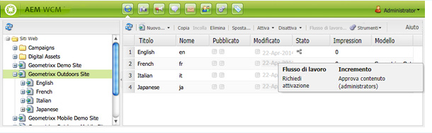
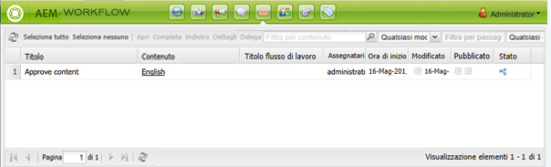
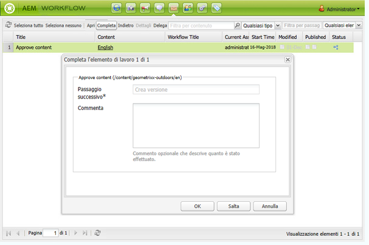
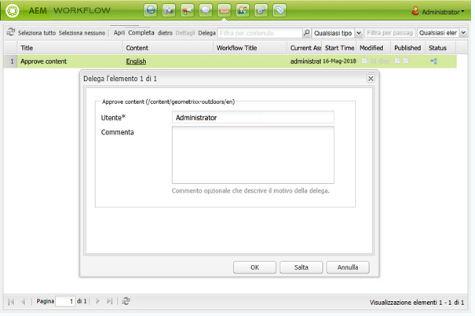
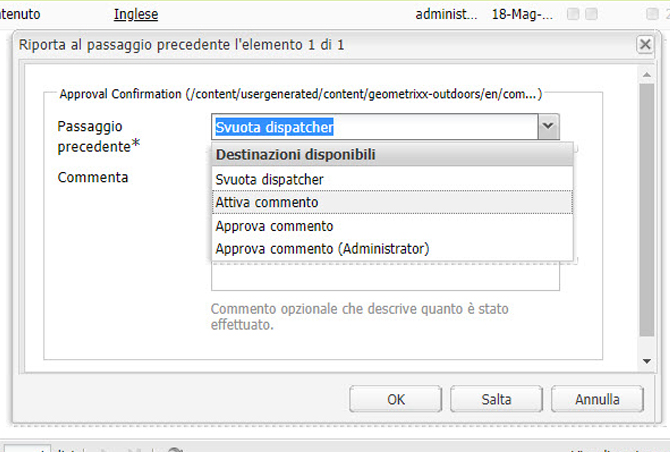

# Partecipazione ai flussi di lavoro{#participating-in-workflows}

>[!CAUTION]
>
>AEM 6.4 ha raggiunto la fine del supporto esteso e questa documentazione non viene più aggiornata. Per maggiori dettagli, consulta la nostra [periodi di assistenza tecnica](https://helpx.adobe.com/it/support/programs/eol-matrix.html). Trova le versioni supportate [qui](https://experienceleague.adobe.com/docs/).

I flussi di lavoro in genere includono passaggi che richiedono a una persona di eseguire un’attività su una pagina o una risorsa. Il flusso di lavoro seleziona un utente o un gruppo per eseguire l’attività e assegna un elemento di lavoro a tale persona o gruppo.

## Elaborazione degli elementi di lavoro {#processing-your-work-items}

Per elaborare un elemento di lavoro è possibile effettuare le seguenti operazioni:

* **Completa**

   Puoi completare un elemento per consentire al flusso di lavoro di passare al passaggio successivo.

* **Delega**

   Se ti è stato assegnato un passaggio, ma per qualsiasi motivo non riesci a eseguire un&#39;azione, puoi delegarlo a un altro utente o gruppo.

   Gli utenti disponibili per la delega dipendono da chi è stato assegnato l’elemento di lavoro:

   * Se l&#39;elemento di lavoro è stato assegnato a un gruppo, i membri del gruppo sono disponibili.
   * Se l’elemento di lavoro è stato assegnato a un gruppo e poi è stato delegato a un utente, sono disponibili i membri del gruppo e il gruppo.
   * Se l&#39;elemento di lavoro è stato assegnato a un singolo utente, non è possibile delegare l&#39;elemento di lavoro.

* **Indietro**

   Se scopri che è necessario ripetere un passaggio o una serie di passaggi, puoi tornare indietro. Ciò ti consente di selezionare un passaggio precedente del flusso di lavoro per la rielaborazione. Il flusso di lavoro torna al passaggio specificato, quindi procede da tale passaggio.

## Partecipazione a un flusso di lavoro {#participating-in-a-workflow}

### Notifiche di azioni flusso di lavoro assegnate {#notifications-of-assigned-workflow-actions}

Quando ti viene assegnato un elemento di lavoro (ad esempio, **Approva contenuto**) vengono visualizzati diversi avvisi e/o notifiche:

* La **Stato** La colonna della console Siti web indica quando una pagina si trova in un flusso di lavoro:

   

* Quando un utente o un gruppo a cui appartiene viene assegnato un elemento di lavoro come parte di un flusso di lavoro, l&#39;elemento di lavoro viene visualizzato nella casella in entrata del flusso di lavoro AEM.

   

### Completamento di un Passaggio Partecipante {#completing-a-participant-step}

Dopo aver eseguito l’azione indicata è possibile completare l’elemento di lavoro, in modo da continuare il flusso di lavoro. Per completare l&#39;elemento di lavoro, attenersi alla procedura descritta di seguito.

1. Seleziona il passaggio del flusso di lavoro e fai clic sul pulsante **Completa** nella barra di navigazione superiore.
1. Nella finestra di dialogo risultante, seleziona la **Passaggio successivo**; ovvero il passaggio da eseguire successivamente. Un elenco a discesa mostra tutte le destinazioni appropriate. A **Commento** può anche essere inserito.

   

   Il numero di passaggi elencati dipende dalla progettazione del modello di flusso di lavoro.

1. Fai clic su **OK** per confermare l’azione.

### Delega di un Passaggio Partecipante {#delegating-a-participant-step}

Per delegare un elemento di lavoro, attenersi alla procedura descritta di seguito.

1. Fai clic sul pulsante **Delega** nella barra di navigazione superiore.
1. Nella finestra di dialogo, utilizza l’elenco a discesa per selezionare il **Utente** per delegare l&#39;elemento di lavoro a. Puoi anche aggiungere una **Commento**.

   

1. Fai clic su **OK** per confermare l’azione.

### Eseguire un passo indietro su un Passaggio partecipante {#performing-step-back-on-a-participant-step}

Segui la procedura seguente per tornare indietro.

1. Fai clic sul pulsante Indietro nella barra di navigazione superiore.
1. Nella finestra di dialogo risultante, seleziona il Passaggio precedente; in altre parole, il passaggio da eseguire successivamente, anche se si tratta di un passaggio che si verifica prima nel flusso di lavoro. Un elenco a discesa mostra tutte le destinazioni appropriate.

   

1. Fai clic su OK per confermare l’azione.
