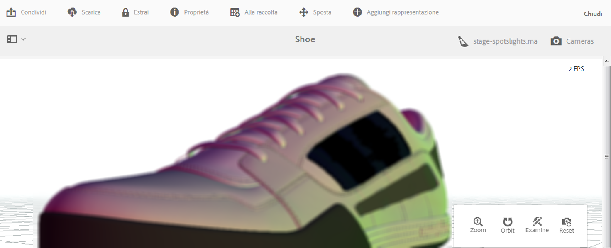

# Visualizzazione di risorse 3D{#viewing-d-assets}

Il visualizzatore 3D interattivo è disponibile dalla pagina dei dettagli delle risorse in AEM. Il visualizzatore include, tra le altre, una raccolta di controlli interattivi della videocamera che consentono di eseguire zoom, rotazione e scorrimento della risorsa 3D.

Oltre a usare le aree di visualizzazione 3D predefinite in AEM, puoi anche utilizzare i livelli creati in un’applicazione di terze parti e caricati in AEM.

Vedi [Utilizzo delle aree di visualizzazione in AEM 3D](/help/sites-classic-ui-authoring/classicui-stages-aem3d.md).

>[!NOTE]
>
>Per visualizzare una risorsa 3D, il browser desktop o del dispositivo deve essere abilitato per WebGL. Inoltre, l’hardware grafico sottostante deve avere capacità e memoria sufficienti a eseguire il rendering dei modelli nella dimensione desiderata.

## Considerazioni sulle prestazioni per la visualizzazione di risorse 3D {#performance-considerations-when-you-view-d-assets}

Il tempo necessario per aprire una risorsa 3D nella pagina Dettagli risorsa dipende da vari fattori, quali:

* Larghezza di banda e latenze al server.
* Dimensione del modello (numero di facce).
* Quantità e dimensione delle mappe.
* Complessità delle aree di visualizzazione. Ad esempio, la dimensione dell’immagine IBL.

Inoltre, le funzionalità del computer client, come una workstation, un notebook o un dispositivo mobile touch, sono importanti anche quando si modifica la telecamera in modo interattivo. Un sistema ragionevolmente potente con buone capacità grafiche può rendere l’esperienza di visualizzazione 3D interattiva più fluida e favorevole.

**Per visualizzare le risorse 3D**:

1. Assicurati di aver caricato le risorse 3D in AEM.

   Vedi [Caricamento ed elaborazione di risorse 3D in AEM](/help/sites-classic-ui-authoring/classicui-upload-proc-3d.md).
1. Da **[!UICONTROL Adobe Experience Manager]**, nella pagina di **[!UICONTROL navigazione]**, tocca **[!UICONTROL Risorse]**.
1. Vicino all&#39;angolo superiore destro della pagina, dall&#39;elenco a discesa **[!UICONTROL View]**, toccare **[!UICONTROL Card View]**.

1. Accedi alla risorsa 3D da visualizzare.
1. Tocca la scheda della risorsa 3D per aprirla nella pagina dei dettagli della risorsa.

1. Effettua una delle operazioni seguenti:

   * Nell’angolo in basso a destra della pagina dei dettagli delle risorse, utilizza la barra dei comandi della fotocamera per cambiare le varie viste delle risorse.

      Se utilizzi un dispositivo di input non touch senza rotella di scorrimento, ad esempio un classico mouse Apple con un solo pulsante, puoi comunque cambiare lo zoom o la prospettiva di una risorsa 3D in ciascuna modalità. Per eseguire l&#39;azione, premere e tenere premuto il tasto `SHIFT`mentre si deprime il pulsante del mouse e si trascina verso l&#39;alto o il basso.

      Quando utilizzi il touchpad di un computer portatile, è spesso difficile controllare lo zoom o la prospettiva mediante il gesto con due dita. In questi casi, è possibile premere e tenere premuto `SHIFT`durante l&#39;azione. Questo riduce la velocità del gesto di avvicinamento delle dita e rende più semplice ottenere lo zoom o la prospettiva desiderati. In alternativa, è possibile trascinare un dito verso l&#39;alto o il basso mentre il tasto `SHIFT`viene premuto per influenzare i comportamenti di zoom o prospettiva.
   <table> 
    <tbody> 
      <tr> 
      <td><strong>Nome controllo telecamera</strong>  </td> 
      <td><strong>Descrizione</strong></td> 
      </tr> 
      <tr> 
      <td>
Zoom
 
o
 
Persp
 </td> 
      <td>
Toccate o fate clic per alternare tra le modalità Zoom e Prospettiva.
 
In alternativa, tenere premuto il tasto <code>ALT/OPTION</code> durante l'azione per passare temporaneamente alla modalità Prospettiva . Rilascia il tasto per tornare alla modalità Zoom.
 
        <ul> 
        <li><strong>Comportamento Zoom</strong>-Dolly in e out, che avvicina o allontana la telecamera dalla   risorsa visualizzata. Lo zoom è il comportamento predefinito per la rotellina di scorrimento del mouse (se disponibile), per i movimenti di allontanamento o avvicinamento con due dita sui dispositivi mobili, o quando tieni premuto il tasto Maiusc mentre muovi il mouse su o giù premendo il pulsante sinistro.</li> 
        <li><strong>Prospettiva</strong>: modifica la lunghezza focale (o campo visivo) della fotocamera, mantenendo le dimensioni relative della risorsa nella vista. La prospettiva è il comportamento alternativo per la rotellina (se disponibile), per i movimenti di allontanamento o avvicinamento con due dita sui dispositivi mobili, o quando tieni premuto il tasto Maiusc mentre muovi il mouse su o giù premendo il pulsante sinistro.</li> 
        </ul> </td> 
      </tr> 
      <tr> 
      <td>
Orbita
 
o
 
Pan
 </td> 
      <td>
Toccate o fate clic per alternare tra le modalità Orbit e Panning.
 
Oppure, tenete premuto il tasto <code>ALT/OPTION</code> durante l'azione per passare temporaneamente alla modalità Scorrimento. Rilascia il tasto per tornare alla modalità Rotazione.
 
        <ul> 
        <li><strong>Orbita</strong> - Per impostazione predefinita, sposta la telecamera di visualizzazione su una sfera centrata su un punto di destinazione vicino al centro della risorsa 3D. La rotazione è il funzionamento predefinito per il trascinamento con il pulsante sinistro o con un singolo tocco sui dispositivi mobili.</li> 
        <li><strong>Pan</strong>-Sposta la telecamera nel piano di visualizzazione. L’obiettivo viene spostato di conseguenza, quindi le successive azioni di rotazione sposteranno la videocamera intorno a un nuovo obiettivo. Il panning è il funzionamento predefinito per il trascinamento con il pulsante sinistro o con un singolo tocco.</li> 
        </ul> </td> 
      </tr> 
      <tr> 
      <td>
Esaminare
 
o
 
Destinazione
 </td> 
      <td>
Toccate o fate clic per alternare tra le modalità Examine e Target.
 
        <ul> 
        <li><strong>Toccate o fate</strong> clic per passare alla modalità Target.</li> 
        <li><strong>Toccate</strong> o fate clic su un punto qualsiasi della risorsa 3D per centrare la visualizzazione sulla parte della risorsa.  Le azioni Rotazione utilizzano il nuovo obiettivo.</li> 
        </ul> </td> 
      </tr> 
      <tr> 
      <td>Ripristina</td> 
      <td>Toccate o fate clic per ripristinare il punto di destinazione della vista al centro del modello. Il ripristino consente inoltre di spostare la telecamera  più vicino o più lontano per mostrare la risorsa nella sua interezza e con dimensioni di visualizzazione ragionevoli.</td> 
      </tr> 
    </tbody> 
    </table>

1. Vicino all&#39;angolo superiore destro della pagina dei dettagli della risorsa, toccate l&#39;icona **[!UICONTROL Selettore fase]**. Seleziona il nome di un’area di visualizzazione con lo sfondo e l’illuminazione che desideri applicare alla risorsa 3D.

   

   Le fasi forniscono l&#39;ambiente-sfondo, il piano terra e l&#39;illuminazione in cui viene visualizzato il modello 3D.

   Vedi [Utilizzo delle aree di visualizzazione in AEM 3D](/help/sites-classic-ui-authoring/classicui-stages-aem3d.md).

1. Nell&#39;angolo superiore destro della pagina dei dettagli della risorsa, toccate l&#39;icona **[!UICONTROL Selettore fotocamera]**, quindi selezionate una vista fotocamera da applicare alla risorsa 3D.

   

   Le aree di visualizzazione spesso forniscono videocamere predefinite. Puoi selezionare di nuovo la videocamera corrente per tornare alle impostazioni predefinite.

   Vedi [Utilizzo delle aree di visualizzazione in AEM 3D](/help/sites-classic-ui-authoring/classicui-stages-aem3d.md).

1. Nell’angolo in alto a destro della pagina, tocca **[!UICONTROL Salva]**.
1. Effettua una delle operazioni seguenti:

   * Esegui il rendering della risorsa 3D.

      Vedi [Rendering delle risorse 3D](/help/sites-classic-ui-authoring/classicui-rendering-3d.md).

   * Nell’angolo in alto a destra della pagina, tocca **[!UICONTROL Chiudi]** per tornare alla schermata Risorse.

