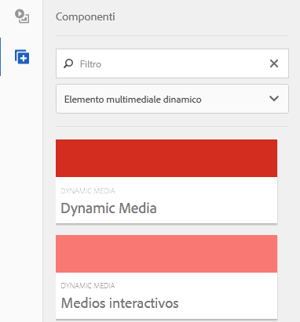

# Aggiunta di risorse Dynamic Media alle pagine{#adding-dynamic-media-assets-to-pages}

>[!CAUTION]
>
>AEM 6.4 ha raggiunto la fine del supporto esteso e questa documentazione non viene più aggiornata. Per maggiori dettagli, consulta la nostra [periodi di assistenza tecnica](https://helpx.adobe.com/it/support/programs/eol-matrix.html). Trova le versioni supportate [qui](https://experienceleague.adobe.com/docs/).

Per aggiungere la funzionalità Dynamic Media alle risorse utilizzate sui siti web, puoi aggiungere la **[!UICONTROL Dynamic Media]** o **[!UICONTROL File multimediali interattivi]** direttamente sulla pagina. Per farlo, immetti [!UICONTROL Progettazione] e l&#39;abilitazione dei componenti multimediali dinamici. Quindi, potrai aggiungere questi componenti alla pagina e fornire così risorse al componente. I componenti per contenuti multimediali dinamici e per contenuti multimediali interattivi sono intelligenti: sanno se aggiungi un’immagine o un video e le opzioni disponibili cambiano di conseguenza.

Se utilizzi AEM come WCM, aggiungi direttamente alla pagina le risorse Dynamic Media.

>[!NOTE]
>
>Per i banner a carosello sono disponibili mappe immagine pronte all’uso.

## Aggiunta di un componente Dynamic Media a una pagina {#adding-a-dynamic-media-component-to-a-page}

Aggiunta di [!UICONTROL Dynamic Media] o [!UICONTROL File multimediali interattivi] equivale ad aggiungere un componente a una pagina. La [!UICONTROL Dynamic Media] e [!UICONTROL File multimediali interattivi] I componenti sono descritti in dettaglio nelle sezioni seguenti.

Per aggiungere un componente/visualizzatore Dynamic Media a una pagina:

1. In AEM, apri la pagina in cui desideri aggiungere il componente Dynamic Media.
1. Se non è disponibile alcun componente Dynamic Media, fai clic sul righello nel [!UICONTROL Barra laterale] per immettere **[!UICONTROL Progettazione]** modalità, fai clic su **[!UICONTROL Modifica]** parsys, quindi selezionare **[!UICONTROL Dynamic Media]** per rendere disponibili i componenti Dynamic Media.

   >[!NOTE]
   >
   >Vedi [Configurazione dei componenti in modalità Progettazione](/help/sites-authoring/default-components-designmode.md) per ulteriori informazioni.

1. Torna a **[!UICONTROL Modifica]** facendo clic sull’icona a forma di matita [!UICONTROL Barra laterale].
1. Trascina **[!UICONTROL Dynamic Media]** o **[!UICONTROL File multimediali interattivi]** dal **[!UICONTROL Altro]** nella barra laterale sulla pagina nella posizione desiderata.
1. Fai clic su **[!UICONTROL Modifica]** per aprire il componente.
1. [Modificare il componente](#dynamic-media-component) se necessario, fai clic su **[!UICONTROL OK]** per salvare le modifiche.

## Componenti Dynamic Media {#dynamic-media-components}

[!UICONTROL Dynamic Media] e [!UICONTROL File multimediali interattivi] sono disponibili in [!UICONTROL Barra laterale] sotto **[!UICONTROL Dynamic Media]**. Utilizzi le **[!UICONTROL File multimediali interattivi]** per qualsiasi risorsa interattiva, ad esempio video interattivo, immagini interattive o set carosello. Per tutti gli altri componenti multimediali dinamici, utilizza la variabile **[!UICONTROL Dynamic Media]** componente.

>[!NOTE]
>
>Questi componenti non sono disponibili per impostazione predefinita e devono essere selezionati in modalità Progettazione prima dell’utilizzo. [Una volta resi disponibili in modalità Progettazione](/help/sites-authoring/default-components-designmode.md), puoi aggiungere i componenti alla pagina come qualsiasi altro componente AEM.

### Componente Dynamic Media {#dynamic-media-component}

Il componente Dynamic Media è intelligente: a seconda che si aggiunga un’immagine o un video, sono disponibili varie opzioni. Il componente supporta i predefiniti per immagini, i visualizzatori basati su immagini come set di immagini, set 360 gradi, set di file multimediali diversi e video. Inoltre, il visualizzatore è reattivo. In altre parole, le dimensioni dello schermo cambiano automaticamente in base alle dimensioni dello schermo. Tutti i visualizzatori sono basati su HTML5.

>[!NOTE]
>
>Quando aggiungi la [!UICONTROL Dynamic Media] e **[!UICONTROL Impostazioni Dynamic Media]** è vuoto oppure non è possibile aggiungere correttamente una risorsa, controlla quanto segue:
>
>* Hai [Dynamic Media abilitato](/help/assets/config-dynamic.md). Dynamic Media è disattivato per impostazione predefinita.
>* L&#39;immagine ha un file TIFF piramidale. Le immagini importate prima dell’abilitazione del supporto dinamico non dispongono di un file TIFF piramidale.
>

#### Quando si lavora con le immagini {#when-working-with-images}

La [!UICONTROL Dynamic Media] consente di aggiungere immagini dinamiche, compresi set di immagini, set 360 gradi e set di file multimediali diversi. Potete ingrandire, ridurre e, se applicabile, ruotare un&#39;immagine all&#39;interno di un set 360 gradi o selezionare un&#39;immagine da un altro tipo di set.

Puoi anche configurare il predefinito visualizzatore, il predefinito immagine o il formato immagine direttamente nel componente. Per rendere un’immagine reattiva, puoi impostare i punti di interruzione o applicare un predefinito per immagini reattive.

Per modificare le seguenti impostazioni di Dynamic Media, fai clic su **[!UICONTROL Modifica]** nel componente , quindi fai clic su **[!UICONTROL Impostazioni Dynamic Media]** scheda .

>[!NOTE]
>
>Per impostazione predefinita, il componente immagine Dynamic Media è adattivo. Se vuoi impostarne una dimensione fissa, impostala nel componente nel **[!UICONTROL Avanzate]** con la scheda **[!UICONTROL Larghezza]** e **[!UICONTROL Altezza]** proprietà.

**[!UICONTROL Predefinito visualizzatore]** - Seleziona un predefinito per visualizzatori esistente dal menu a discesa. Se il predefinito per visualizzatori che stai cercando non è visibile, potrebbe essere necessario renderlo visibile. Vedi [Gestione dei predefiniti per visualizzatori](/help/assets/managing-viewer-presets.md). Non puoi selezionare un predefinito per visualizzatori se utilizzi un predefinito per immagini e viceversa.

Questa è l’unica opzione disponibile se visualizzi set di immagini, set 360 gradi o set di file multimediali diversi. Anche i predefiniti visualizzatore visualizzati sono intelligenti: vengono visualizzati solo i predefiniti visualizzatore pertinenti.

**[!UICONTROL Predefinito immagine]** - Seleziona un predefinito per immagini dal menu a discesa. Se il predefinito immagine che cerchi non è visibile, potrebbe essere necessario renderlo visibile. Vedi [Gestione dei predefiniti per immagini](/help/assets/managing-image-presets.md). Non puoi selezionare un predefinito per visualizzatori se utilizzi un predefinito per immagini e viceversa.

Questa opzione non è disponibile se visualizzi set di immagini, set 360 gradi o set di file multimediali diversi.

**[!UICONTROL Modificatori immagine]** - È possibile modificare gli effetti immagine fornendo ulteriori comandi immagine. Sono descritti in [Gestione dei predefiniti per immagini](/help/assets/managing-viewer-presets.md) e [Riferimento comando](https://experienceleague.adobe.com/docs/dynamic-media-developer-resources/image-serving-api/image-serving-api/http-protocol-reference/command-reference/c-command-reference.html).

Questa opzione non è disponibile se visualizzi set di immagini, set 360 gradi o set di file multimediali diversi.

**[!UICONTROL Punti di interruzione]** - Se utilizzi questa risorsa su un sito reattivo, devi aggiungere i punti di interruzione pagina. I punti di interruzione dell’immagine devono essere separati da virgole (,). Questa opzione funziona quando non è definita alcuna altezza o larghezza in un predefinito per immagini.

Questa opzione non è disponibile se visualizzi set di immagini, set 360 gradi o set di file multimediali diversi.

È possibile modificare quanto segue [!UICONTROL Impostazioni avanzate] facendo clic su **[!UICONTROL Modifica]** nel componente.

**[!UICONTROL Titolo]** - Modificare il titolo dell&#39;immagine.

**[!UICONTROL Testo Alt]** - Aggiungi un titolo all’immagine per gli utenti che hanno disattivato la grafica.

Questa opzione non è disponibile se visualizzi set di immagini, set 360 gradi o set di file multimediali diversi.

**[!UICONTROL URL, Apri in]** - Puoi impostare una risorsa da per aprire un collegamento. Imposta la **[!UICONTROL URL]** e **[!UICONTROL Apri in]** per indicare se si desidera aprire nella stessa finestra o in una nuova finestra.

Questa opzione non è disponibile se visualizzi set di immagini, set 360 gradi o set di file multimediali diversi.

**[!UICONTROL Larghezza e altezza]** - Immetti il valore in pixel se vuoi che l&#39;immagine sia di dimensioni fisse. Lasciando vuoti questi valori, la risorsa diventa adattiva.

#### Quando si lavora con i video {#when-working-with-video}

Utilizza la [!UICONTROL Dynamic Media] per aggiungere video dinamici alle pagine web. Quando modifichi il componente puoi scegliere di utilizzare un predefinito visualizzatore video per la riproduzione del video sulla pagina.

È possibile modificare quanto segue [!UICONTROL Impostazioni Dynamic Media] facendo clic su **[!UICONTROL Modifica]** nel componente.

>[!NOTE]
>
>Per impostazione predefinita, il componente video Dynamic Media è adattivo. Se vuoi impostarne una dimensione fissa, impostala nel componente con la **[!UICONTROL Larghezza]** e **[!UICONTROL Altezza]** in **[!UICONTROL Avanzate]** scheda .

**[!UICONTROL Predefinito visualizzatore]** - Seleziona un predefinito per visualizzatori video dal menu a discesa. Se il predefinito per visualizzatori che stai cercando non è visibile, potrebbe essere necessario renderlo visibile. Vedi [Gestione dei predefiniti per visualizzatori](/help/assets/managing-viewer-presets.md).

È possibile modificare quanto segue [!UICONTROL Avanzate] impostazioni facendo clic su **[!UICONTROL Modifica]** nel componente.

**[!UICONTROL Titolo]** - Modifica il titolo del video.

**[!UICONTROL Larghezza e altezza]** - Immetti il valore in pixel se vuoi che il video sia di dimensioni fisse. Lasciando vuoti questi valori, diventa adattivo.

#### Come distribuire video sicuro {#how-to-delivery-secure-video}

Nella AEM 6.2, quando si installa [FP-13480](https://experience.adobe.com/#/downloads/content/software-distribution/en/aem.html?package=/content/software-distribution/en/details.html/content/dam/aem/public/adobe/packages/cq620/featurepack/cq-6.2.0-featurepack-13480), puoi controllare se un video viene distribuito tramite una connessione SSL protetta (HTTPS) o una connessione non sicura (HTTP). Per impostazione predefinita, il protocollo di consegna video viene ereditato automaticamente dal protocollo della pagina web di incorporamento. Se la pagina web viene caricata tramite HTTPS, anche il video viene distribuito tramite HTTPS. E viceversa, se la pagina web è su HTTP, il video viene distribuito via HTTP. Nella maggior parte dei casi, questo comportamento predefinito va bene e non è necessario apportare modifiche alla configurazione. Tuttavia, puoi ignorare questo comportamento predefinito aggiungendo `VideoPlayer.ssl=on` alla fine di un percorso URL o all’elenco di altri parametri di configurazione del visualizzatore in uno snippet di codice da incorporare, per forzare la distribuzione video sicura.

Per ulteriori informazioni sulla distribuzione video sicura e sull&#39;utilizzo di `VideoPlayer.ssl` attributo di configurazione nel percorso URL, vedi [Distribuzione video sicura](https://experienceleague.adobe.com/docs/dynamic-media-developer-resources/library/viewers-aem-assets-dmc/video/c-html5-video-viewer-20-securevideodelivery.html) nella Guida di riferimento visualizzatori. Oltre al visualizzatore video, la distribuzione video sicura è disponibile per il visualizzatore di file multimediali diversi e per il visualizzatore di video interattivi.

### Componente File multimediali interattivi {#interactive-media-component}

Il componente File multimediali interattivi è destinato alle risorse che dispongono di interattività, come punti attivi o mappe immagine. Se disponi di un banner interattivo immagine, video interattivo o carosello, utilizza la funzione **[!UICONTROL File multimediali interattivi]** componente.

La [!UICONTROL File multimediali interattivi] componente è intelligente : a seconda che aggiunga un’immagine o un video, avrai a disposizione diverse opzioni. Inoltre, il visualizzatore è reattivo. In altre parole, le dimensioni dello schermo cambiano automaticamente in base alle dimensioni dello schermo. Tutti i visualizzatori sono basati su HTML5.

È possibile modificare quanto segue **[!UICONTROL Generale]** impostazioni facendo clic su **[!UICONTROL Modifica]** nel componente.

**[!UICONTROL Predefinito visualizzatore]** - Seleziona un predefinito per visualizzatori esistente dal menu a discesa. Se il predefinito per visualizzatori che stai cercando non è visibile, potrebbe essere necessario renderlo visibile. I predefiniti per visualizzatori devono essere pubblicati prima di poter essere utilizzati. Consulta Gestione dei predefiniti per visualizzatori .

**[!UICONTROL Titolo]** - Modifica il titolo del video.

**[!UICONTROL Larghezza e altezza]** - Immetti il valore in pixel se vuoi che il video sia di dimensioni fisse. Lasciando vuoti questi valori, diventa adattivo.

È possibile modificare quanto segue **[!UICONTROL Aggiungi al carrello]** impostazioni facendo clic su **[!UICONTROL Modifica]** nel componente.

**[!UICONTROL Mostra risorsa prodotto]** - Per impostazione predefinita, questo valore è selezionato. La risorsa prodotto mostra un’immagine del prodotto come definito nel modulo Commerce . Deseleziona il segno di spunta per non visualizzare la risorsa del prodotto.

**[!UICONTROL Mostra prezzo prodotto]** - Per impostazione predefinita, questo valore è selezionato. Il prezzo del prodotto mostra il prezzo dell’articolo come definito nel modulo Commerce. Deselezionare il segno di spunta per non visualizzare il prezzo del prodotto.

**[!UICONTROL Mostra modulo di prodotto]** - Per impostazione predefinita, questo valore non è selezionato. Il modulo di prodotto include tutte le varianti di prodotto, ad esempio le dimensioni e il colore. Deselezionare il segno di spunta per non visualizzare le varianti di prodotto.
