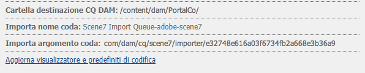
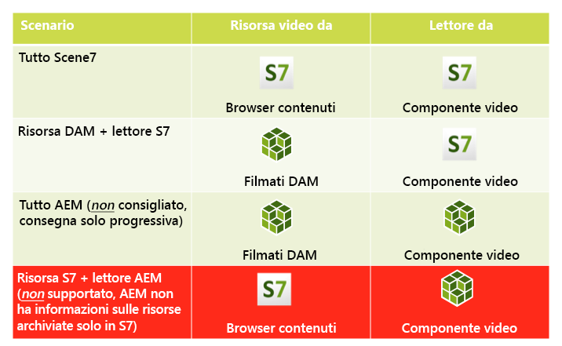
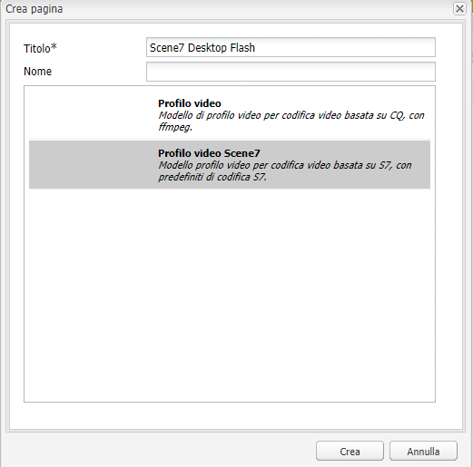
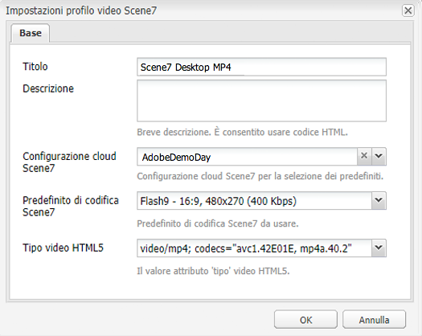

# Video{#video}

>[!CAUTION]
>
>AEM 6.4 ha raggiunto la fine del supporto esteso e questa documentazione non viene più aggiornata. Per maggiori dettagli, consulta la nostra [periodi di assistenza tecnica](https://helpx.adobe.com/it/support/programs/eol-matrix.html). Trova le versioni supportate [qui](https://experienceleague.adobe.com/docs/).

Assets offre una gestione centralizzata delle risorse video, che consente di caricare i video direttamente in Assets per la codifica automatica in Dynamic Media Classic e di accedere ai video Dynamic Media Classic direttamente da Assets per la creazione delle pagine.

L&#39;integrazione video Dynamic Media Classic estende la portata dei video ottimizzati a tutti gli schermi (rilevamento automatico della periferica e della larghezza di banda).

* Il componente video Dynamic Media Classic (Scene7) esegue automaticamente il rilevamento del dispositivo e della larghezza di banda per riprodurre il formato e la qualità video appropriati su desktop, tablet e dispositivi mobili.
* Risorse: puoi includere set video adattivi anziché risorse video singole. Un set video adattivo è un contenitore per tutte le rappresentazioni video necessarie per riprodurre video in modo semplice su più schermi. Un Adaptive Video Set raggruppa versioni dello stesso video codificate con diversi bit rate e formati come 400 kbps, 800 kbps e 1000 kbps. Utilizza un set video adattivo, insieme al componente video S7, per lo streaming video adattivo su più schermi, tra cui desktop, iOS, Android, Blackberry e dispositivi mobili Windows. Vedi [Documentazione di Scene7 sui set video adattivi per ulteriori informazioni](https://experienceleague.adobe.com/docs/dynamic-media-classic/using/setup/application-setup.html#video-presets-for-encoding-video-files).

## FFMPEG e Dynamic Media Classic {#about-ffmpeg-and-scene}

Il processo di codifica video predefinito si basa sull’utilizzo dell’integrazione basata su FFMPEG con i profili video. Pertanto, il flusso di lavoro Aggiorna risorsa DAM predefinito contiene i due passaggi seguenti del flusso di lavoro basato su ffmpeg:

* Miniature FFMPEG
* Codifica FFMPEG

Tieni presente che l’abilitazione e la configurazione dell’integrazione Dynamic Media Classic non rimuovono o disattivano automaticamente questi due passaggi del flusso di lavoro dal flusso di lavoro preconfigurato per l’acquisizione di risorse di aggiornamento DAM. Se utilizzi già la codifica video basata su FFMPEG in AEM, è probabile che FFMPEG sia installato negli ambienti di authoring. In questo caso, un nuovo video acquisito tramite Assets viene codificato due volte: una volta dall&#39;encoder FFMPEG e una dall&#39;integrazione Dynamic Media Classic.

Se hai la codifica video basata su FFMPEG in AEM configurato e FFMPEG installato, Adobe consiglia di rimuovere i due flussi di lavoro FFMPEG dai flussi di lavoro DAM Update Asset.

### Formati supportati {#supported-formats}

Per il componente Video di Dynamic Media Classic sono supportati i seguenti formati:

* F4V H.264
* MP4 H.264

### Decidere dove caricare il video {#deciding-where-to-upload-your-video}

La decisione su dove caricare le risorse video dipende dai seguenti elementi:

* È necessario un flusso di lavoro per la risorsa video?
* È necessario il controllo delle versioni per la risorsa video?

Se la risposta è &quot;sì&quot; a una di queste domande o a entrambe, carica il video direttamente in Adobe DAM. Se la risposta è &quot;no&quot; a entrambe le domande, carica il video direttamente in Dynamic Media Classic. Il flusso di lavoro per ogni scenario è descritto nella sezione seguente.

#### Se carichi il video direttamente in Risorse di Adobe {#if-you-are-uploading-your-video-directly-to-adobe-assets}

Se hai bisogno di un flusso di lavoro o di un controllo delle versioni per le tue risorse, devi prima caricarlo in Adobe Assets. Di seguito è riportato il flusso di lavoro consigliato:

1. Carica la risorsa video in Adobe Assets e codifica e pubblica automaticamente in Dynamic Media Classic.
1. In AEM, accedi alle risorse video in WCM nel **[!UICONTROL Filmati]** scheda di Content Finder.
1. Crea con il componente video Dynamic Media Classic o video di base.

#### Se carichi il video in Dynamic Media Classic {#if-you-are-uploading-your-video-to-scene}

Se non hai bisogno di un flusso di lavoro o di un controllo delle versioni per le tue risorse, carica le risorse in Dynamic Media Classic. Di seguito è riportato il flusso di lavoro consigliato:

1. In Dynamic Media Classic, [configurare un caricamento e una codifica FTP pianificati su Dynamic Media Classic (sistema automatizzato)](https://experienceleague.adobe.com/docs/dynamic-media-classic/using/upload-publish/uploading-files.html#uploading-your-files).
1. In AEM, accedi alle risorse video in WCM nel **[!UICONTROL Dynamic Media Classic]** scheda di Content Finder.
1. Crea con il componente video Dynamic Media Classic.

### Configurazione dell’integrazione con video Dynamic Media Classic {#configuring-integration-with-scene-video}

**Per configurare i predefiniti universali**:

1. In **[!UICONTROL Cloud Services]**, vai alla **[!UICONTROL Dynamic Media Classic]** configurazione e fai clic su **[!UICONTROL Modifica]**.
1. Seleziona la **[!UICONTROL Video]** scheda .

   >[!NOTE]
   >
   >La **[!UICONTROL Video]** non viene visualizzata se la pagina non dispone di una configurazione cloud. Vedi [Abilitazione di Dynamic Media Classic per WCM](#enablingscene7forwcm).

1. Seleziona il profilo di codifica del video adattivo, un profilo di codifica video singolo predefinito o un profilo di codifica video personalizzato.

   >[!NOTE]
   >
   >Per ulteriori informazioni sul significato dei predefiniti video, consulta la [Documentazione di Dynamic Media Classic](https://experienceleague.adobe.com/docs/dynamic-media-classic/using/setup/application-setup.html#video-presets-for-encoding-video-files).
   >
   >Adobe consiglia di selezionare entrambi i set di video adattivi al momento della configurazione dei predefiniti universali o di selezionare il **[!UICONTROL Codifica video adattiva]** opzione .

1. I profili di codifica selezionati vengono applicati automaticamente a tutti i video caricati nella cartella di destinazione CQ DAM impostata per questa configurazione cloud Dynamic Media Classic. Puoi impostare più configurazioni cloud di Dynamic Media Classic con diverse cartelle di destinazione per applicare profili di codifica diversi in base alle esigenze.

### Aggiornamento del visualizzatore e dei predefiniti di codifica {#updating-viewer-and-encoding-presets}

Se devi aggiornare il visualizzatore e i predefiniti di codifica video in AEM perché i predefiniti sono stati aggiornati in Dynamic Media Classic, passa alla configurazione Dynamic Media Classic nella configurazione cloud e fai clic su **Aggiornare il visualizzatore e i predefiniti di codifica**.

### Caricamento del video principale {#uploading-your-master-video}

Per caricare il video principale su Dynamic Media Classic da DAM Adobe:

1. Passa alla cartella di destinazione CQ DAM in cui hai configurato la configurazione cloud con i profili di codifica Dynamic Media Classic.
1. Fai clic su **[!UICONTROL Carica]** per caricare il video principale. Il caricamento e la codifica dei video vengono completati dopo la [!UICONTROL Risorsa di aggiornamento DAM] il flusso di lavoro è completato e **[!UICONTROL Pubblicare su Dynamic Media Classic]** ha un segno di spunta.

   >[!NOTE]
   >
   >La generazione delle miniature video potrebbe richiedere del tempo.

   Quando si trascina il video principale DAM sul componente video, si accede al componente video *tutto* delle rappresentazioni proxy codificate Dynamic Media Classic per la distribuzione.

### Componente video di base e componente video di Dynamic Media Classic {#foundation-video-component-versus-scene-video-component}

Quando utilizzi AEM, puoi accedere sia al componente Video disponibile in Sites che al componente video Dynamic Media Classic (Scene7). Questi componenti non sono intercambiabili.

Il componente video Dynamic Media Classic funziona solo per i video Dynamic Media Classic. Il componente foundation funziona con i video memorizzati da AEM (utilizzando ffmpeg) e i video Dynamic Media Classic.

La matrice seguente spiega quando utilizzare il componente:

>[!NOTE]
>
>Il componente video Dynamic Media Classic utilizza il profilo video universale. È tuttavia possibile ottenere il lettore video basato su HTML5 da utilizzare per AEM. In Dynamic Media Classic, copia il codice di incorporamento del lettore video HTML5 predefinito e inseriscilo nella pagina AEM.

## Componente video AEM {#aem-video-component}

Anche se per visualizzare i video Dynamic Media Classic si consiglia di utilizzare il componente video Dynamic Media Classic, questa sezione descrive l’utilizzo dei video Dynamic Media Classic con [!UICONTROL Componente video di base] in AEM, per la completezza.

### Confronto video e video Dynamic Media Classic AEM {#aem-video-and-scene-video-comparison}

La tabella seguente fornisce un confronto ad alto livello delle funzionalità supportate tra il componente Video di base AEM e il componente Video di Scene7:

|  | Video di AEM Foundation | Video Dynamic Media Classic |
|---|---|---|
| Approccio | primo approccio di HTML5. Il Flash viene utilizzato solo per il fallback non di HTML5. | Flash sulla maggior parte dei desktop. HTML5 viene utilizzato per dispositivi mobili e tablet. |
| Distribuzione | Progressivo | Streaming adattivo |
| Tracking | Sì | Sì |
| Estensibilità | Sì | Sì (con SDK visualizzatore Dynamic Media Classic) |
| Video mobile | Sì | Sì |

### Impostazione {#setting-up}

#### Creazione di profili video {#creating-video-profiles}

Le varie codifiche video vengono create in base ai predefiniti di codifica Dynamic Media Classic selezionati nella configurazione cloud di Dynamic Media Classic. Affinché il componente video di base possa utilizzarli, è necessario creare un profilo video per ogni predefinito di codifica Dynamic Media Classic selezionato. Questo consente al componente video di selezionare di conseguenza le rappresentazioni DAM.

>[!NOTE]
>
>Per pubblicare, è necessario attivare i nuovi profili video e le relative modifiche.

1. In AEM, vai a **[!UICONTROL Strumenti]**, quindi seleziona **[!UICONTROL Console di configurazione]**. Nella console di configurazione passa a **[!UICONTROL Strumenti]** > **[!UICONTROL Risorse]** > **[!UICONTROL Profili video]** nella struttura di navigazione.
1. Crea un nuovo profilo video Dynamic Media Classic. In **[!UICONTROL Nuovo...]** menu, seleziona **[!UICONTROL Crea pagina]** quindi seleziona il modello Profilo video Dynamic Media Classic . Assegna un nome alla nuova pagina del profilo video e fai clic su **[!UICONTROL Crea]**.

   

1. Modifica il nuovo profilo video. Seleziona prima la configurazione cloud. Quindi seleziona lo stesso predefinito di codifica selezionato nella configurazione cloud.

   

   | Proprietà | Descrizione |
   |---|---|
   | Configurazione cloud Dynamic Media Classic (Scene7) | Configurazione cloud da utilizzare per i predefiniti di codifica. |
   | Predefinito di codifica Dynamic Media Classic (Scene7) | Predefinito di codifica con cui mappare il profilo video. |
   | Tipo video HTML5 | Questa proprietà consente di impostare il valore della proprietà type dell&#39;elemento sorgente video HTML5. Queste informazioni non vengono fornite dai predefiniti di codifica Dynamic Media Classic, ma sono necessarie per il corretto rendering dei video con l’elemento video HTML5. Viene fornito un elenco dei formati comuni, ma può essere sovrascritto per altri formati. |

   Ripeti questo passaggio per tutti i predefiniti di codifica selezionati nella configurazione cloud che desideri utilizzare nel componente video.

#### Configurazione della progettazione {#configuring-design}

Il componente video di base deve sapere quali profili video utilizzare per creare l’elenco delle sorgenti video. È necessario aprire la finestra di dialogo di progettazione dei componenti video e configurare la progettazione dei componenti per l’utilizzo dei nuovi profili video.

>[!NOTE]
>
>Se utilizzi il componente video di base su una pagina mobile, potrebbe essere necessario ripetere questi passaggi nella progettazione della pagina mobile.

>[!NOTE]
>
>Le modifiche apportate alla progettazione richiedono l’attivazione della progettazione per avere effetto al momento della pubblicazione.

1. Apri la finestra di dialogo di progettazione del componente video di base e passa a **[!UICONTROL Profili]** scheda . Quindi elimina i profili predefiniti e aggiungi i nuovi profili video Dynamic Media Classic. L’ordine dell’elenco dei profili nella finestra di dialogo di progettazione definisce anche l’ordine dell’elemento delle sorgenti video durante il rendering.
1. Per i browser che non supportano HTML5, il componente video consente di configurare un fallback flash. Apri la finestra di dialogo di progettazione dei componenti video e passa a **[!UICONTROL Flash]** scheda . Configura le impostazioni del lettore Flash e assegna un profilo di fallback per il lettore Flash.

#### Elenco di controllo {#checklist}

1. Crea una configurazione cloud Dynamic Media Classic (Scene7). Assicurati che i predefiniti di codifica video siano impostati e che l’importazione sia in esecuzione.
1. Crea un profilo video Dynamic Media Classic per ogni predefinito di codifica video selezionato nella configurazione cloud.
1. I profili video devono essere attivati.
1. Configura la progettazione del componente video di base sulla pagina.
1. Dopo aver apportato le modifiche di progettazione, attiva la progettazione.
