# Aggiunta di funzionalità di Dynamic Media Classic alla pagina{#adding-scene-features-to-your-page}

[Adobe Dynamic Media Classic](https://help.adobe.com/en_US/scene7/using/WS26AB0D9A-F51C-464e-88C8-580A5A82F810.html) è una soluzione in hosting per la gestione, l&#39;ottimizzazione, la pubblicazione e la distribuzione di risorse multimediali per schermi e stampe Web, mobili, e-mail e connessi a Internet.

Potete visualizzare le risorse AEM pubblicate in Dynamic Media Classic in diversi visualizzatori:

* Zoom
* A comparsa
* Video
* Modello immagini
* Immagine

Potete pubblicare risorse digitali direttamente da AEM ad Dynamic Media Classic e pubblicare risorse digitali da Dynamic Media Classic ad AEM.

Questa sezione descrive come pubblicare risorse digitali da AEM ad Dynamic Media Classic e viceversa. Sono inoltre descritti nel dettaglio i visualizzatori. Per informazioni sulla configurazione di AEM per Dynamic Media Classic, consultate [Integrazione di Dynamic Media Classic con AEM](/help/sites-administering/scene7.md).

Consulta anche [Aggiunta di mappe immagine](/help/assets/image-maps.md).

Per ulteriori informazioni sull’uso dei componenti video con AEM, consulta i seguenti riferimenti:

* [Video](/help/sites-classic-ui-authoring/manage-assets-classic-s7-video.md)

>[!NOTE]
>
>If Dynamic Media Classic assets do not display properly, make sure that Dynamic media is [disabled](/help/assets/config-dynamic.md#disabling-dynamic-media) and then refresh the page.

## Pubblicazione manuale in Dynamic Media Classic da risorse {#manually-publishing-to-scene-from-assets}

Puoi pubblicare risorse digitali in Dynamic Media Classic dalla console Risorse nell’interfaccia classica o direttamente dalla risorsa.

>[!NOTE]
>
>AEM viene pubblicato in Dynamic Media Classic in modo asincrono. After you click **[!UICONTROL Publish]**, it may take several seconds for your asset to publish to Dynamic Media Classic.

### Pubblicazione dalla console Assets {#publishing-from-the-assets-console}

Per pubblicare contenuti da Dynamic Media Classic dalla console Risorse se le risorse si trovano in una cartella di destinazione Dynamic Media Classic:

1. In the AEM classic UI, click **[!UICONTROL Digital Assets]** to access the digital asset manager.

1. Select the asset (or assets) or folder from within the target folder you want to publish to Dynamic Media Classic and right-click and select **[!UICONTROL Publish to Dynamic Media Classic]**. In alternativa, puoi selezionare **[!UICONTROL Pubblica in Dynamic Media Classic]** dal menu **[!UICONTROL Strumenti] .

   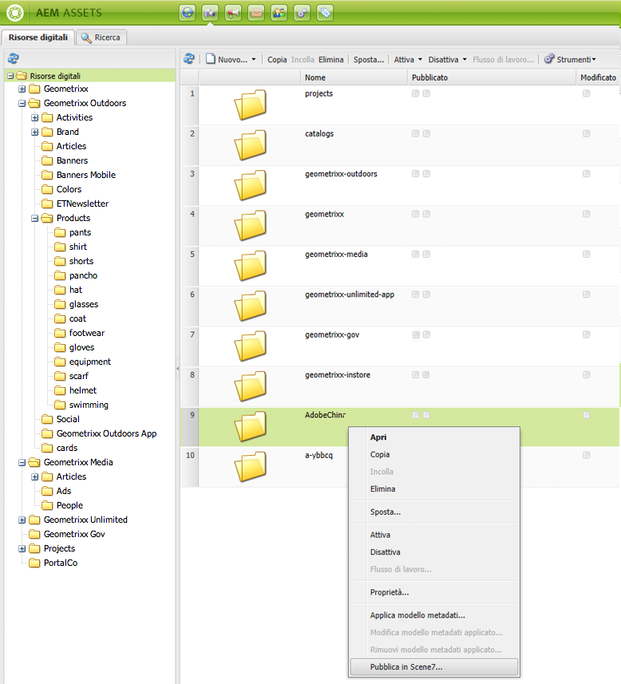

1. Passate ad Dynamic Media Classic e verificate che le risorse siano disponibili.

   >[!NOTE]
   >
   >If the assets are not in a Dynamic Media Classic synchronized folder, **[!UICONTROL Publish to Dynamic Media Classic]** in both menus is visible but disabled.

### Pubblicazione da una risorsa {#publishing-from-an-asset}

Potete pubblicare manualmente una risorsa purché sia ubicata all’interno della cartella sincronizzata di Dynamic Media Classic.

>[!NOTE]
>
>Se la risorsa non si trova nella cartella sincronizzata Dynamic Media Classic, il collegamento **[!UICONTROL Pubblica in Dynamic Media Classic]** non è disponibile.

**Per pubblicare contenuti in Dynamic Media Classic direttamente da una risorsa** digitale:

1. In AEM, fai clic su **[!UICONTROL Risorse digitali]** per accedere al manager di risorse digitali.

1. Fai doppio clic per aprire una risorsa.

1. Nel riquadro dei dettagli delle risorse, selezionate **[!UICONTROL Pubblica in Dynamic Media Classic]**.

   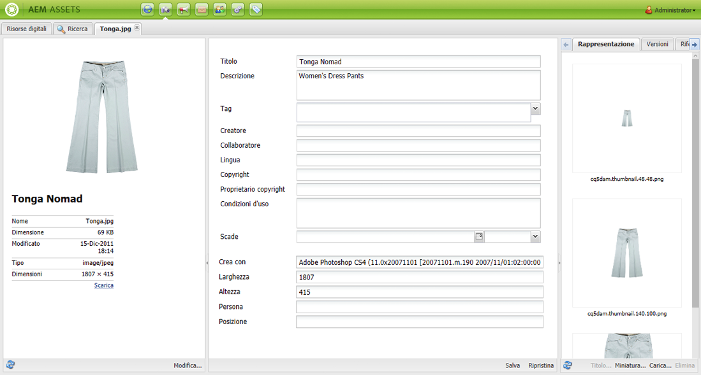

1. Il collegamento diventa **[!UICONTROL Pubblicazione...]** e quindi **[!UICONTROL Pubblicato]**. Andate ad Dynamic Media Classic e confermate che la risorsa sia disponibile.

   >[!NOTE]
   >
   >If the asset does not publish properly to Dynamic Media Classic, the link changes to **[!UICONTROL Publishing Failed]**. Se la risorsa è già stata pubblicata in Dynamic Media Classic, il collegamento è **[!UICONTROL Ripubblica in Dynamic Media Classic]**. La ripubblicazione consente di apportare modifiche a una risorsa in AEM e di ripubblicarla.

### Publishing assets from outside the CQ target folder {#publishing-assets-from-outside-the-cq-target-folder}

Adobe consiglia di pubblicare le risorse in Dynamic Media Classic solo dalle risorse presenti nella cartella di destinazione di Dynamic Media Classic. However, if you need to upload assets from a folder outside of the target folder, you can still do that by uploading them to an *ad-hoc* folder on Dynamic Media Classic.

A tale scopo, configura la configurazione Cloud per la pagina in cui apparirà la risorsa. Quindi aggiungete un componente Dynamic Media Classic alla pagina e trascinate e rilasciate una risorsa sul componente. After the page properties are set for that page, a **[!UICONTROL Publish to Dynamic Media Classic]** link appears that when selected triggers uploading to Dynamic Media Classic.

>[!NOTE]
>
>Le risorse che si trovano nella cartella ad hoc non vengono visualizzate nel browser del contenuto di Dynamic Media Classic.

**Per pubblicare le risorse che risiedono al di fuori della cartella di destinazione di CQ**:

1. In AEM in the classic UI, click **[!UICONTROL Websites]** and navigate to the web page that you want to add a digital asset to that is not yet published to Dynamic Media Classic. (Si applicano le normali regole di ereditarietà delle pagine.)

1. In the sidekick, click the **[!UICONTROL Page]** icon, then click **[!UICONTROL Page Properties]**.

1. Fate clic su **[!UICONTROL Cloud Services > Aggiungi servizi > Dynamic Media Classic (Scene7)**.
1. Nell’elenco a discesa Adobe Dynamic Media Classic, selezionate la configurazione desiderata, quindi fate clic su **[!UICONTROL OK]**.

   

1. Nella pagina Web, aggiungete un componente Dynamic Media Classic (Scene7) nella posizione desiderata sulla pagina.
1. Dal Content Finder, trascina una risorsa digitale sul componente. Viene visualizzato un collegamento per **[!UICONTROL verificare lo stato]** di pubblicazione di Dynamic Media Classic.

   >[!NOTE]
   >
   >If the digital asset is in the CQ target folder, then no link to **[!UICONTROL Check Dynamic Media Classic Publication Status]** appears. Le risorse sono semplicemente inserite nel componente.

   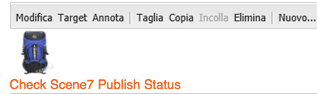

1. Fate clic su **[!UICONTROL Controlla stato]** pubblicazione Dynamic Media Classic. Se la risorsa non è pubblicata, AEM la pubblica in Dynamic Media Classic. Dopo il caricamento, la risorsa si trova nella cartella ad-hoc. Per impostazione predefinita, la cartella ad hoc si trova nella cartella `name_of_the_company/CQ5_adhoc`. Se necessario, [è possibile configurarla](#configuringtheadhocfolder).

   >[!NOTE]
   >
   >Se la risorsa non si trova in una cartella sincronizzata Dynamic Media Classic e alla pagina corrente non è associata alcuna configurazione cloud Dynamic Media Classic, il caricamento non riuscirà.

## Componenti Dynamic Media Classic (Scene7) {#scene-components}

In AEM sono disponibili i seguenti componenti Dynamic Media Classic:

* Zoom
* Zoom a comparsa
* Modello immagini
* Immagine
* Video

>[!NOTE]
>
>These components are not available by default and need to be selected in **[!UICONTROL Design]** mode before using.

After they are made available in **[!UICONTROL Design]** mode, you can add the components to your page like any other AEM component. Le risorse non ancora pubblicate in Dynamic Media Classic vengono pubblicate in Dynamic Media Classic se si trovano in una cartella sincronizzata o su una pagina o con una configurazione cloud Dynamic Media Classic.

### Flash viewers end-of-life notice {#flash-viewers-end-of-life-notice}

A partire dal 31 gennaio 2017, Adobe Dynamic Media Classic ha dichiarato ufficialmente terminato il supporto per la piattaforma di visualizzatori Flash.

For more information about this important change, see [Flash viewer end-of-life FAQs](https://docs.adobe.com/content/docs/en/aem/6-1/administer/integration/marketing-cloud/scene7/flash-eol.html).

### Adding a Dynamic Media Classic component to a page {#adding-a-scene-component-to-a-page}

L’aggiunta di un componente Dynamic Media Classic a una pagina equivale all’aggiunta di un componente a qualsiasi pagina. I componenti di Dynamic Media Classic sono descritti dettagliatamente nelle sezioni seguenti.

**Per aggiungere un componente/visualizzatore Dynamic Media Classic a una pagina nell’interfaccia** classica:

1. In AEM, aprite la pagina in cui desiderate aggiungere il componente Dynamic Media Classic.

1. If no Dynamic Media Classic components are available, click the ruler in the sidekick to enter **[!UICONTROL Design]** mode, click **[!UICONTROL Edit]** parsys, and select all the **[!UICONTROL Dynamic Media Classic]** components to make them available.

1. Return to **[!UICONTROL Edit]** mode by clicking the pencil in the sidekick.

1. Drag a component from the **[!UICONTROL Dynamic Media Classic]** group in the sidekick onto the page in the desired location.

1. Fai clic su **[!UICONTROL Modifica]** per aprire il componente.

1. Se necessario, modifica il componente, quindi fai clic su **[!UICONTROL OK]** per salvare le modifiche.

### Aggiunta di esperienze di visualizzazione interattive a un sito web reattivo {#adding-interactive-viewing-experiences-to-a-responsive-website}

Una progettazione reattiva per le risorse significa che queste si adattano a seconda di dove vengono visualizzate. Con la progettazione reattiva, le stesse risorse vengono visualizzate in modo efficace su più dispositivi.

**Per aggiungere un’esperienza di visualizzazione interattiva a un sito reattivo nell’interfaccia classica**:

1. Log in to AEM, and ensure that you have [configured Adobe Dynamic Media Classic Cloud Services](/help/sites-administering/scene7.md#configuring-scene-integration) and that Dynamic Media Classic components are available.

   >[!NOTE]
   >
   >Se i componenti Dynamic Media Classic WCM non sono disponibili, accertatevi di attivarli in modalità **[!UICONTROL Design] .

1. In a website with the Dynamic Media Classic components enabled, drag an **[!UICONTROL Image]** viewer to the page.
1. Edit the component and adjust the breakpoints in the **[!UICONTROL Dynamic Media Classic Settings]** tab.

   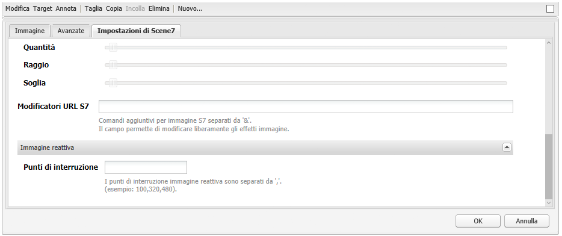

1. Verifica che i visualizzatori si ridimensionino in modo reattivo e che tutte le interazioni siano ottimizzate per desktop, tablet e dispositivi mobili.

### Impostazioni comuni a tutti i componenti Dynamic Media Classic {#settings-common-to-all-scene-components}

Anche se le opzioni di configurazione variano, quanto segue è comune a tutti i componenti di Dynamic Media Classic:

* **[!UICONTROL File di riferimento]**: consente di individuare un file a cui fare riferimento. Il riferimento al file mostra l’URL della risorsa e non necessariamente l’URL completo di Dynamic Media Classic, inclusi i comandi e i parametri dell’URL. In questo campo non è possibile aggiungere parametri e comandi URL di Dynamic Media Classic. che devono essere aggiunti attraverso la funzionalità corrispondente nel componente.
* **[!UICONTROL Larghezza]**: consente di impostare la larghezza.
* **[!UICONTROL Altezza]**: consente di impostare l’altezza.

You set these configuration options by double-clicking a Dynamic Media Classic component, for example, when you open a **[!UICONTROL Zoom]** component:

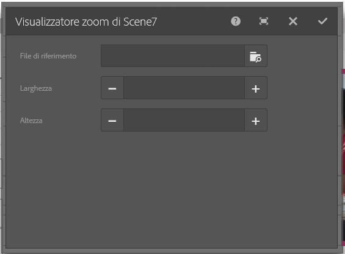

### Zoom {#zoom}

Il componente Zoom HTML5 visualizza un’immagine più grande quando si preme il pulsante +.

La risorsa dispone di strumenti di zoom nella parte inferiore. Fai clic su **[!UICONTROL +]** per ingrandire. Fai clic su **[!UICONTROL -]** per ridurre. Clicking **[!UICONTROL x]** or the reset zoom arrow brings the image back to the original size it was imported as. Fai clic sulle frecce diagonali per renderla a schermo intero. Fai clic su **[!UICONTROL Modifica]** per configurare il componente. With this component, you can configure [settings common to all Dynamic Media Classic components](#settings-common-to-all-scene-components).

### A comparsa {#flyout}

Nel componente A comparsa HTML5, la risorsa viene visualizzata come schermo diviso; a sinistra la risorsa nelle dimensioni specificate; a destra viene visualizzata la porzione di zoom. Fai clic su **[!UICONTROL Modifica]** per configurare il componente. With this component, you can configure [settings common to all Dynamic Media Classic components](/help/sites-administering/scene7.md#settingscommontoalldynamicmediaclassiccomponents).

>[!NOTE]
>
>Se il componente A comparsa utilizza una dimensione personalizzata, viene utilizzata tale dimensione e la configurazione reattiva del componente viene disabilitata.
>
>If your Flyout component uses the default size, as set in the [!UICONTROL Design] view, then the default size is used and the component stretches to accomodate the page layout size with responsive setup of the component enabled. Tuttavia, tenete presente che esiste un limite alla configurazione reattiva del componente. Quando si utilizza il componente A comparsa con un’impostazione reattiva, non utilizzarlo con dilatazione sull’intera pagina. In caso contrario, il riquadro a comparsa potrebbe estendersi oltre il bordo destro della pagina.

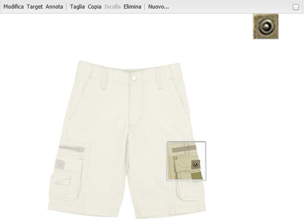

### Immagine {#image}

Il componente Immagine classica di Dynamic Media consente di aggiungere alle immagini funzionalità di Dynamic Media Classic, ad esempio modificatori Dynamic Media Classic, predefiniti per immagini o visualizzatori e nitidezza. Il componente immagine Dynamic Media Classic è simile ad altri componenti immagine in AEM con funzionalità speciali di Dynamic Media Classic. In questo esempio, all’immagine è `&op_invert=1` applicato il modificatore URL Dynamic Media Classic.

**[!UICONTROL Titolo, Testo]** Alt - Nella scheda [!UICONTROL Avanzate] , aggiungere un titolo all’immagine e testo alternativo per gli utenti che hanno disattivato la grafica.

**[!UICONTROL URL, Apri in]** - Puoi impostare una risorsa da cui aprire un collegamento. Set the **[!UICONTROL URL]** and **[!UICONTROL Open in]** to indicate whether you want it to open in the same window or a new window.

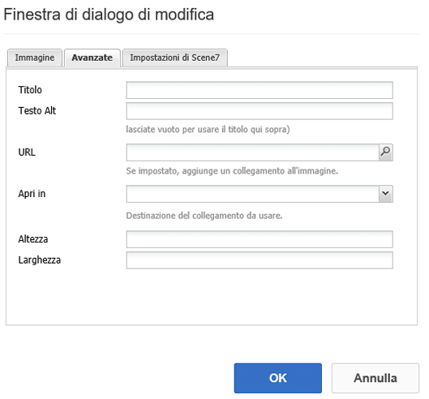

**[!UICONTROL Predefinito]** visualizzatore - Selezionate un predefinito esistente dal menu a discesa. Se il predefinito per visualizzatori che cerchi non è visibile, potrebbe essere necessario renderlo visibile. Consulta [Gestione dei predefiniti per visualizzatori](/help/assets/managing-viewer-presets.md). Non è possibile selezionare un predefinito per visualizzatori se si utilizza un predefinito per immagini, e viceversa.

**[!UICONTROL Configurazione]** Dynamic Media Classic - Selezionate la configurazione Dynamic Media Classic da usare per recuperare i predefiniti per immagini attivi da Scene7 Publishing System.

**[!UICONTROL Predefinito]** immagine - Selezionate un predefinito per immagini esistente dal menu a discesa. Se il predefinito per immagini che cerchi non è visibile, potrebbe essere necessario renderlo visibile. Consulta [Gestione dei predefiniti per immagini](/help/assets/managing-image-presets.md). Non è possibile selezionare un predefinito per visualizzatori se si utilizza un predefinito per immagini, e viceversa.

**[!UICONTROL Formato]** di output - Selezionare il formato di output dell&#39;immagine, ad esempio jpeg. A seconda del formato di output selezionato, è possibile che siano disponibili ulteriori opzioni di configurazione. Consulta [Gestione dei predefiniti per immagini](/help/assets/managing-image-presets.md).

**[!UICONTROL Nitidezza]** - Selezionate la modalità di nitidezza dell’immagine. La nitidezza viene spiegata dettagliatamente in [*Adobe Dynamic Media Classic Image Quality e nelle procedure *](/help/assets/assets/s7_sharpening_images.pdf)consigliate per la nitidezza.

**[!UICONTROL Modificatori]** URL - Potete modificare gli effetti immagine fornendo ulteriori comandi immagine Dynamic Media Classic. These are described in [Managing Image Presets](/help/assets/managing-image-presets.md) and the [Command reference](https://docs.adobe.com/content/help/en/dynamic-media-developer-resources/image-serving-api/image-serving-api/http-protocol-reference/command-reference/c-command-reference.html).

**[!UICONTROL Punti di interruzione]** - Se il sito Web è reattivo, è necessario regolare i punti di interruzione. I punti di interruzione devono essere separati da virgole `,`.

### Modello immagini {#image-template}

[I modelli](https://help.adobe.com/en_US/scene7/using/WS60B68844-9054-4099-BF69-3DC998A04D3C.html) immagine classici di Dynamic Media sono contenuti Photoshop a più livelli importati in Dynamic Media Classic, dove il contenuto e le proprietà erano parametrizzati per la variabilità. Il componente **[!UICONTROL Modello immagini]** consente di importare immagini e modificare il testo in modo dinamico in AEM. Inoltre, è possibile configurare il componente **[!UICONTROL Modello immagini]** in modo che utilizzi valori contestuali ClientContext, affinché ogni utente possa avere un’esperienza personalizzata dell’immagine.

Fai clic su **[!UICONTROL Modifica]** per configurare il componente. You can configure [settings common to all Dynamic Media Classic components](/help/sites-administering/scene7.md#settingscommontoalldynamicmediaclassicscomponents) as well as other settings described in this section.

**[!UICONTROL Riferimento file, Larghezza, Altezza]** - Vedere le impostazioni comuni a tutti i componenti Dynamic Media Classic.

>[!NOTE]
>
>I comandi e i parametri URL di Dynamic Media Classic non possono essere aggiunti direttamente all’URL di riferimento del file. Possono essere definiti solo nell’interfaccia utente del componente del pannello **[!UICONTROL Parametri]**.

**[!UICONTROL Titolo, Testo]** Alt Nella scheda Modello [!UICONTROL immagine] Dynamic Media Classic aggiungere un titolo all’immagine e testo alternativo per gli utenti che hanno disattivato la grafica.

**[!UICONTROL URL, Apri in]** È possibile impostare una risorsa da cui aprire un collegamento. Imposta l’**[!UICONTROL URL]** e in **[!UICONTROL Apri in]** indica se desideri aprirlo nella stessa finestra o in una nuova finestra.

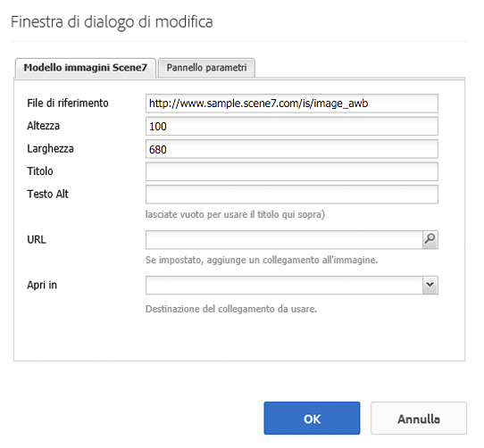

**[!UICONTROL Pannello]** Parametri Quando importate un’immagine, i parametri vengono precompilati con le informazioni dell’immagine. Se non vi sono contenuti modificabili dinamicamente, questa finestra è vuota.

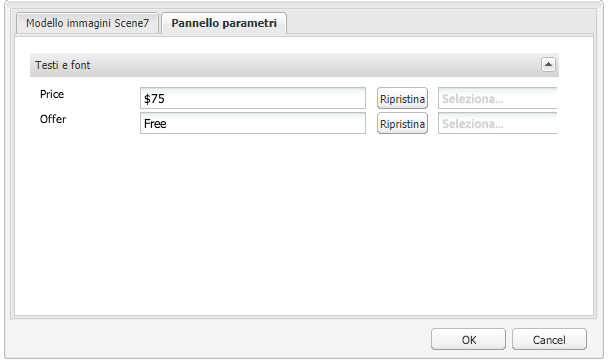

#### Modifica dinamica del testo {#changing-text-dynamically}

Per modificare il testo in modo dinamico, immetti un nuovo testo nei campi e fai clic su **[!UICONTROL OK]**. In questo esempio, il **[!UICONTROL Prezzo]** è ora di $50 e la spedizione è di 99 centesimi.

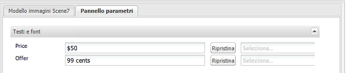

Il testo nell’immagine cambia. Per ripristinare il testo al valore originale, fai clic su **[!UICONTROL Ripristina]** accanto al campo.

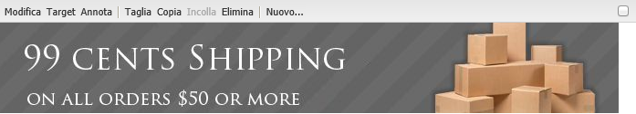

#### Modifica del testo in base a un valore personalizzato ClientContext {#changing-text-to-reflect-the-value-of-a-client-context-value}

To link a field to a client context value, click **[!UICONTROL Select]** to open the client-context menu, select the client context, and click **[!UICONTROL OK]**. In questo esempio, il nome cambia perché è collegato al nome formattato nel profilo.

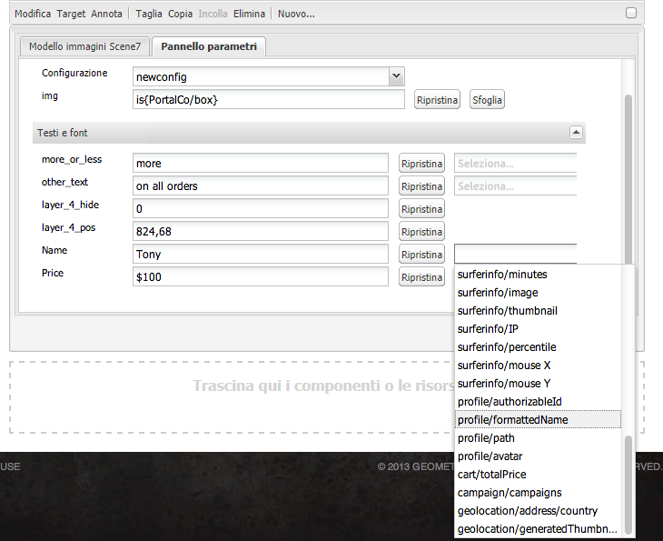

Il testo si aggiorna con il nome dell’utente attualmente connesso. Per ripristinare il testo al valore originale, fai clic su **[!UICONTROL Ripristina]** accanto al campo.

#### Come rendere il modello di immagine Dynamic Media Classic un collegamento {#making-the-scene-image-template-a-link}

**Per rendere il modello di immagine Dynamic Media Classic un collegamento**:

1. On the page with the Dynamic Media Classic image template component, click **[!UICONTROL Edit]**.
1. Nel campo **[!UICONTROL URL]**, immetti l’URL a cui gli utenti verranno indirizzati quando fanno clic sull’immagine. In the **[!UICONTROL Open in]** field, select whether you want the target to open (a new window or same window).

   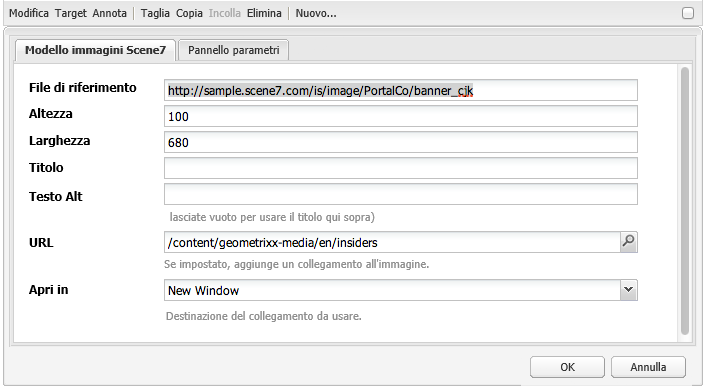

1. Fai clic su **[!UICONTROL OK]**.

### Componente video {#video-component}

The Dynamic Media Classic **[!UICONTROL Video]** component (available from the Dynamic Media Classic section of the sidekick) uses device and bandwidth detection to serve the right video to each screen. Questo componente è un lettore video HTML5; è un singolo visualizzatore che può essere usato su più canali.

Può essere usato per set video adattivi, un singolo video MP4 o un singolo video F4V.

See [Video](/help/sites-classic-ui-authoring/manage-assets-classic-s7-video.md) for more information on how videos work with Dynamic Media Classic integration. In addition, see how [the **Dynamic Media Classic video** component compares to the foundation **video** component](/help/sites-classic-ui-authoring/manage-assets-classic-s7-video.md).

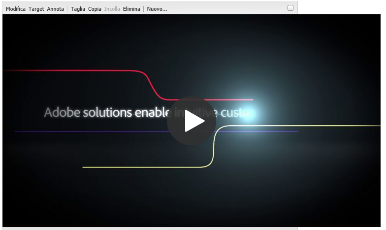

### Limitazioni note per il componente video {#known-limitations-for-the-video-component}

Adobe DAM e WCM mostrano se è stato caricato un video principale. Non mostrano queste risorse proxy:

* Rappresentazioni codificate di Dynamic Media Classic
* Set video adattivi Dynamic Media Classic

Quando usate un set video adattivo con il componente video Dynamic Media Classic, dovete ridimensionare il componente per adattarlo alle dimensioni del video.

## Browser dei contenuti Dynamic Media Classic {#scene-content-browser}

Il browser Dynamic Media Classic consente di visualizzare i contenuti da Dynamic Media Classic direttamente in AEM. To access the content browser, in the Content Finder, select **[!UICONTROL Dynamic Media Classic]** in the touch-optimized user interface or the **[!UICONTROL S7]** icon in the classic user interface. La funzionalità è identica nelle due interfacce utente.

Se si dispone di più configurazioni, per impostazione predefinita AEM visualizza la [configurazione predefinita](/help/sites-administering/scene7.md#configuring-a-default-configuration). Puoi selezionare diverse configurazioni direttamente nel browser del contenuto di Dynamic Media Classic nel menu a discesa.

>[!NOTE]
>
>* Le risorse che si trovano nella cartella ad hoc non vengono visualizzate nel browser del contenuto di Dynamic Media Classic.
>* Quando Anteprima [protetta è abilitata](/help/sites-administering/scene7.md#configuring-the-state-published-unpublished-of-assets-pushed-to-scene), le risorse pubblicate e non pubblicate in Dynamic Media Classic vengono visualizzate nel browser dei contenuti di Dynamic Media Classic.
>* If you do not see **[!UICONTROL Dynamic Media Classic]** or the **[!UICONTROL S7]** icon as an option in the content browser, you need to [configure Dynamic Media Classic to work with AEM](/help/sites-administering/scene7.md).

   >
   >
* Per i video, il browser del contenuto Dynamic Media Classic supporta:
   >
   >
* Set di video adattivo: contenitore di tutte le rappresentazioni video necessarie per consentirne la riproduzione su diversi tipi di schermi
>* Video MP4 singolo
>* Video F4V singolo

### Navigazione dei contenuti nell’interfaccia classica {#browsing-content-in-the-classic-ui}

Sfogliate il contenuto in Dynamic Media Classic facendo clic sulla scheda **[!UICONTROL S7]** .

Per modificare la configurazione a cui accedete, selezionate la configurazione. Le cartelle cambiano a seconda della configurazione selezionata.

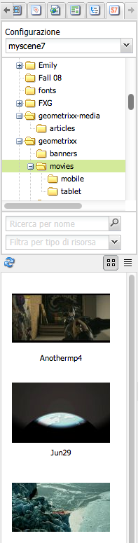

Come per il Content Finder di Assets, è possibile cercare le risorse e filtrare i risultati. Tuttavia, a differenza del finder di Assets, quando si immette una parola chiave nella scheda **[!UICONTROL S7]**, il nome del file *inizia con* la stringa immessa, anziché *contenere* la parola chiave nel nome del file.

Per impostazione predefinita, le risorse vengono visualizzate per nome di file. È anche possibile filtrare i risultati per tipo di risorsa.

>[!NOTE]
>
>Per i video, il browser di contenuti Dynamic Media Classic di WCM supporta:
>
>* Set di video adattivo: contenitore di tutte le rappresentazioni video necessarie per consentirne la riproduzione su diversi tipi di schermi
>* Video MP4 singolo
>* Video F4V singolo

>

### Ricerca di risorse Dynamic Media Classic con il browser dei contenuti {#searching-for-scene-assets-with-the-content-browser}

La ricerca di risorse Dynamic Media Classic è simile alla ricerca di risorse AEM, ma quando effettuate una ricerca viene visualizzata una visualizzazione remota delle risorse nel sistema Dynamic Media Classic, anziché importarle direttamente in AEM.

Per visualizzare e cercare le risorse è possibile utilizzare l’interfaccia touch o classica. A seconda dell’interfaccia, la modalità di ricerca è leggermente diversa.

Durante la ricerca in una qualsiasi delle interfacce utente, è possibile filtrare in base ai seguenti criteri (mostrati qui nell’interfaccia touch):

**[!UICONTROL Inserite le parole chiave]** : potete cercare le risorse per nome. Durante la ricerca, immetti le parole chiave con cui inizia il nome del file. Ad esempio, se digiti la parola “nuoto” verranno cercati i nomi dei file delle risorse che iniziano con queste lettere, in questo ordine. Assicurati di fare clic su Invia dopo aver digitato il termine per trovare la risorsa.

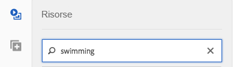

**[!UICONTROL Cartella/percorso]** - Il nome della cartella visualizzata si basa sulla configurazione selezionata. Per passare alle cartelle di livello inferiore, fai clic sull’icona della cartella e seleziona una sottocartella, quindi fai clic sul segno di spunta per selezionarla.

Se si immette una parola chiave e si seleziona una cartella, AEM esegue la ricerca in tale cartella e in tutte le relative sottocartelle. Tuttavia, se non si immettono parole chiave durante la ricerca, la selezione della cartella mostrerà solo le risorse in quella cartella, senza includere le sottocartelle.

Per impostazione predefinita, AEM cerca nella cartella selezionata e in tutte le sue sottocartelle.

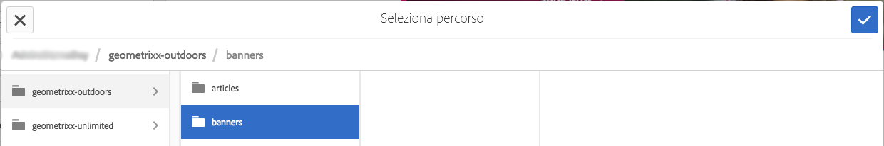

**[!UICONTROL Tipo di risorsa]** Selezionate Dynamic Media Classic per sfogliare il contenuto di Dynamic Media Classic. Questa opzione è disponibile solo se avete già configurato Dynamic Media Classic.

**[!UICONTROL Configurazione]** Se hai più di una configurazione Dynamic Media Classic definita in [!UICONTROL Cloud Services], puoi selezionarla qui. Di conseguenza, la cartella cambierà in base alla configurazione scelta.

**[!UICONTROL Tipo]** di risorsa Nel browser Dynamic Media Classic potete filtrare i risultati in modo da includere i seguenti elementi: immagini, modelli, video e set video adattivi. Se non si seleziona alcun tipo di risorsa, per impostazione predefinita AEM ricerca tutti i tipi di risorsa.

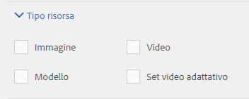

>[!NOTE]
>
>* Durante la ricerca di video, si cerca una singola rappresentazione. I risultati restituiscono la rappresentazione originale (solo &amp;ast;.mp4) e la rappresentazione codificata.
>* Quando eseguite una ricerca in un set video adattivo, state cercando la cartella e tutte le sottocartelle, ma solo se avete aggiunto una parola chiave alla ricerca. Se non hai aggiunto una parola chiave, AEM non cerca nelle sottocartelle.

>

**[!UICONTROL Stato]** pubblicazione Potete filtrare le risorse in base allo stato di pubblicazione: [!UICONTROL Pubblicato] o [!UICONTROL Non pubblicato]. If you do not select any [!UICONTROL Publish status], AEM by default searches all publish statuses.

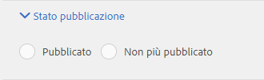

