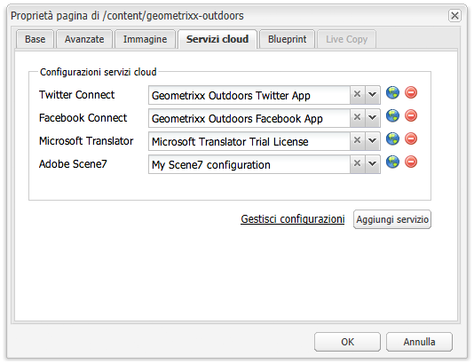

# Aggiunta di funzionalità di Dynamic Media Classic alla pagina{#adding-scene-features-to-your-page}

>[!CAUTION]
>
>AEM 6.4 ha raggiunto la fine del supporto esteso e questa documentazione non viene più aggiornata. Per maggiori dettagli, consulta la nostra [periodi di assistenza tecnica](https://helpx.adobe.com/it/support/programs/eol-matrix.html). Trova le versioni supportate [qui](https://experienceleague.adobe.com/docs/).

Adobe Dynamic Media Classic è una soluzione in hosting per la gestione, l’ottimizzazione, la pubblicazione e la distribuzione di risorse multimediali sul web, su dispositivi mobili, e-mail, schermi collegati a Internet e la stampa.

Puoi visualizzare AEM risorse pubblicate in Dynamic Media Classic in diversi visualizzatori:

* Zoom
* A comparsa
* Video
* Modello immagini
* Immagine

Puoi pubblicare risorse digitali direttamente da AEM a Dynamic Media Classic e le risorse digitali da Dynamic Media Classic a AEM.

Questa sezione descrive come pubblicare risorse digitali da AEM a Dynamic Media Classic e viceversa. Vengono inoltre descritti in dettaglio i visualizzatori. Per informazioni sulla configurazione di AEM per Dynamic Media Classic, consulta [Integrazione di Dynamic Media Classic con AEM](/help/sites-administering/scene7.md).

Vedi anche [Aggiunta di mappe immagine](/help/assets/image-maps.md).

Per ulteriori informazioni sull’utilizzo dei componenti video con AEM, consulta:

* [Video](/help/sites-classic-ui-authoring/manage-assets-classic-s7-video.md)

>[!NOTE]
>
>Se le risorse Dynamic Media Classic non vengono visualizzate correttamente, assicurati che gli elementi multimediali dinamici siano [disattivato](/help/assets/config-dynamic.md#disabling-dynamic-media) e quindi aggiorna la pagina.

## Pubblicazione manuale in Dynamic Media Classic da Assets {#manually-publishing-to-scene-from-assets}

Puoi pubblicare risorse digitali in Dynamic Media Classic dalla console Assets nell’interfaccia classica o direttamente dalla risorsa.

>[!NOTE]
>
>AEM pubblicato in Dynamic Media Classic in modo asincrono. Dopo aver fatto clic su **[!UICONTROL Pubblica]** La pubblicazione della risorsa in Dynamic Media Classic potrebbe richiedere alcuni secondi.

### Pubblicazione dalla console Assets {#publishing-from-the-assets-console}

Per pubblicare in Dynamic Media Classic dalla console Risorse se le risorse si trovano in una cartella di destinazione Dynamic Media Classic:

1. Nell’interfaccia classica AEM, fai clic su **[!UICONTROL Risorse digitali]** per accedere al manager di risorse digitali.

1. Seleziona la risorsa (o le risorse) o la cartella all’interno della cartella di destinazione da pubblicare in Dynamic Media Classic, fai clic con il pulsante destro del mouse e seleziona **[!UICONTROL Pubblicare su Dynamic Media Classic]**. In alternativa, è possibile selezionare **[!UICONTROL Pubblicare su Dynamic Media Classic]** dal **[!UICONTROL Strumenti]** menu.

   

1. Vai a Dynamic Media Classic e conferma che le risorse sono disponibili.

   >[!NOTE]
   >
   >Se le risorse non si trovano in una cartella sincronizzata di Dynamic Media Classic, **[!UICONTROL Pubblicare su Dynamic Media Classic]** in entrambi i menu è visibile ma disabilitato.

### Pubblicazione da una risorsa {#publishing-from-an-asset}

Puoi pubblicare manualmente una risorsa purché si trovi nella cartella Dynamic Media Classic sincronizzata.

>[!NOTE]
>
>Se la risorsa non si trova nella cartella sincronizzata di Dynamic Media Classic, il collegamento a **[!UICONTROL Pubblicare su Dynamic Media Classic]** non è disponibile.

**Per pubblicare su Dynamic Media Classic direttamente da una risorsa digitale**:

1. In AEM, fai clic su **[!UICONTROL Risorse digitali]** per accedere al manager di risorse digitali.

1. Fate doppio clic per aprire una risorsa.

1. Nel riquadro dei dettagli delle risorse, seleziona **[!UICONTROL Pubblicare su Dynamic Media Classic]**.

   

1. Il collegamento diventa **[!UICONTROL Pubblicazione in corso...]** e poi **[!UICONTROL Pubblicato]**. Vai su Dynamic Media Classic e conferma che la risorsa è disponibile.

   >[!NOTE]
   >
   >Se la risorsa non viene pubblicata correttamente in Dynamic Media Classic, il collegamento diventa **[!UICONTROL Pubblicazione non riuscita]**. Se la risorsa è già stata pubblicata su Dynamic Media Classic, il collegamento legge **[!UICONTROL Ripubblicazione in Dynamic Media Classic]**. La ripubblicazione consente di apportare modifiche a una risorsa in AEM e di ripubblicarle.

### Pubblicazione di risorse dall’esterno della cartella di destinazione CQ {#publishing-assets-from-outside-the-cq-target-folder}

Adobe consiglia di pubblicare le risorse in Dynamic Media Classic solo dalle risorse presenti nella cartella di destinazione di Dynamic Media Classic. Tuttavia, se devi caricare le risorse da una cartella esterna a quella di destinazione, puoi comunque farlo caricandole in un *ad hoc* in Dynamic Media Classic.

Per farlo, configura la configurazione Cloud per la pagina in cui apparirà la risorsa. Quindi aggiungi un componente Dynamic Media Classic alla pagina e trascina e rilascia una risorsa sul componente. Dopo aver impostato le proprietà della pagina per quella pagina, un **[!UICONTROL Pubblicare su Dynamic Media Classic]** viene visualizzato un collegamento che, se selezionato, attiva il caricamento in Dynamic Media Classic.

>[!NOTE]
>
>Le risorse che si trovano nella cartella ad-hoc non vengono visualizzate nel browser dei contenuti di Dynamic Media Classic.

**Per pubblicare risorse che risiedono al di fuori della cartella di destinazione di CQ**:

1. In AEM nell’interfaccia classica, fai clic su **[!UICONTROL Siti Web]** e passa alla pagina web alla quale desideri aggiungere una risorsa digitale non ancora pubblicata in Dynamic Media Classic. (Si applicano le normali regole di ereditarietà delle pagine.)

1. Nella barra laterale, fai clic sul pulsante **[!UICONTROL Pagina]** icona, quindi fai clic su **[!UICONTROL Proprietà pagina]**.

1. Fai clic su **[!UICONTROL Cloud Services] > [!UICONTROL Aggiungi servizi] > [!UICONTROL Dynamic Media Classic (Scene7)]**.
1. Nell’elenco a discesa Adobe Dynamic Media Classic , seleziona la configurazione desiderata, quindi fai clic su **[!UICONTROL OK]**.

   

1. Nella pagina web, aggiungi un componente Dynamic Media Classic (Scene7) nella posizione desiderata sulla pagina.
1. Da Content Finder, trascina una risorsa digitale sul componente. Viene visualizzato un collegamento a **[!UICONTROL Verifica lo stato di pubblicazione di Dynamic Media Classic]**.

   >[!NOTE]
   >
   >Se la risorsa digitale si trova nella cartella di destinazione di CQ, nessun collegamento a **[!UICONTROL Verifica lo stato di pubblicazione di Dynamic Media Classic]** appare. Le risorse vengono semplicemente inserite nel componente .

   

1. Fai clic su **[!UICONTROL Verifica lo stato di pubblicazione di Dynamic Media Classic]**. Se la risorsa non viene pubblicata, AEM la pubblica in Dynamic Media Classic. Dopo il caricamento, la risorsa si trova nella cartella ad-hoc . Per impostazione predefinita, la cartella ad-hoc si trova nella cartella `name_of_the_company/CQ5_adhoc`. È possibile [configuralo, se necessario](#configuringtheadhocfolder).

   >[!NOTE]
   >
   >Se la risorsa non si trova in una cartella sincronizzata di Dynamic Media Classic e alla pagina corrente non è associata alcuna configurazione cloud di Dynamic Media Classic, il caricamento avrà esito negativo.

## Componenti Dynamic Media Classic (Scene7) {#scene-components}

I seguenti componenti Dynamic Media Classic sono disponibili in AEM:

* Zoom
* A comparsa (zoom)
* Modello immagini
* Immagine
* Video

>[!NOTE]
>
>Questi componenti non sono disponibili per impostazione predefinita e devono essere selezionati in **[!UICONTROL Progettazione]** prima dell&#39;utilizzo.

Una volta resi disponibili in **[!UICONTROL Progettazione]** , puoi aggiungere i componenti alla pagina come qualsiasi altro componente AEM. Le risorse non ancora pubblicate in Dynamic Media Classic vengono pubblicate in Dynamic Media Classic se si trovano in una cartella sincronizzata, in una pagina o con una configurazione cloud di Dynamic Media Classic.

### Avviso di fine del ciclo di vita dei visualizzatori di Flash {#flash-viewers-end-of-life-notice}

Dal 31 gennaio 2017, Adobe Dynamic Media Classic ha ufficialmente terminato il supporto per la piattaforma di visualizzazione dei Flash.

### Aggiunta di un componente Dynamic Media Classic a una pagina {#adding-a-scene-component-to-a-page}

L’aggiunta di un componente Dynamic Media Classic a una pagina equivale all’aggiunta di un componente a qualsiasi pagina. I componenti Dynamic Media Classic sono descritti in dettaglio nelle sezioni seguenti.

**Per aggiungere un componente/visualizzatore Dynamic Media Classic a una pagina nell’interfaccia classica**:

1. In AEM, apri la pagina in cui desideri aggiungere il componente Dynamic Media Classic.

1. Se non sono disponibili componenti Dynamic Media Classic, fai clic sul righello nella barra laterale per accedere a **[!UICONTROL Progettazione]** modalità, fai clic su **[!UICONTROL Modifica]** parsys, quindi selezionare tutti i **[!UICONTROL Dynamic Media Classic]** componenti per renderli disponibili.

1. Torna a **[!UICONTROL Modifica]** facendo clic sulla matita nella barra laterale.

1. Trascina un componente dal **[!UICONTROL Dynamic Media Classic]** nella barra laterale sulla pagina nella posizione desiderata.

1. Fai clic su **[!UICONTROL Modifica]** per aprire il componente.

1. Modifica il componente come necessario e fai clic su **[!UICONTROL OK]** per salvare le modifiche.

### Aggiunta di esperienze di visualizzazione interattive a un sito web reattivo {#adding-interactive-viewing-experiences-to-a-responsive-website}

La progettazione reattiva delle risorse comporta che le risorse si adattino a seconda di dove vengono visualizzate. Con il design reattivo, le stesse risorse vengono visualizzate in modo efficace su più dispositivi.

**Per aggiungere un’esperienza di visualizzazione interattiva a un sito reattivo nell’interfaccia classica**:

1. Accedi a AEM e assicurati di [Cloud Services Adobe Dynamic Media Classic configurati](/help/sites-administering/scene7.md#configuring-scene-integration) e che i componenti Dynamic Media Classic sono disponibili.

   >[!NOTE]
   >
   >Se i componenti WCM di Dynamic Media Classic non sono disponibili, assicurati di abilitarli tramite **[!UICONTROL Progettazione] modalità.

1. In un sito web con i componenti Dynamic Media Classic abilitati, trascina un **[!UICONTROL Immagine]** visualizzatore sulla pagina.
1. Modifica il componente e regola i punti di interruzione nel **[!UICONTROL Impostazioni Dynamic Media Classic]** scheda .

   

1. Verifica che i visualizzatori si ridimensionino in modo reattivo e che tutte le interazioni siano ottimizzate per desktop, tablet e dispositivi mobili.

### Impostazioni comuni a tutti i componenti Dynamic Media Classic {#settings-common-to-all-scene-components}

Anche se le opzioni di configurazione variano, quanto segue è comune a tutti i componenti di Dynamic Media Classic:

* **[!UICONTROL Riferimento file]** - Individuare un file a cui si desidera fare riferimento. Il riferimento al file mostra l’URL della risorsa e non necessariamente l’URL completo di Dynamic Media Classic, inclusi i comandi e i parametri dell’URL. Non è possibile aggiungere comandi e parametri URL Dynamic Media Classic in questo campo. Devono essere aggiunti attraverso la funzionalità corrispondente nel componente.
* **[!UICONTROL Larghezza]** - Consente di impostare la larghezza.
* **[!UICONTROL Altezza]** - Consente di impostare l&#39;altezza.

Per impostare queste opzioni di configurazione, fai doppio clic su un componente Dynamic Media Classic, ad esempio, quando apri una **[!UICONTROL Zoom]** componente:

### Zoom {#zoom}

Il componente Zoom di HTML5 visualizza un’immagine più grande quando si preme il pulsante +.

La risorsa dispone di strumenti di zoom in basso. Fai clic su **[!UICONTROL +]** per ingrandire. Fai clic su **[!UICONTROL -]** ridurre. Clic **[!UICONTROL x]** oppure la freccia di reimpostazione dello zoom riporta l’immagine alle dimensioni originali in cui era stata importata. Fai clic sulle frecce diagonali per renderle a schermo intero. Fai clic su **[!UICONTROL Modifica]** per configurare il componente . Con questo componente puoi configurare [impostazioni comuni a tutti i componenti Dynamic Media Classic](#settings-common-to-all-scene-components).

### A comparsa {#flyout}

Nel componente a comparsa HTML5, la risorsa viene visualizzata come schermata divisa; ha lasciato la risorsa nella dimensione specificata; a destra viene visualizzata la parte dello zoom. Fai clic su **[!UICONTROL Modifica]** per configurare il componente . Con questo componente puoi configurare [impostazioni comuni a tutti i componenti Dynamic Media Classic](/help/sites-administering/scene7.md#settingscommontoalldynamicmediaclassiccomponents).

>[!NOTE]
>
>Se il componente a comparsa utilizza una dimensione personalizzata, questa viene utilizzata e la configurazione reattiva del componente viene disabilitata.
>
>Se il componente A comparsa utilizza le dimensioni predefinite, come impostato in [!UICONTROL Progettazione] visualizza , viene quindi utilizzata la dimensione predefinita e il componente si estende per adattarsi alle dimensioni del layout di pagina con l’impostazione reattiva del componente abilitata. Tieni presente, tuttavia, che esiste un limite alla configurazione reattiva del componente. Quando utilizzi il componente a comparsa con configurazione reattiva, non utilizzarlo con dilatazione pagina completa. In caso contrario, il riquadro a comparsa potrebbe estendersi oltre il bordo destro della pagina.

### Immagine {#image}

Il componente Immagine di Dynamic Media Classic consente di aggiungere funzionalità Dynamic Media Classic alle immagini, ad esempio modificatori Dynamic Media Classic, predefiniti per immagini o visualizzatori e nitidezza. Il componente immagine Dynamic Media Classic è simile ad altri componenti immagine in AEM con funzionalità Dynamic Media Classic speciali. In questo esempio, l’immagine ha il modificatore URL Dynamic Media Classic, `&op_invert=1` applicato.

**[!UICONTROL Titolo, Testo Alt]** - Nel [!UICONTROL Avanzate] , aggiungi un titolo all’immagine e il testo Alt per gli utenti che hanno disattivato la grafica.

**[!UICONTROL URL, Apri in]** - Puoi impostare una risorsa da per aprire un collegamento. Imposta la **[!UICONTROL URL]** e **[!UICONTROL Apri in]** per indicare se si desidera aprire nella stessa finestra o in una nuova finestra.

**[!UICONTROL Predefinito visualizzatore]** - Seleziona un predefinito per visualizzatori esistente dal menu a discesa. Se il predefinito per visualizzatori che stai cercando non è visibile, potrebbe essere necessario renderlo visibile. Vedi [Gestione dei predefiniti per visualizzatori](/help/assets/managing-viewer-presets.md). Non puoi selezionare un predefinito per visualizzatori se utilizzi un predefinito per immagini e viceversa.

**[!UICONTROL Configurazione Dynamic Media Classic]** - Seleziona la configurazione Dynamic Media Classic da utilizzare per recuperare i predefiniti immagine attivi da Scene7 Publishing System.

**[!UICONTROL Predefinito immagine]** - Seleziona un predefinito per immagini dal menu a discesa. Se il predefinito immagine che cerchi non è visibile, potrebbe essere necessario renderlo visibile. Vedi [Gestione dei predefiniti per immagini](/help/assets/managing-image-presets.md). Non puoi selezionare un predefinito per visualizzatori se utilizzi un predefinito per immagini e viceversa.

**[!UICONTROL Formato di uscita]** - Selezionare il formato di output dell&#39;immagine, ad esempio jpeg. A seconda del formato di output selezionato, potrebbero essere disponibili opzioni di configurazione aggiuntive. Vedi [Gestione dei predefiniti per immagini](/help/assets/managing-image-presets.md).

**[!UICONTROL Nitidezza]** - Selezionare la modalità di nitidezza dell&#39;immagine. La nitidezza viene spiegata in dettaglio [*Tecniche consigliate per la qualità delle immagini e la nitidezza di Adobe Dynamic Media Classic*](/help/assets/assets/sharpening_images.pdf).

**[!UICONTROL Modificatori URL]** - È possibile modificare gli effetti immagine fornendo ulteriori comandi immagine Dynamic Media Classic. Sono descritti in [Gestione dei predefiniti per immagini](/help/assets/managing-image-presets.md) e [Riferimento comando](https://experienceleague.adobe.com/docs/dynamic-media-developer-resources/image-serving-api/image-serving-api/http-protocol-reference/command-reference/c-command-reference.html).

**[!UICONTROL Punti di interruzione]** - Se il sito web è reattivo, è necessario regolare i punti di interruzione. I punti di interruzione devono essere separati da virgole `,`.

### Modello immagini {#image-template}

[Modelli immagine Dynamic Media Classic](https://experienceleague.adobe.com/docs/dynamic-media-classic/using/template-basics/quick-start-template-basics.html#template-basics) sono contenuti Photoshop a più livelli importati in Dynamic Media Classic, dove il contenuto e le proprietà sono stati parametrizzati per la variabilità. La **[!UICONTROL Modello immagini]** component consente ;di importare le immagini e modificare dinamicamente il testo in AEM. Inoltre, puoi configurare le **[!UICONTROL Modello immagini]** per utilizzare i valori del contesto client, in modo che ogni utente possa visualizzare l’immagine in modo personalizzato.

Fai clic su **[!UICONTROL Modifica]** per configurare il componente . Puoi configurare [impostazioni comuni a tutti i componenti Dynamic Media Classic](/help/sites-administering/scene7.md#settingscommontoalldynamicmediaclassicscomponents) nonché altre impostazioni descritte in questa sezione.

**[!UICONTROL Riferimento file, larghezza, altezza]** - Vedi le impostazioni comuni a tutti i componenti Dynamic Media Classic.

>[!NOTE]
>
>I comandi e i parametri URL di Dynamic Media Classic non possono essere aggiunti direttamente all’URL di riferimento del file. Possono essere definiti solo nell’interfaccia utente dei componenti nel **[!UICONTROL Parametro]** pannello.

**[!UICONTROL Titolo, Testo Alt]** In [!UICONTROL Modello immagini Dynamic Media Classic] , aggiungi un titolo all’immagine e il testo Alt per gli utenti che hanno disattivato la grafica.

**[!UICONTROL URL, Apri in]** Puoi impostare una risorsa da per aprire un collegamento. Imposta la **[!UICONTROL URL]** e **[!UICONTROL Apri in]** indicare se si desidera aprire nella stessa finestra o in una nuova finestra.

**[!UICONTROL Pannello Parametri]** Durante l’importazione di un’immagine, i parametri vengono precompilati con le informazioni provenienti dall’immagine. Se non è possibile modificare dinamicamente il contenuto, questa finestra è vuota.

#### Modifica dinamica del testo {#changing-text-dynamically}

Per modificare il testo in modo dinamico, immetti un nuovo testo nei campi e fai clic su **[!UICONTROL OK]**. In questo esempio, la **[!UICONTROL Prezzo]** ora è $50 e la spedizione è di 99 centesimi.

Il testo nell&#39;immagine cambia. Per ripristinare il testo al valore originale, fai clic su **[!UICONTROL Reimposta]** accanto al campo .

#### Modifica del testo per riflettere il valore di un valore di contesto client {#changing-text-to-reflect-the-value-of-a-client-context-value}

Per collegare un campo a un valore di contesto client, fai clic su **[!UICONTROL Seleziona]** per aprire il menu di scelta rapida ClientContext, seleziona il contesto client e fai clic su **[!UICONTROL OK]**. In questo esempio, il nome cambia in base al collegamento del Nome con il nome formattato nel profilo.

Il testo riflette il nome dell&#39;utente attualmente connesso. Per ripristinare il testo al valore originale, fai clic su **[!UICONTROL Reimposta]** accanto al campo .

#### Creazione di un collegamento al modello di immagine Dynamic Media Classic {#making-the-scene-image-template-a-link}

**Per fare del modello di immagine Dynamic Media Classic un collegamento**:

1. Nella pagina con il componente Modello immagini di Dynamic Media Classic, fai clic su **[!UICONTROL Modifica]**.
1. In **[!UICONTROL URL]** , immetti l’URL a cui gli utenti indirizzano quando fanno clic sull’immagine. In **[!UICONTROL Apri in]** selezionare se si desidera aprire la destinazione (una nuova finestra o una stessa finestra).

   

1. Fai clic su **[!UICONTROL OK]**.

### Componente video {#video-component}

Dynamic Media Classic **[!UICONTROL Video]** Il componente (disponibile nella sezione Dynamic Media Classic della barra laterale) utilizza il rilevamento del dispositivo e della larghezza di banda per distribuire il video corretto a ogni schermata. Questo componente è un lettore video HTML5; è un singolo visualizzatore che può essere utilizzato su più canali.

Può essere utilizzato per set video adattivi, per un singolo video MP4 o per un singolo video F4V.

Vedi [Video](/help/sites-classic-ui-authoring/manage-assets-classic-s7-video.md) per ulteriori informazioni sul funzionamento dei video con l’integrazione Dynamic Media Classic. Inoltre, vedi come [la **Video Dynamic Media Classic** confronto tra il componente e la base **video** component](/help/sites-classic-ui-authoring/manage-assets-classic-s7-video.md).

### Limitazioni note per il componente video {#known-limitations-for-the-video-component}

Adobe DAM e WCM mostra se un video principale viene caricato. Non mostrano queste risorse proxy:

* Rendering codificati in Dynamic Media Classic
* Set video adattivi Dynamic Media Classic

Quando utilizzi un set di video adattivo con il componente video Dynamic Media Classic, devi ridimensionare il componente per adattarlo alle dimensioni del video.

## Browser dei contenuti Dynamic Media Classic {#scene-content-browser}

Il browser dei contenuti Dynamic Media Classic consente di visualizzare i contenuti da Dynamic Media Classic direttamente in AEM. Per accedere al browser dei contenuti, in Content Finder seleziona **[!UICONTROL Dynamic Media Classic]** nell’interfaccia touch o nella **[!UICONTROL S7]** nell’interfaccia utente classica. La funzionalità è identica tra entrambe le interfacce utente.

Se si dispone di più configurazioni, AEM per impostazione predefinita visualizza la variabile [configurazione predefinita](/help/sites-administering/scene7.md#configuring-a-default-configuration). Puoi selezionare diverse configurazioni direttamente nel browser dei contenuti di Dynamic Media Classic nel menu a discesa.

>[!NOTE]
>
>* Le risorse che si trovano nella cartella ad-hoc non vengono visualizzate nel browser dei contenuti di Dynamic Media Classic.
>* Quando [Anteprima protetta abilitata](/help/sites-administering/scene7.md#configuring-the-state-published-unpublished-of-assets-pushed-to-scene), le risorse pubblicate e non pubblicate in Dynamic Media Classic vengono visualizzate nel browser dei contenuti di Dynamic Media Classic.
>* Se non vedi **[!UICONTROL Dynamic Media Classic]** o **[!UICONTROL S7]** come opzione nel browser del contenuto, è necessario [configurare Dynamic Media Classic per lavorare con AEM](/help/sites-administering/scene7.md).
>
>* Per i video, il browser dei contenuti Dynamic Media Classic supporta:
>
>* Set video adattivi: contenitore di tutte le rappresentazioni video necessarie per una riproduzione senza soluzione di continuità su più schermi
>* Singolo video MP4
>* Singolo video F4V

### Esplorazione dei contenuti nell’interfaccia classica {#browsing-content-in-the-classic-ui}

Sfoglia il contenuto in Dynamic Media Classic facendo clic sul pulsante **[!UICONTROL S7]** scheda .

Puoi modificare la configurazione a cui accedi selezionando la configurazione. Le cartelle cambiano a seconda della configurazione selezionata.

Come per il Content Finder di Assets, puoi cercare le risorse e filtrare i risultati. Tuttavia, a differenza di Assets Finder, quando si immette una parola chiave nel **[!UICONTROL S7]** scheda , il nome del file *inizia con* la stringa immessa, anziché *contenente* la parola chiave nel nome del file.

Per impostazione predefinita, le risorse vengono visualizzate per nome file. Puoi anche filtrare i risultati per tipo di risorsa.

>[!NOTE]
>
>Per i video, il browser dei contenuti Dynamic Media Classic di WCM supporta:
>
>* Set video adattivi: contenitore di tutte le rappresentazioni video necessarie per una riproduzione senza soluzione di continuità su più schermi
>* Singolo video MP4
>* Singolo video F4V
>

### Ricerca di risorse Dynamic Media Classic con il browser dei contenuti {#searching-for-scene-assets-with-the-content-browser}

La ricerca di risorse Dynamic Media Classic è simile alla ricerca AEM risorse, ma quando effettui una ricerca viene visualizzata una visualizzazione remota delle risorse nel sistema Dynamic Media Classic, anziché importarle direttamente in AEM.

È possibile utilizzare l’interfaccia classica o l’interfaccia touch per visualizzare e cercare le risorse. A seconda dell’interfaccia, la modalità di ricerca è leggermente diversa.

Durante la ricerca in una delle due interfacce, puoi filtrare in base ai seguenti criteri (mostrati qui nell’interfaccia touch):

**[!UICONTROL Immetti le parole chiave]** - È possibile cercare le risorse per nome. Quando si cerca le parole chiave che si immettono è ciò con cui inizia il nome del file. Ad esempio, se digiti la parola &quot;nuoto&quot; verranno cercati i nomi dei file delle risorse che iniziano con le lettere in tale ordine. Assicurati di fare clic su enter dopo aver digitato il termine per trovare la risorsa.

**[!UICONTROL Cartella/percorso]** - Il nome della cartella visualizzata si basa sulla configurazione selezionata. Per espandere i livelli inferiori, fai clic sull’icona della cartella e seleziona una sottocartella, quindi fai clic sul segno di spunta per selezionarla.

Se si immette una parola chiave e si seleziona una cartella, AEM cerca tale cartella ed eventuali sottocartelle. Tuttavia, se non si immettono parole chiave durante la ricerca, la selezione della cartella mostrerà solo le risorse presenti nella cartella e non includerà alcuna sottocartella.

Per impostazione predefinita, AEM cerca nella cartella selezionata e in tutte le sottocartelle.

**[!UICONTROL Tipo di risorsa]** Seleziona Dynamic Media Classic per sfogliare il contenuto Dynamic Media Classic. Questa opzione è disponibile solo se hai già configurato Dynamic Media Classic.

**[!UICONTROL Configurazione]** Se hai più di una configurazione Dynamic Media Classic definita in [!UICONTROL Cloud Services], puoi selezionarlo qui. Di conseguenza, la cartella cambierà in base alla configurazione scelta.

**[!UICONTROL Tipo di risorsa]** Nel browser Dynamic Media Classic, puoi filtrare i risultati per includere uno dei seguenti elementi: immagini, modelli, video e set video adattivi. Se non selezioni alcun tipo di risorsa, AEM per impostazione predefinita esegue la ricerca in tutti i tipi di risorsa.

>[!NOTE]
>
>* Durante la ricerca di un video, stai cercando un singolo rendering. I risultati restituiscono il rendering originale (solo &amp;ast;.mp4) e il rendering codificato.
>* Durante la ricerca di un set video adattivo, stai cercando la cartella e tutte le sottocartelle, ma solo se hai aggiunto una parola chiave alla ricerca. Se non hai aggiunto una parola chiave, AEM non esegue la ricerca nelle sottocartelle.
>

**[!UICONTROL Stato di pubblicazione]** Puoi filtrare le risorse in base allo stato di pubblicazione: [!UICONTROL Pubblicato] o [!UICONTROL Non pubblicato]. Se non selezioni nessuna [!UICONTROL Stato di pubblicazione], AEM per impostazione predefinita esegue la ricerca in tutti gli stati di pubblicazione.

