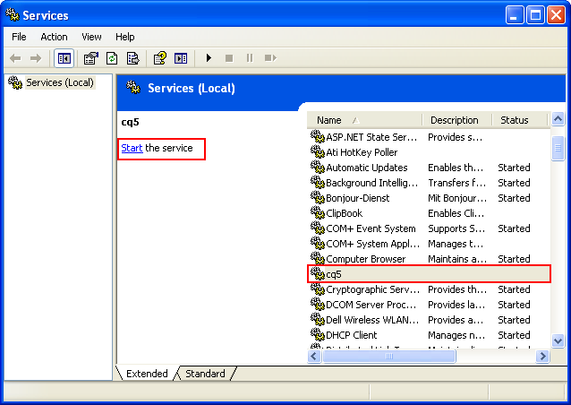

# Installazione personalizzata indipendente{#custom-standalone-install}

>[!CAUTION]
>
>AEM 6.4 ha raggiunto la fine del supporto esteso e questa documentazione non viene più aggiornata. Per maggiori dettagli, consulta la nostra [periodi di assistenza tecnica](https://helpx.adobe.com/it/support/programs/eol-matrix.html). Trova le versioni supportate [qui](https://experienceleague.adobe.com/docs/).

Questa sezione descrive le opzioni disponibili per l’installazione di un’istanza di AEM autonoma. È inoltre possibile leggere [Elementi di storage](/help/sites-deploying/storage-elements-in-aem-6.md) per ulteriori informazioni sulla scelta del tipo di storage back-end dopo aver installato di recente AEM 6.

## Modifica del numero di porta rinominando il file {#changing-the-port-number-by-renaming-the-file}

La porta predefinita per AEM è 4502. Se la porta non è disponibile o è già in uso, Quickstart si configura automaticamente per utilizzare il primo numero di porta disponibile come segue: 4502, 8080, 8081, 8082, 8083, 8084, 8085, 8888, 9362, `<random>`.

Puoi anche impostare il numero di porta rinominando il file jar quickstart, in modo che il nome del file includa il numero di porta; ad esempio, `cq5-publish-p4503.jar` o `cq5-author-p6754.jar`.

Ci sono varie regole da seguire quando si rinomina il file jar quickstart:

* Quando rinomini il file, deve iniziare con `cq;` come in `cq5-publish-p4503.jar`.

* Si consiglia di *sempre* prefisso il numero di porta con -p; come in cq5-publish-p4503.jar o cq5-author-p6754.jar.

>[!NOTE]
>
>Questo per evitare di doverti preoccupare di rispettare le regole utilizzate per estrarre il numero di porta:
>
>* il numero di porta deve essere di 4 o 5 cifre
>* queste cifre devono venire dopo un trattino
>* se nel nome del file sono presenti altre cifre, il numero di porta deve essere preceduto da `-p`
>* il prefisso &quot;cq5&quot; all&#39;inizio del nome del file viene ignorato
>


>[!NOTE]
>
>È inoltre possibile modificare il numero di porta utilizzando il `-port` nel comando start.

## Modalità di esecuzione {#run-modes}

**Modalità di esecuzione** consente di ottimizzare la propria istanza AEM per uno scopo specifico; ad esempio, autore o pubblicazione, test, sviluppo, Intranet ecc. Queste modalità consentono inoltre di controllare l’uso del contenuto campione. Questo contenuto di esempio viene definito prima della creazione dell’avvio rapido e può includere pacchetti, configurazioni e così via. Questa funzione può essere particolarmente utile per le installazioni pronte per la produzione quando si desidera mantenere l&#39;installazione magra e senza contenuti di esempio. Per ulteriori informazioni, consulta:

* [Modalità di esecuzione](/help/sites-deploying/configure-runmodes.md)

## Aggiunta di un provider di installazione file {#adding-a-file-install-provider}

Per impostazione predefinita, la cartella `crx-quickstart/install` viene controllato per i file.\
Questa cartella non esiste, ma può essere creata in fase di runtime.

Se un bundle, una configurazione o un pacchetto di contenuti viene inserito in questa directory, viene automaticamente rilevato e installato. Se viene rimosso, viene disinstallato.\
È un altro modo per mettere bundle, pacchetti di contenuti o configurazioni nell&#39;archivio.

Questo è particolarmente interessante per diversi casi d’uso:

* Durante lo sviluppo, potrebbe essere più facile inserire qualcosa nel file system.
* Se qualcosa non funziona, la console Web e l’archivio non sono raggiungibili. Con questo è possibile mettere bundle aggiuntivi in questa directory e dovrebbero essere installati.
* La `crx-quickstart/install` prima dell’avvio di quickstart è possibile creare una cartella e inserire pacchetti aggiuntivi.

>[!NOTE]
>
>Vedi anche [Come installare automaticamente i pacchetti CRX all&#39;avvio del server](https://helpx.adobe.com/experience-manager/kb/HowToInstallPackagesUsingRepositoryInstall.html) per esempi.

## Installazione e avvio di Adobe Experience Manager as a Windows Service {#installing-and-starting-adobe-experience-manager-as-a-windows-service}

>[!NOTE]
>
>Assicurati di eseguire la seguente procedura durante l&#39;accesso come amministratore o di avviare/eseguire questi passaggi utilizzando **Esegui come amministratore** selezione del menu di scelta rapida.
>
>Accesso come utente con privilegi di amministratore **insufficiente**. Se non hai effettuato l&#39;accesso come amministratore al completamento di questi passaggi, riceverai **Accesso negato** errori.

Per installare e avviare AEM come servizio Windows:

1. Apri il file crx-quickstart\opt\helpers\instsrv.bat in un editor di testo.
1. Se si sta configurando un server Windows a 64 bit, sostituire tutte le istanze di prunsrv con uno dei seguenti comandi, in base al sistema operativo in uso:

   * prunsrv_amd64
   * prunsrv_ia64

   Questo comando richiama lo script appropriato che avvia il daemon del servizio Windows in Java a 64 bit invece di Java a 32 bit.

1. Per evitare che il processo si imbatte in più processi, aumenta la dimensione massima dell&#39;heap e i parametri JVM PermGen. Individua il `set jvm_options` e impostare il valore come segue:

   `set jvm_options=-XX:MaxPermSize=256M;-Xmx1792m`

1. Apri Prompt dei comandi, modifica la directory corrente nella cartella crx-quickstart/opt/helpers dell&#39;installazione AEM e immetti il seguente comando per creare il servizio:

   `instsrv.bat cq5`

   Per verificare che il servizio sia stato creato, aprire Servizi nel pannello di controllo Strumenti di amministrazione o digitare `start services.msc` nel prompt dei comandi. Il servizio cq5 viene visualizzato nell&#39;elenco.

1. Avvia il servizio eseguendo una delle operazioni seguenti:

   * Nel pannello di controllo Servizi fare clic su cq5 e quindi su Start.

   

   * Nella riga di comando, digita net start cq5.

   

1. Windows indica che il servizio è in esecuzione. AEM viene avviato e l&#39;eseguibile prunsrv viene visualizzato in Task Manager. Nel browser Web, ad esempio, accedi a AEM `http://localhost:4502` per iniziare a utilizzare AEM.

   

>[!NOTE]
>
>I valori delle proprietà nel file instsrv.bat vengono utilizzati durante la creazione del servizio Windows. Se si modificano i valori delle proprietà in instsrv.bat, è necessario disinstallare e reinstallare il servizio.

>[!NOTE]
>
>Quando installi AEM come servizio, devi fornire il percorso assoluto della directory dei registri in `com.adobe.xmp.worker.files.ncomm.XMPFilesNComm` da Configuration Manager.

Per disinstallare il servizio, fai clic su **Interrompi** in **Servizi** pannello di controllo o nella riga di comando, passare alla cartella e digitare `instsrv.bat -uninstall cq5`. Il servizio viene rimosso dall&#39;elenco nel **Servizi** pannello di controllo o dall&#39;elenco nella riga di comando quando si digita `net start`.

## Ridefinizione della posizione della directory del lavoro temporaneo {#redefining-the-location-of-the-temporary-work-directory}

Il percorso predefinito della cartella temporanea del computer java è `/tmp`. AEM utilizza anche questa cartella, ad esempio per la creazione di pacchetti.

Se desideri modificare la posizione della cartella temporanea (ad esempio, se hai bisogno di una directory con più spazio libero), definisci un `<new-tmp-path>` aggiungendo il parametro JVM:

`-Djava.io.tmpdir="/<new-tmp-path>"`

a:

* la riga di comando di avvio del server
* il parametro di ambiente CQ_JVM_OPTS nello script serverctl o start

## Altre opzioni disponibili nel file Quickstart {#further-options-available-from-the-quickstart-file}

Ulteriori opzioni e convenzioni di ridenominazione sono descritte nel file della guida di Quickstart, disponibile tramite l’opzione -help. Per accedere alla guida, digita:

* `java -jar cq5-<version>.jar -help`

```shell
Loading quickstart properties: default
Loading quickstart properties: instance
Setting properties from filename '/Users/Desktop/AEM/cq-quickstart-5.6.0.jar'
--------------------------------------------------------------------------------
Adobe Experience Manager Quickstart (build 20130129)                            
--------------------------------------------------------------------------------
Usage:                                                                          
 Use these options on the Quickstart command line.                              
--------------------------------------------------------------------------------

-help (--help,-h)
         Show this help message                                                 
-quickstart.server.port (-p,-port) <port>
         Set server port number                                                 
-contextpath (-c,-org.apache.felix.http.context_path) <contextpath>
         Set context path                                                       
-debug <port>
         Enable Java Debugging on port number; forces forking                   
-gui 
         Show GUI if running on a terminal                                      
-nobrowser (-quickstart.nobrowser)
         Do not open browser at startup                                         
-unpack
         Unpack installation files only, do not start the server (implies       
         -verbose)                                                              
-v (-verbose)
         Do not redirect stdout/stderr to files and do not close stdin          
-nofork
         Do not fork the JVM, even if not running on a console                  
-fork
         Force forking the JVM if running on a console, using recommended       
         default memory settings for the forked JVM.                            
-forkargs <args> [<args> ...]
         Additional arguments for the forked JVM, defaults to '-Xmx1024m        
         -XX:MaxPermSize=256m '.  Use -- to specify values starting with -,     
         example: '-forkargs -- -server'                                        
-a (--interface) <interface>
         Optional IP address (interface) to bind to                             
-pt <string>
         Process type (main/fork) - do not use directly, used when forking a    
         process                                                                
-r <string> [<string> [<string> [<string> [<string> [<string> [<string> [<string> [<string> [<string>]]]]]]]]]
         Runmode(s) - Use this to define the run mode(s)                        
-b <string>
         Base folder - defines the path under which the quickstart work folder  
         is created                                                             
-low-mem-action <string>
         Low memory action - what to do if memory is insufficient at startup    
-use-control-port
         Start a control port                                                   
-ll <level>
         Define launchpad log level (1 = error...4 = debug)                     
--------------------------------------------------------------------------------
Quickstart filename options                                                     
--------------------------------------------------------------------------------
Usage:                                                                          
 Rename the jar file, including one of the patterns shown below, to set the     
corresponding option. Command-line options have priority on these filename      
patterns.                                                                       
--------------------------------------------------------------------------------

-NNNN
         Include -NNNN.jar or -pNNNN in the renamed jar filename to run on port 
         NNNN, for example: quickstart-8085.jar                                 
-nobrowser
         Include -nobrowser in the renamed jar filename to avoid opening the    
         browser at startup, example: quickstart-nobrowser-8085.jar             
-publish
         Include -publish in the renamed jar filename to run cq5 in "publish"   
         mode, example: cq5-publish-7502.jar                                    
--------------------------------------------------------------------------------
The license.properties file
--------------------------------------------------------------------------------
  The license.properties file stores licensing information, created from the    
  licensing form displayed on first startup and stored in the folder from where 
  Quickstart is run.                                                            
--------------------------------------------------------------------------------
Log files
--------------------------------------------------------------------------------
  Once Quickstart has been unpacked and started, log files can be found under   
  ./crx-quickstart/logs.                                                        
--------------------------------------------------------------------------------
```

## Installazione di AEM nell’ambiente Amazon EC2 {#installing-aem-in-the-amazon-ec-environment}

Quando installi AEM su un&#39;istanza Amazon Elastic Compute Cloud (EC2), se installi sia l&#39;autore che la pubblicazione sull&#39;istanza EC2, l&#39;istanza Author viene installata correttamente seguendo la procedura su come [installa un&#39;istanza di AEM](/help/sites-deploying/custom-standalone-install.md); tuttavia, l’istanza Pubblica diventa Autore.

Prima di installare l’istanza Publish nell’ambiente EC2, procedi come segue:

1. Decomprimi il file jar per l’istanza Publish prima di avviare l’istanza per la prima volta. Per decomprimere il file, utilizzare il seguente comando:

   ```xml
   java -jar quickstart.jar -unpack
   ```

   >[!NOTE]
   >
   >Se si modifica la modalità **dopo** all’avvio dell’istanza la prima volta, non è possibile modificare la modalità runmode.

1. Avvia l&#39;istanza eseguendo:

   ```xml
   java -jar quickstart.jar -r publish
   ```

   >[!CAUTION]
   >
   >Assicurati di eseguire prima l&#39;istanza dopo averlo decompresso eseguendo il comando precedente. In caso contrario, il riempimento quickstart.properties non verrà generato. Senza questo file, eventuali aggiornamenti futuri AEM non avranno esito positivo.

1. In **bidone** aprire la cartella **start** esegui lo script e controlla la sezione seguente:

   ```xml
   # runmode(s)
   if [ -z "$CQ_RUNMODE" ]; then
    CQ_RUNMODE='author'
   fi
   ```

1. Cambia la modalità runmode in **pubblicare** e salva il file.

   ```xml
   # runmode(s)
   if [ -z "$CQ_RUNMODE" ]; then
    CQ_RUNMODE='publish'
   fi
   ```

1. Arresta l&#39;istanza e riavviala eseguendo il comando **start** script.

## Verifica dell&#39;installazione {#verifying-the-installation}

I seguenti collegamenti possono essere utilizzati per verificare che l&#39;installazione sia operativa (tutti gli esempi sono sulla base del fatto che l&#39;istanza è in esecuzione sulla porta 8080 del localhost, che CRX è installato sotto /crx e Launchpad sotto /):

* `http://localhost:8080/crx/de`

   Console CRXDE Lite.

* `http://localhost:8080/system/console`

   Console Web.

## Azioni dopo l’installazione {#actions-after-installation}

Sebbene vi siano molte possibilità di configurare AEM WCM, alcune azioni devono essere intraprese o almeno riviste immediatamente dopo l&#39;installazione:

* Consulta la [Lista di controllo sicurezza](/help/sites-administering/security-checklist.md) per le attività necessarie per garantire la protezione del sistema.
* Rivedi l&#39;elenco degli utenti e dei gruppi predefiniti installati con AEM WCM. Controlla se desideri intervenire su altri account - vedi [Sicurezza e amministrazione degli utenti](/help/sites-administering/security.md) per ulteriori dettagli.

## Accesso a CRXDE Lite e alla console Web {#accessing-crxde-lite-and-the-web-console}

Una volta avviato AEM WCM, puoi anche accedere a:

* [CRXDE Lite](#accessing-crxde-lite) - utilizzato per accedere e gestire l&#39;archivio
* [Console web](#accessing-the-web-console) - utilizzato per gestire o configurare i bundle OSGi (noti anche come Console OSGi)

### Accesso a CRXDE Lite {#accessing-crxde-lite}

Per aprire CRXDE Lite puoi selezionare **CRXDE Lite** dalla schermata di benvenuto o utilizza il browser per navigare a

```
 https://<<i>host</i>>:<<i>port</i>>/crx/de/index.jsp
```

Ad esempio:\
`http://localhost:4502/crx/de/index.jsp` ``


### Accesso alla console Web {#accessing-the-web-console}

Per accedere alla console Web di Adobe CQ, seleziona **Console OSGi** dalla schermata di benvenuto o utilizza il browser per navigare a

```
 https://<<i>host</i>>:<<i>port</i>>/system/console
```

Ad esempio:\
`http://localhost:4502/system/console`\
o per la pagina Bundle\
`http://localhost:4502/system/console/bundles`


Vedi [Configurazione OSGi con la console Web](/help/sites-deploying/configuring-osgi.md#osgi-configuration-with-the-web-console) per ulteriori dettagli.

## Risoluzione dei problemi {#troubleshooting}

Per informazioni sui problemi che possono verificarsi durante l&#39;installazione, vedi:

* [Risoluzione dei problemi](/help/sites-deploying/troubleshooting.md)

## Disinstallazione di Adobe Experience Manager {#uninstalling-adobe-experience-manager}

Poiché AEM installato in una singola directory, non è necessaria un&#39;utilità di disinstallazione. La disinstallazione può essere semplice come l&#39;eliminazione dell&#39;intera directory di installazione, anche se la modalità di disinstallazione AEM dipende da ciò che si desidera ottenere e da quale memoria permanente si utilizza.

Se l&#39;archiviazione permanente è incorporata nella directory di installazione, ad esempio, nell&#39;installazione predefinita di TarPM, l&#39;eliminazione delle cartelle rimuove anche i dati.

>[!NOTE]
>
>L’Adobe consiglia vivamente di eseguire il backup dell’archivio prima di eliminare AEM. Se si elimina l&#39;intero &lt;cq-installation-directory>, l’archivio verrà eliminato. Per mantenere i dati del repository prima di eliminare, spostare o copiare il &lt;cq-installation-directory>/crx-quickstart/repository cartella da qualche altra parte prima di eliminare le altre cartelle.

Se l&#39;installazione di AEM utilizza lo storage esterno, ad esempio un server di database, la rimozione della cartella non rimuove automaticamente i dati, ma rimuove la configurazione di archiviazione, il che rende difficile il ripristino del contenuto JCR.
