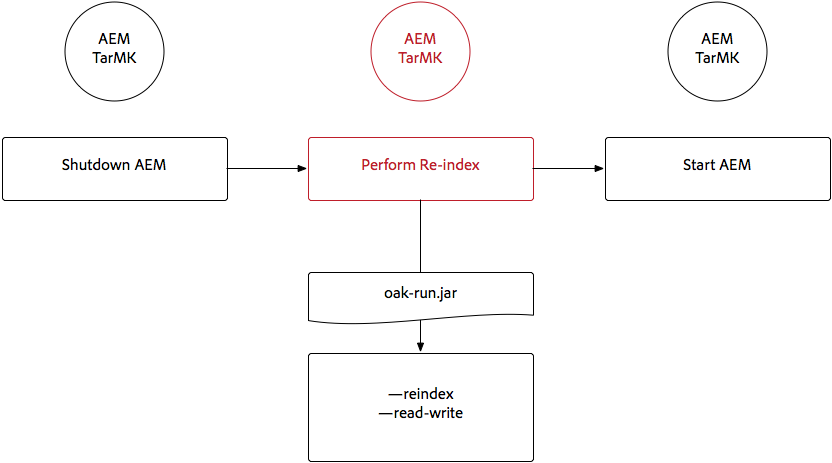

# Indicizzazione tramite Oak-run Jar{#indexing-via-the-oak-run-jar}

Oak-run supporta tutti i casi di utilizzo dell&#39;indicizzazione sulla riga di comando senza dover operare dal livello JMX. I vantaggi dell&#39;approccio oak-run sono:

1. È un nuovo set di strumenti di indicizzazione per AEM 6.4
1. Diminuisce il time-to-reindex che influisce positivamente sui tempi di reindicizzazione su archivi più grandi
1. Durante la reindicizzazione in AEM, il consumo di risorse viene ridotto e ciò migliora le prestazioni del sistema per altre attività AEM
1. Oak-run fornisce supporto fuori banda: Se le condizioni di produzione non consentono di eseguire il reindicizzazione sulle istanze di produzione, è possibile utilizzare un ambiente clonato per la reindicizzazione in modo da evitare un impatto critico sulle prestazioni.

Di seguito trovi un elenco di casi d’uso che possono essere utilizzati durante l’esecuzione di operazioni di indicizzazione tramite lo strumento `oak-run` .

## Controlli di coerenza dell’indice {#indexconsistencychecks}

>[!NOTE]
>
>Per informazioni più dettagliate su questo scenario, consulta [Caso d&#39;uso 1 - Controllo di coerenza dell&#39;indice](/help/sites-deploying/oak-run-indexing-usecases.md#usercase1indexconsistencycheck).

* `oak-run.jar`determina rapidamente se gli indici lucene oak sono corrotti.
* È sicuro eseguire su un&#39;istanza di AEM in uso per i livelli di controllo di coerenza 1 e 2.

## Statistiche indice {#indexstatistics}

>[!NOTE]
>
>Per informazioni più dettagliate su questo scenario, vedi [Caso d&#39;uso 2 - Statistiche indice](/help/sites-deploying/oak-run-indexing-usecases.md#usecase2indexstatistics)

* `oak-run.jar` scarica tutte le definizioni dell&#39;indice, gli stati importanti dell&#39;indice e il contenuto dell&#39;indice per l&#39;analisi offline.

* Sicuro da eseguire su un&#39;istanza AEM in uso.

## Albero decisionale dell’approccio di reindicizzazione {#reindexingapproachdecisiontree}

Questo diagramma è un albero decisionale per quando utilizzare i vari approcci di reindicizzazione.

## Re-indicizzazione MongoMK / RDMBMK {#reindexingmongomk}

>[!NOTE]
>
>Per informazioni più dettagliate su questo scenario, vedi [Caso d&#39;uso 3 - Reindicizzazione](/help/sites-deploying/oak-run-indexing-usecases.md#usecase3reindexing).

### Pre-estrazione del testo per SegmentNodeStore e DocumentNodeStore {#textpre-extraction}

[La preestrazione del testo](/help/sites-deploying/best-practices-for-queries-and-indexing.md#how-to-perform-text-pre-extraction)  (una funzione esistente con AEM 6.3) può essere utilizzata per ridurre il tempo di reindicizzazione. La preestrazione del testo può essere utilizzata insieme a tutti gli approcci di reindicizzazione.

A seconda dell&#39;approccio di indicizzazione `oak-run.jar`, ci saranno vari passaggi su entrambi i lati del passaggio Esegui reindicizzazione nel diagramma seguente.

>[!NOTE]
>
>Arancione indica le attività in cui AEM deve trovarsi in una finestra di manutenzione.

### Reindicizzazione online per MongoMK o RDBMK utilizzando oak-run.jar {#onlinere-indexingformongomk}

>[!NOTE]
>
>Per informazioni più dettagliate su questo scenario, vedere [Reindex - DocumentNodeStore](/help/sites-deploying/oak-run-indexing-usecases.md#reindexdocumentnodestore).

Questo è il metodo consigliato per la reindicizzazione delle installazioni AEM MongoMK (e RDBMK). Non utilizzare altri metodi.

Questo processo deve essere eseguito solo su una singola istanza AEM nel cluster.

## Re-indicizzazione TarMK {#re-indexingtarmk}

>[!NOTE]
>
>Per informazioni più dettagliate su questo scenario, vedi [Reindex - SegmentNodeStore](/help/sites-deploying/oak-run-indexing-usecases.md#reindexsegmentnodestore).

* **Considerazioni sullo standby a freddo (TarMK)**

   * Non vi è alcuna considerazione particolare per lo standby a freddo; le istanze di standby a freddo sincronizzeranno le modifiche come di consueto.

* **AEM Publish Farms (AEM Publish Farms dovrebbe sempre essere TarMK)**

   * Per la farm di pubblicazione è necessario eseguire tutti i passaggi OR su una singola pubblicazione e quindi clonare la configurazione per gli altri (seguendo tutte le solite predizioni durante la clonazione di istanze AEM; sling.id - dovrebbe collegare a qualcosa qui)

### Re-indicizzazione online per TarMK {#onlinere-indexingfortarmk}

>[!NOTE]
>
>Per informazioni più dettagliate su questo scenario, consulta [Reindicizzazione online - SegmentNodeStore](/help/sites-deploying/oak-run-indexing-usecases.md#onlinereindexsegmentnodestore).

Questo è il metodo utilizzato prima dell&#39;introduzione delle nuove funzionalità di indicizzazione di oak-run.jar. Per farlo, imposta la proprietà `reindex=true` sull&#39;indice Oak.

Questo approccio può essere utilizzato se gli effetti di tempo e prestazioni da indicizzare sono accettabili per il cliente. Questo accade spesso per gli impianti di AEM di piccole e medie dimensioni.

### Re-indicizzazione online TarMK utilizzando oak-run.jar {#onlinere-indexingtarmkusingoak-run-jar}

>[!NOTE]
>
>Per informazioni più dettagliate su questo scenario, vedi [Reindicizzazione online - SegmentNodeStore - L&#39;istanza AEM è in esecuzione](/help/sites-deploying/oak-run-indexing-usecases.md#onlinereindexsegmentnodestoretheaeminstanceisrunning).

La reindicizzazione online di TarMK utilizzando oak-run.jar è più veloce della [reindicizzazione online per TarMK](#onlinere-indexingfortarmk) descritta sopra. Tuttavia, richiede anche l&#39;esecuzione durante un periodo di mantenimento; con la menzione che la finestra sarà più breve e sono necessari più passaggi per eseguire la reindicizzazione.

>[!NOTE]
>
>Arancione indica le operazioni in cui AEM deve essere eseguito in un periodo di manutenzione.

### Re-indicizzazione offline TarMK utilizzando oak-run.jar {#offlinere-indexingtarmkusingoak-run-jar}

>[!NOTE]
>
>Per informazioni più dettagliate su questo scenario, vedere [Reindicizzazione online - SegmentNodeStore - L&#39;istanza AEM è Spenta](/help/sites-deploying/oak-run-indexing-usecases.md#onlinereindexsegmentnodestoreaeminstanceisdown).

La reindicizzazione offline di TarMK è l&#39;approccio di reindicizzazione basato su `oak-run.jar` più semplice per TarMK in quanto richiede un singolo commento `oak-run.jar`. Tuttavia, richiede lo spegnimento dell&#39;istanza AEM.

>[!NOTE]
>
>Il rosso indica le operazioni in cui AEM deve essere spento.

### Re-indicizzazione TarMK fuori banda utilizzando oak-run.jar  {#out-of-bandre-indexingtarmkusingoak-run-jar}

>[!NOTE]
>
>Per informazioni più dettagliate su questo scenario, consulta [Reindice fuori banda - SegmentNodeStore](/help/sites-deploying/oak-run-indexing-usecases.md#outofbandreindexsegmentnodestore).

La reindicizzazione out-of-band riduce al minimo l&#39;impatto della reindicizzazione sulle istanze di AEM in uso.

>[!NOTE]
>
>Il rosso indica le operazioni in cui AEM può essere arrestato.

## Aggiornamento delle definizioni di indicizzazione {#updatingindexingdefinitions}

>[!NOTE]
>
>Per informazioni più dettagliate su questo scenario, vedere [Caso d&#39;uso 4 - Aggiornamento delle definizioni degli indici](/help/sites-deploying/oak-run-indexing-usecases.md#usecase4updatingindexdefinitions).

### Creazione e aggiornamento delle definizioni dell&#39;indice su TarMK utilizzando ACS Assurance Index {#creatingandupdatingindexdefinitionsontarmkusingacsensureindex}

>[!NOTE]
>
>L&#39;indice ACS Assurance è un progetto supportato dalla community e non è supportato dal supporto Adobe.

Questo consente la definizione dell&#39;indice di spedizione tramite il pacchetto di contenuti che successivamente si traduce in reindicizzazione impostando il flag di reindicizzazione su `true`. Questo funziona per configurazioni più piccole in cui la reindicizzazione non richiede molto tempo.

Per ulteriori informazioni, consulta la [documentazione sull&#39;indice di verifica di ACS](https://adobe-consulting-services.github.io/acs-aem-commons/features/ensure-oak-index/index.html) per ulteriori informazioni.

### Creazione e aggiornamento delle definizioni dell&#39;indice su TarMK utilizzando oak-run.jar {#creatingandupdatingindexdefinitionsontarmkusingoak-run-jar}

Se l&#39;impatto sul tempo o sulle prestazioni della reindicizzazione utilizzando metodi non `oak-run.jar` è troppo elevato, il seguente approccio basato su `oak-run.jar` può essere utilizzato per importare e reindicizzare le definizioni di Lucene Index in un&#39;installazione AEM basata su TarMK.

### Creazione e aggiornamento delle definizioni degli indici su MonogMK utilizzando oak-run.jar {#creatingandupdatingindexdefinitionsonmonogmkusingoak-run-jar}

Se l&#39;impatto sul tempo o sulle prestazioni della reindicizzazione utilizzando metodi non `oak-run.jar` è troppo elevato, è possibile utilizzare il seguente approccio basato su `oak-run.jar` per importare e reindicizzare le definizioni degli indici Lucene nelle installazioni AEM basate su MongoMK.

