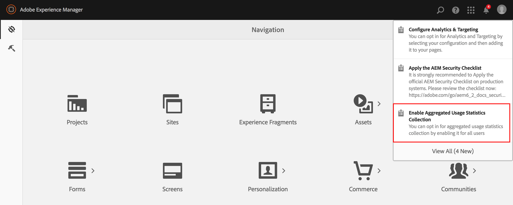

# Passaggio All&#39;Insieme Di Statistiche Di Utilizzo Aggregato{#opting-into-aggregated-usage-statistics-collection}

## Introduzione {#introduction}

È possibile migliorare Adobe Marketing Cloud inviando  statistiche di Adobe sulle modalità di interazione con AEM. Queste informazioni non contengono dati sui visitatori del sito della società e vengono utilizzate solo per aiutare  Adobe a fornire, supportare e migliorare l&#39;esperienza utente.

È possibile scegliere di utilizzare la raccolta delle statistiche di utilizzo utilizzando l&#39;interfaccia utente touch o la console Web.

>[!NOTE]
>
>Esistono varie normative in materia di protezione dei dati e di privacy; tra cui, ad esempio, GDPR e CCPA.  AEM Sites è pronta ad aiutare i clienti a rispettare gli obblighi in materia di protezione dei dati e privacy. Questa pagina illustra ai clienti le procedure per consentire o meno l&#39;accesso alla raccolta delle statistiche di utilizzo aggregato.
>
>Per ulteriori informazioni, vedere anche il [Adobe  Centro](https://www.adobe.com/privacy.html)per la privacy.

>[!NOTE]
>
>Potete inoltre rifiutare in qualsiasi momento utilizzando la console  Web o non selezionando l&#39;opzione di consenso nella schermata di consenso AEM.

## Consenso mediante l’interfaccia touch {#opt-in-by-using-the-touch-ui}

La prima volta che avviate AEM, potete scegliere di utilizzare l&#39;interfaccia utente touch come segue:

1. Nella schermata Navigazione AEM, fate clic sull’icona **Inbox** (bell).

   

1. Nell&#39;elenco a discesa, fate clic su &quot;**Abilita raccolta** statistiche di utilizzo aggregato&quot;.

   

1. Nella schermata di consenso, selezionate &quot;**Consenti raccolta di statistiche** di utilizzo aggregate&quot;.

   

1. Fare clic su &quot;**Fine**&quot;.

## Consenso mediante la console Web {#opt-in-by-using-the-web-console}

Potete scegliere (o rifiutare) utilizzando la console Web come segue:

1. Nella schermata Navigazione AEM, fare clic su **Strumenti** e quindi su **Operazioni**.

   

1. Nella finestra Operazioni, fate clic su Console **** Web.

   

1. Cercate &quot;Raccolta **di statistiche di utilizzo** aggregato&quot;.
1. Click the **Edit** icon.

   

1. Selezionare la casella di controllo **Abilitato** . In alternativa, potete deselezionare la casella di controllo se desiderate rinunciare alla raccolta delle statistiche di utilizzo.

   

1. Fai clic su **Salva**.

