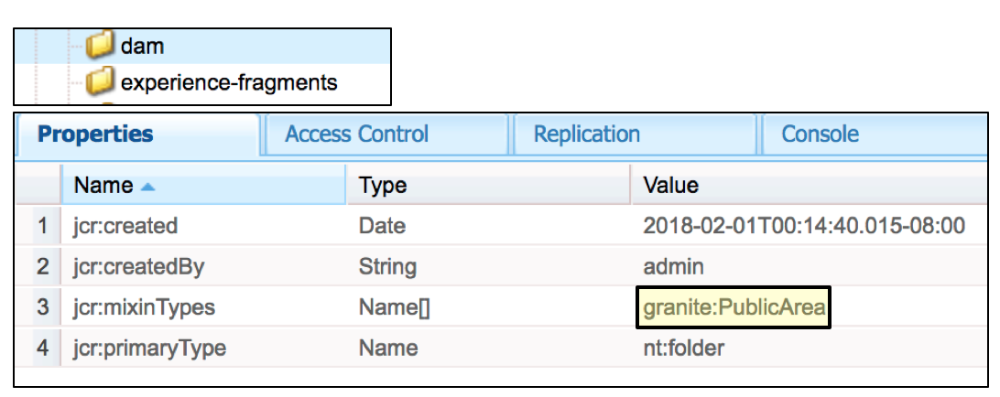

# Aggiornamenti sostenibili{#sustainable-upgrades}

## Framework di personalizzazione {#customization-framework}

### Architettura (funzionalità/infrastruttura/contenuto/applicazione) {#architecture-functional-infrastructure-content-application}

La funzione Customization Framework consente di ridurre le violazioni nelle aree non estensibili del codice (come APIS) o del contenuto (come le sovrapposizioni) che non sono facili da aggiornare.

Esistono due componenti del framework di personalizzazione: la superficie **** API e la classificazione **dei** contenuti.

#### Superficie API {#api-surface}

Nelle versioni precedenti di AEM molte API erano esposte tramite Uber Jar. Alcune di queste API non erano destinate ai clienti, ma erano esposte al supporto della funzionalità AEM tra i bundle. In futuro, le API Java saranno contrassegnate come Pubbliche o Private per indicare ai clienti quali API sono sicure da utilizzare nel contesto degli aggiornamenti. Altre specifiche includono:

* Le API Java contrassegnate come `Public` possono essere utilizzate e a cui fanno riferimento i bundle di implementazione personalizzati.

* Le API pubbliche saranno compatibili con l&#39;installazione di un pacchetto di compatibilità.
* Il pacchetto di compatibilità conterrà un Uber JAR compatibile per garantire la compatibilità con le versioni precedenti
* Le API Java contrassegnate come `Private` sono destinate a essere utilizzate solo dai bundle interni di AEM e non devono essere utilizzate dai bundle personalizzati.

>[!NOTE]
>
>Il concetto di `Private` e `Public` in questo contesto non dovrebbe essere confuso con nozioni Java di classi pubbliche e private.

#### Classificazioni dei contenuti {#content-classifications}

AEM utilizza da tempo l’entità delle sovrapposizioni e della fusione delle risorse Sling per consentire ai clienti di estendere e personalizzare le funzionalità di AEM. Le funzionalità predefinite per l’utilizzo delle console e dell’interfaccia utente di AEM sono memorizzate in **/libs**. I clienti non devono mai modificare nulla sotto **/libs** , ma possono aggiungere contenuto aggiuntivo sotto **/app** per sovrapporre ed estendere le funzionalità definite in **/libs** (per ulteriori informazioni, consultate Sviluppo con sovrapposizioni). Ciò causava ancora numerosi problemi durante l’aggiornamento di AEM, in quanto il contenuto in **/libs** poteva cambiare, causando interruzioni impreviste della funzionalità della sovrapposizione. I clienti possono anche estendere i componenti AEM tramite l’ereditarietà tramite `sling:resourceSuperType`, o semplicemente fare riferimento a un componente in **/libs** direttamente tramite sling:resourceType. Problemi simili di aggiornamento possono verificarsi con i casi di utilizzo di riferimento e ignorare.

Al fine di rendere più sicuro e facile per i clienti capire quali aree di **/libs** sono sicure da usare e sovrapporre il contenuto in **/libs** è stato classificato con le seguenti miscele:

* **Public (granite:PublicArea)** - Definisce un nodo come pubblico in modo che possa essere sovrapposto, ereditato ( `sling:resourceSuperType`) o utilizzato direttamente ( `sling:resourceType`). I nodi sotto /libs contrassegnati come Pubblico saranno sicuri da aggiornare con l&#39;aggiunta di un pacchetto di compatibilità. In generale, i clienti devono solo sfruttare i nodi contrassegnati come Pubblico.

* **Abstract (granite:AbstractArea)** - Definisce un nodo come astratto. I nodi possono essere sovrapposti o ereditati ( `sling:resourceSupertype`) ma non devono essere utilizzati direttamente ( `sling:resourceType`).

* **Final (granite:FinalArea)** - Definisce un nodo come finale. I nodi classificati come finali non possono essere sovrapposti o ereditati. I nodi finali possono essere utilizzati direttamente tramite `sling:resourceType`. I sottonodi sotto il nodo finale sono considerati interni per impostazione predefinita

* **Internal (granite:InternalArea)** - Definisce un nodo come interno. I nodi classificati come interni non possono essere sovrapposti, ereditati o utilizzati direttamente. Questi nodi sono destinati solo alla funzionalità interna di AEM

* **Nessuna annotazione** : i nodi ereditano la classificazione in base alla gerarchia ad albero. Per impostazione predefinita, / root è Pubblico. **Anche i nodi con un elemento padre classificato come interno o finale devono essere trattati come interni.**

>[!NOTE]
>
>Questi criteri vengono applicati solo ai meccanismi basati sul percorso di ricerca Sling. Altre aree di **/libs** , come una libreria lato client, possono essere contrassegnate come `Internal`, ma possono comunque essere utilizzate con l&#39;inclusione clientlib standard. È importante che un cliente continui a rispettare la classificazione interna in questi casi.

#### Indicatori del tipo di contenuto CRXDE Lite {#crxde-lite-content-type-indicators}

Le miscele applicate in CRXDE Lite mostreranno i nodi di contenuto e le strutture ad albero contrassegnate come `INTERNAL` disabilitate. Poiché `FINAL` solo l&#39;icona è disattivata. Anche gli elementi secondari di questi nodi risulteranno grigi. In entrambi i casi, la funzionalità Overlay Node (Nodo sovrapposizione) è disabilitata.

**Pubblico**

**Finale**

**Interno**

**Controllo integrità contenuto**

AEM 6.4 invierà un controllo dello stato per avvisare i clienti se il contenuto sovrapposto o di riferimento viene utilizzato in modo non coerente con la classificazione del contenuto.

Il controllo **Sling/Granite Content Access Check** è un nuovo controllo dello stato che controlla l&#39;archivio per verificare se il codice cliente accede in modo errato ai nodi protetti in AEM.

Questa operazione eseguirà la scansione **/le app** e in genere richiede diversi secondi per il completamento.

Per accedere a questa nuova verifica dello stato di salute, è necessario effettuare le seguenti operazioni:

1. Dalla schermata iniziale di AEM, andate a **Strumenti > Operazioni > Rapporti sullo stato**
1. Fate clic su **Sling/Granite Content Access Check** come mostrato di seguito:

   

Al termine dell&#39;analisi, verrà visualizzato un elenco di avvisi che avvisano un utente finale del nodo protetto a cui viene fatto riferimento in modo non corretto:

Dopo aver riparato le violazioni, ritornerà allo stato verde:

La verifica dello stato mostra le informazioni raccolte da un servizio in background che verifica in modo asincrono ogni volta che una sovrapposizione o un tipo di risorsa viene utilizzata in tutti i percorsi di ricerca Sling. Se i mixaggi di contenuto vengono utilizzati in modo errato, segnala una violazione.
