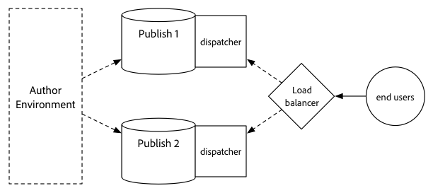

# Procedura di aggiornamento{#upgrade-procedure}

>[!CAUTION]
>
>AEM 6.4 ha raggiunto la fine del supporto esteso e questa documentazione non viene più aggiornata. Per maggiori dettagli, consulta la nostra [periodi di assistenza tecnica](https://helpx.adobe.com/it/support/programs/eol-matrix.html). Trova le versioni supportate [qui](https://experienceleague.adobe.com/docs/).

>[!NOTE]
>
>L’aggiornamento richiederà tempi di inattività per il livello di authoring, in quanto la maggior parte degli aggiornamenti AEM vengono eseguiti sul posto. Seguendo queste best practice, è possibile ridurre o eliminare i tempi di inattività del livello di pubblicazione.

Quando aggiorni gli ambienti di AEM, è necessario considerare le differenze di approccio tra l’aggiornamento degli ambienti di authoring o di pubblicazione per ridurre al minimo i tempi di inattività sia per gli autori che per gli utenti finali. Questa pagina illustra la procedura di alto livello per l’aggiornamento di una topologia AEM attualmente in esecuzione su una versione di AEM 6.x. Poiché il processo è diverso tra i livelli di authoring e pubblicazione e le implementazioni basate su Mongo e TarMK, ogni livello e microkernel è stato elencato in una sezione separata. Durante l’esecuzione della distribuzione, consigliamo innanzitutto di aggiornare l’ambiente di authoring, determinare il successo e quindi procedere con gli ambienti di pubblicazione.

## Livello di authoring TarMK {#tarmk-author-tier}

### Avvio topologia {#starting-topology}

La topologia presunta per questa sezione è costituita da un server Author in esecuzione su TarMK con uno standby a freddo. La replica si verifica dal server Author alla farm di pubblicazione TarMK. Anche se non è illustrato qui, questo approccio può essere utilizzato anche per le distribuzioni che utilizzano lo scaricamento. Assicurati di aggiornare o ricreare l&#39;istanza di offload sulla nuova versione dopo aver disabilitato gli agenti di replica sull&#39;istanza Author e prima di riabilitarli.

### Preparazione all&#39;aggiornamento {#upgrade-preparation}

1. Interrompere la creazione dei contenuti
1. Arresta l&#39;istanza di standby
1. Disattiva gli agenti di replica sull&#39;autore
1. Esegui il [attività di manutenzione pre-aggiornamento](/help/sites-deploying/pre-upgrade-maintenance-tasks.md).

### Esecuzione aggiornamento {#upgrade-execution-1}

1. Esegui il [aggiornamento sul posto](/help/sites-deploying/in-place-upgrade.md)
1. Aggiorna il modulo dispatcher *se necessario*
1. Controllo qualità convalida l&#39;aggiornamento
1. Arresta l&#39;istanza dell&#39;autore.

### In caso di esito positivo {#if-successful}

1. Copia l&#39;istanza aggiornata per creare un nuovo standby a freddo
1. Avvia l&#39;istanza Author
1. Avvia l&#39;istanza Standby.

### In caso di esito negativo (rollback) {#if-unsuccessful-rollback}

1. Avvia l&#39;istanza di standby a freddo come nuovo primario
1. Ricrea l’ambiente Authoring dallo standby a freddo.

## Cluster di authoring MongoMK {#mongomk-author-cluster}

### Avvio topologia {#starting}

La topologia presunta per questa sezione è costituita da un cluster Autore MongoMK con almeno due istanze Autore AEM, supportate da almeno due database MongoMK. Tutte le istanze Autore condividono un datastore. Questi passaggi devono essere applicati sia ai datastore S3 che ai file . La replica si verifica dai server Author alla farm TarMK Publish.

### Preparazione all&#39;aggiornamento {#preparation}

1. Interrompere la creazione dei contenuti
1. Clonare l&#39;archivio dati per il backup
1. Interrompi tutte le istanze AEM Author tranne una, il tuo autore principale
1. Rimuovi tutti i nodi MongoDB tranne uno dal set di repliche, l&#39;istanza Mongo primaria
1. Aggiorna `DocumentNodeStoreService.cfg` file sull&#39;autore principale per riflettere il set di repliche membro singolo
1. Riavvia l&#39;autore principale per assicurarne il corretto riavvio
1. Disattiva gli agenti di replica sull&#39;autore principale
1. Esegui [attività di manutenzione pre-aggiornamento](/help/sites-deploying/pre-upgrade-maintenance-tasks.md) sull’istanza Author principale
1. Se necessario, aggiorna MongoDB sull&#39;istanza Mongo primaria alla versione 3.2 con WiredTiger

### Esecuzione aggiornamento {#execution}

1. Eseguire un [aggiornamento sul posto](/help/sites-deploying/in-place-upgrade.md) sull&#39;autore principale
1. Aggiornare il Dispatcher o il modulo Web *se necessario*
1. Controllo qualità convalida l&#39;aggiornamento

### In caso di esito positivo {#successful-1}

1. Crea nuove istanze di authoring 6.3, connesse all&#39;istanza Mongo aggiornata
1. Rigenera i nodi MongoDB rimossi dal cluster
1. Aggiorna `DocumentNodeStoreService.cfg` file per riflettere l&#39;intero set di repliche
1. Riavvia le istanze di authoring, una alla volta
1. Rimuovi l&#39;archivio dati clonati.

### In caso di esito negativo (rollback)  {#if-unsuccessful}

1. Riconfigura le istanze di authoring secondarie per connettersi all’archivio dati clonati
1. Arrestare l&#39;istanza primaria Author aggiornata
1. Spegni l&#39;istanza primaria Mongo aggiornata.
1. Avvia le istanze Mongo secondarie con una di esse come nuova istanza primaria
1. Configura le `DocumentNodeStoreService.cfg` file nelle istanze di authoring secondarie per puntare al set di repliche delle istanze Mongo non ancora aggiornate
1. Avvia le istanze di authoring secondarie
1. Pulisci le istanze dell’autore aggiornate, il nodo Mongo e l’archivio dati.

## TarMK Publish Farm {#tarmk-publish-farm}

### TarMK Publish Farm {#publish-farm}

La topologia presunta per questa sezione è costituita da due istanze di pubblicazione TarMK, precedute da Dispatcher che a loro volta sono precedute da un load balancer. La replica si verifica dal server Author alla farm di pubblicazione TarMK.

### Esecuzione aggiornamento {#execution-upgrade}

1. Arresta il traffico verso l’istanza Publish 2 al load balancer
1. Esegui [manutenzione pre-aggiornamento](/help/sites-deploying/pre-upgrade-maintenance-tasks.md) su Publish 2
1. Eseguire un [aggiornamento sul posto](/help/sites-deploying/in-place-upgrade.md) su Publish 2
1. Aggiornare il Dispatcher o il modulo Web *se necessario*
1. Svuotare la cache del Dispatcher
1. Il controllo qualità convalida la pubblicazione 2 tramite Dispatcher, dietro il firewall
1. Arresta pubblicazione 2
1. Copia l&#39;istanza Publish 2
1. Avvia pubblicazione 2

### In caso di esito positivo {#successful-2}

1. Abilita il traffico a Pubblica 2
1. Arresta il traffico per pubblicare 1
1. Arresta l’istanza Publish 1
1. Sostituisci l’istanza Publish 1 con una copia di Publish 2
1. Aggiornare il Dispatcher o il modulo Web *se necessario*
1. Svuotare la cache del Dispatcher per Pubblica 1
1. Avvia pubblicazione 1
1. Il controllo qualità convalida la pubblicazione 1 tramite Dispatcher, dietro il firewall

### In caso di esito negativo (rollback) {#rollback}

1. Crea una copia di Publish 1
1. Sostituisci l’istanza Publish 2 con una copia di Publish 1
1. Svuotare la cache del Dispatcher per Pubblica 2
1. Avvia pubblicazione 2
1. Il controllo qualità convalida la pubblicazione 2 tramite Dispatcher, dietro il firewall
1. Abilita il traffico a Pubblica 2

## Passaggi per l&#39;aggiornamento finale {#final-upgrade-steps}

1. Abilita il traffico alla pubblicazione 1
1. Il controllo qualità esegue la convalida finale da un URL pubblico
1. Abilitare gli agenti di replica dall’ambiente Author
1. Riprendere l’authoring dei contenuti
1. Esegui [controlli successivi all’aggiornamento](/help/sites-deploying/post-upgrade-checks-and-troubleshooting.md).

