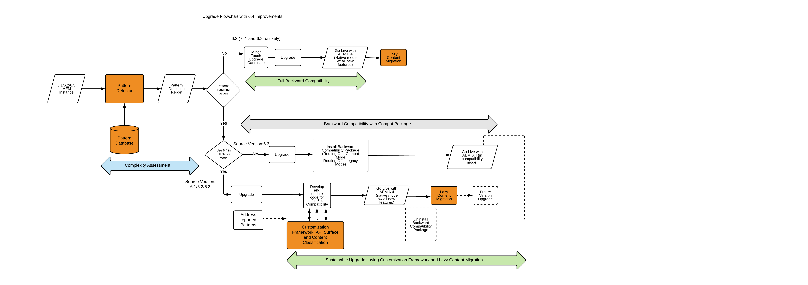

# Aggiornamento a AEM 6.4{#upgrading-to-aem}

>[!CAUTION]
>
>AEM 6.4 ha raggiunto la fine del supporto esteso e questa documentazione non viene più aggiornata. Per maggiori dettagli, consulta la nostra [periodi di assistenza tecnica](https://helpx.adobe.com/it/support/programs/eol-matrix.html). Trova le versioni supportate [qui](https://experienceleague.adobe.com/docs/).

In questa sezione viene descritto l’aggiornamento di un’installazione AEM a AEM 6.4:

* [Pianificazione dell&#39;aggiornamento](/help/sites-deploying/upgrade-planning.md)
* [Valutazione della complessità dell’aggiornamento con rilevatore pattern](/help/sites-deploying/pattern-detector.md)
* [Compatibilità con le versioni precedenti in AEM 6.4](/help/sites-deploying/backward-compatibility.md)
* [Procedura di aggiornamento](/help/sites-deploying/upgrade-procedure.md)
* [Aggiornamento di codice e personalizzazioni](/help/sites-deploying/upgrading-code-and-customizations.md)
* [Attività di manutenzione pre-aggiornamento](/help/sites-deploying/pre-upgrade-maintenance-tasks.md)
* [Esecuzione di un aggiornamento sul posto](/help/sites-deploying/in-place-upgrade.md)
* [Controlli e risoluzione dei problemi post-aggiornamento](/help/sites-deploying/post-upgrade-checks-and-troubleshooting.md)
* [Aggiornamenti sostenibili](/help/sites-deploying/sustainable-upgrades.md)
* [Migrazione dei contenuti Lazy](/help/sites-deploying/lazy-content-migration.md)
* [Ristrutturazione dell’archivio in AEM 6.4](/help/sites-deploying/repository-restructuring.md)

Per fare un riferimento più agevole alle istanze AEM coinvolte in queste procedure, in questi articoli sono utilizzati i termini seguenti:

* La *source* L&#39;istanza è l&#39;istanza AEM da cui stai eseguendo l&#39;aggiornamento.
* La *target* L&#39;istanza è quella in cui si sta effettuando l&#39;aggiornamento.

>[!NOTE]
>
>Nell&#39;ambito degli sforzi volti a migliorare l&#39;affidabilità degli aggiornamenti, AEM 6.4 ha subito una ristrutturazione completa degli archivi. Per ulteriori informazioni su come allineare con la nuova struttura, consulta [Ristrutturazione dell’archivio in AEM 6.4](/help/sites-deploying/repository-restructuring.md)

## Cosa è cambiato? {#what-has-changed}

Di seguito sono riportate le principali modifiche apportate alle note nelle ultime diverse versioni di AEM:

AEM 6.0 ha introdotto il nuovo archivio Jackrabbit Oak. I gestori di persistenza sono stati sostituiti da [Micro Kernel](/help/sites-deploying/recommended-deploys.md). A partire dalla versione 6.1, CRX2 non è più supportato. Per migrare gli archivi CRX2 dalle istanze 5.6.1, è necessario eseguire uno strumento di migrazione denominato crx2oak. Per ulteriori informazioni, consulta [Utilizzo dello strumento di migrazione CRX2OAK](/help/sites-deploying/using-crx2oak.md).

Se devi utilizzare Assets Insights e stai eseguendo l’aggiornamento da una versione precedente alla AEM 6.2, devi eseguire la migrazione delle risorse e generare gli ID tramite un tag JMX. Nei nostri test interni, le risorse 125K in un ambiente TarMK sono state migrate in un&#39;ora, ma i risultati potrebbero variare.

AEM 6.3 ha introdotto un nuovo formato per `SegmentNodeStore`, che è alla base dell’implementazione di TarMK. Se esegui l’aggiornamento da una versione precedente alla versione 6.3 di AEM, sarà necessaria una migrazione dell’archivio come parte dell’aggiornamento, che implica tempi di inattività del sistema.

L&#39;ingegneria Adobe stima che questo sia di circa 20 minuti. Si noti che la reindicizzazione non sarà necessaria. Inoltre, è stata rilasciata una nuova versione dello strumento crx2oak per lavorare con il nuovo formato dell&#39;archivio.

**Questa migrazione non è necessaria se si esegue l’aggiornamento da AEM 6.3 a AEM 6.4.**

Le attività di manutenzione pre-aggiornamento sono state ottimizzate per supportare l’automazione.

Le opzioni di utilizzo della riga di comando dello strumento crx2oak sono state modificate per essere facili da usare e supportare più percorsi di aggiornamento.

Anche i controlli post-aggiornamento sono stati resi facili dall&#39;automazione.

La raccolta periodica degli oggetti inattivi di revisioni e la raccolta degli oggetti inattivi dell&#39;archivio dati sono ora attività di manutenzione ordinaria che devono essere eseguite periodicamente. Con l&#39;introduzione di AEM 6.3, Adobe supporta e consiglia il cleanup delle revisioni online. Vedi [Pulizia revisioni](/help/sites-deploying/revision-cleanup.md) per informazioni su come configurare queste attività.

**AEM 6.4** introduce [Rilevatore pattern](/help/sites-deploying/pattern-detector.md) per valutare la complessità dell&#39;aggiornamento quando si inizia a pianificare l&#39;aggiornamento. 6.4 ha anche una forte attenzione [compatibilità con le versioni precedenti](/help/sites-deploying/backward-compatibility.md) delle funzioni. Infine, best practice per [aggiornamenti sostenibili](/help/sites-deploying/sustainable-upgrades.md) sono aggiunti anche.

Per ulteriori dettagli sulle modifiche apportate alle versioni recenti di AEM, consulta le note complete sulla versione:

* [https://helpx.adobe.com/it/experience-manager/6-2/release-notes.html](https://helpx.adobe.com/it/experience-manager/6-2/release-notes.html)
* [https://helpx.adobe.com/it/experience-manager/6-3/release-notes.html](https://helpx.adobe.com/it/experience-manager/6-3/release-notes.html)
* [https://helpx.adobe.com/it/experience-manager/6-4/release-notes.html](https://helpx.adobe.com/it/experience-manager/6-4/release-notes.html)

## Panoramica dell&#39;aggiornamento {#upgrade-overview}

L&#39;aggiornamento di AEM è un processo a più passaggi, a volte a più mesi. La seguente struttura è stata fornita come panoramica di ciò che è incluso in un progetto di aggiornamento e del contenuto incluso in questa documentazione:

## Flusso di aggiornamento con miglioramenti dell’aggiornamento alla versione 6.4 {#upgrade-overview-1}

Il diagramma seguente acquisisce il flusso consigliato complessivo evidenziando l’approccio di aggiornamento. Nota il riferimento alle nuove funzioni introdotte. L&#39;aggiornamento deve iniziare con il rilevatore pattern (vedi [Valutazione della complessità dell’aggiornamento con rilevatore pattern](/help/sites-deploying/pattern-detector.md)), che dovrebbe consentirti di decidere il percorso da intraprendere per la compatibilità con AEM 6.4 in base ai pattern nel rapporto generato.

La versione 6.4 di è stata messa a fuoco per mantenere tutte le nuove funzioni compatibili con le versioni precedenti, ma nei casi in cui si riscontrano ancora problemi di compatibilità con le versioni precedenti, la modalità di compatibilità consente di posticipare temporaneamente lo sviluppo per mantenere il codice personalizzato conforme alla versione 6.4. Questo approccio consente di evitare lo sforzo di sviluppo subito dopo l’aggiornamento (consulta [Compatibilità con le versioni precedenti in AEM 6.4](/help/sites-deploying/backward-compatibility.md)).

Infine, nel tuo ciclo di sviluppo 6.4, le funzioni introdotte in Aggiornamento Sostenibile (vedi [Aggiornamenti sostenibili](/help/sites-deploying/sustainable-upgrades.md)) ti aiuta a seguire le best practice per rendere gli aggiornamenti futuri ancora più efficienti e diretti.

