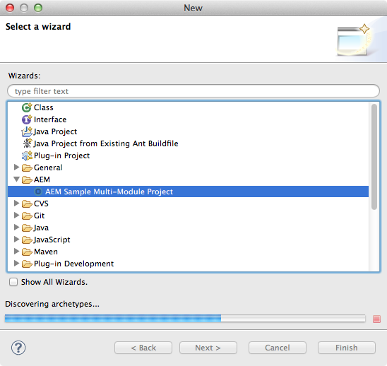

# AEM Developer Tools for Eclipse{#aem-developer-tools-for-eclipse}


## Panoramica {#overview}

AEM Developer Tools for Eclipse è un plugin Eclipse basato sul plug-in [Eclipse per Apache Sling](https://sling.apache.org/documentation/development/ide-tooling.html) rilasciato sotto la Licenza Apache 2.

Offre diverse funzioni che semplificano AEM sviluppo:

* Integrazione perfetta con AEM istanze tramite Eclipse Server Connector.
* Sincronizzazione sia per il contenuto che per i bundle OSGI.
* Supporto per il debug con funzionalità di swaping del codice.
* Avvio semplice di AEM progetti tramite una procedura guidata specifica per la creazione di progetti.
* Facile modifica delle proprietà JCR.

## Requisiti {#requirements}

Prima di utilizzare gli AEM Developer Tools, è necessario:

* Scaricate e installate [Eclipse IDE per sviluppatori](https://eclipse.org/downloads/packages/eclipse-ide-java-ee-developers/lunar)Java EE. AEM Developer Tools supporta attualmente Eclipse Kepler o versioni successive

* Può essere utilizzato con AEM versione 5.6.1 o successiva
* Configurate l&#39;installazione dell&#39;eclisse per garantire che possiate disporre di almeno 1 gigabyte di memoria heap modificando il file di `eclipse.ini` configurazione come descritto nelle domande frequenti [Eclipse](https://wiki.eclipse.org/FAQ_How_do_I_increase_the_heap_size_available_to_Eclipse%3F).

>[!NOTE]
>
>In macOS, per trovare il contenuto **del pacchetto è necessario fare clic con il pulsante destro del mouse su** Eclipse.app **, quindi selezionare** Mostra contenuto `eclipse.ini`**pacchetto.**

## Come installare AEM Developer Tools per Eclipse {#how-to-install-the-aem-developer-tools-for-eclipse}

Una volta soddisfatti i [requisiti](#requirements) di cui sopra, potete installare il plug-in come segue:

1. Sfogliate il sito Web [**AEM **Developer Tools](https://eclipse.adobe.com/aem/dev-tools/).

1. Copiate il collegamento **all’** installazione.

   In alternativa potete scaricare un archivio invece di utilizzare il collegamento di installazione. Questo consente l&#39;installazione offline, ma in questo modo non riceverete notifiche di aggiornamento automatico.

1. In Eclipse, aprite il menu **Aiuto** .
1. Fate clic su **Installa nuovo software**.
1. Fate clic su **Aggiungi...**.
1. In **Nome** , AEM Strumenti per sviluppatori.
1. In **Location** copiate l’URL di installazione.
1. Click **Ok**.
1. Controllate i plug-in **AEM** e **Sling** .
1. Fai clic su **Avanti**.
1. Fai clic su **Avanti**.
1. Accettate gli accordi di collegamento e fate clic su **Fine**.
1. Fate clic su **Sì** per riavviare Eclipse.

## Come importare progetti esistenti {#how-to-import-existing-projects}

>[!NOTE]
>
>Consultate [Come lavorare con un bundle in Eclipse quando è stato scaricato da AEM](https://stackoverflow.com/questions/29699726/how-to-work-with-a-bundle-in-eclipse-when-it-was-downloaded-from-aem/29705407#29705407).

## La prospettiva AEM {#the-aem-perspective}

Gli strumenti di sviluppo AEM per Eclipse vengono forniti con una prospettiva che offre il pieno controllo sui progetti e le istanze AEM.


## Esempio di progetto con più moduli {#sample-multi-module-project}

AEM Developer Tools for Eclipse è dotato di un progetto multivodulo di esempio che consente di acquisire rapidamente la massima velocità grazie alla configurazione di un progetto in Eclipse, oltre a fungere da guida best practice per diverse funzioni AEM. [Ulteriori informazioni su Project Archetype](https://github.com/Adobe-Marketing-Cloud/aem-project-archetype).

Per creare il progetto di esempio, effettuate le seguenti operazioni:

1. Nel menu **File** > **Nuovo** > **Progetto** , passare alla sezione **AEM** e selezionare **AEM Esempio di progetto** con più moduli.

   

1. Fai clic su **Avanti**.

   >[!NOTE]
   >
   >Questo passaggio potrebbe richiedere un po&#39; perché m2eclipse deve eseguire la scansione dei cataloghi archetype.

   

1. Scegliete **com.adobe.granite.archetypes : sample-project-archetype : (numero più alto)** dal menu, quindi fate clic su **Avanti**.

   

1. Compilate un **Nome**, un ID **** gruppo e un ID **** articolo per il progetto di esempio. Potete anche scegliere di impostare alcune proprietà avanzate.

   

1. È quindi necessario configurare un server AEM a cui Eclipse si connetterà.

   Per utilizzare la funzione Debugger, è necessario aver avviato AEM in modalità debug, che può essere ottenuta ad esempio aggiungendo quanto segue alla riga di comando:

   ```
       -nofork -agentlib:jdwp=transport=dt_socket,server=y,suspend=n,address=10123
   ```

   

1. Click **Finish**. La struttura del progetto viene creata.

   >[!NOTE]
   >
   >Per una nuova installazione (più precisamente: quando non sono mai state scaricate le dipendenze morali) è possibile che il progetto venga creato con degli errori. In questo caso, seguire la procedura descritta in [Risoluzione della definizione](#resolving-invalid-project-definition)di progetto non valida.

## Risoluzione dei problemi {#troubleshooting}

### Risoluzione della definizione di progetto non valida {#resolving-invalid-project-definition}

Per risolvere dipendenze non valide e definire il progetto, procedere come segue:

1. Seleziona tutti i progetti creati.
1. Fare clic con il pulsante destro del mouse. Nel menu **Paradiso** selezionare **Aggiorna progetti**.
1. Controllare **gli aggiornamenti di snapshot/release**.
1. Fai clic su **OK**. Eclipse tenta di scaricare le dipendenze richieste.

### Abilitazione del completamento automatico della libreria di tag nei file JSP {#enabling-tag-library-autocompletion-in-jsp-files}

Il completamento automatico della libreria di tag non è disponibile, in quanto al progetto vengono aggiunte le dipendenze corrette. Esiste un problema noto quando si utilizza la AEM Jar Uber, che non include i file tld e TagExtraInfo necessari.

Per aggirare il problema, accertati che l&#39;artifact org.apache.sling.scripting.jsp.taglib sia posizionato nel percorso di classe prima della AEM Uber Jar. Per i progetti Maven, posizionate la seguente dipendenza nel file pom.xml prima del file Uber Jar.

```xml
<dependency>
  <groupId>org.apache.sling</groupId>
  <artifactId>org.apache.sling.scripting.jsp.taglib</artifactId>
  <scope>provided</scope>
</dependency>
```

Assicuratevi di aggiungere la versione corretta per la distribuzione di AEM.

## More information {#more-information}

Il sito ufficiale Apache Sling IDE tooltool per Eclipse fornisce informazioni utili:

* La [**Apache Sling IDE tooling for Eclipse **User Guide](https://sling.apache.org/documentation/development/ide-tooling.html), questa documentazione vi guiderà attraverso i concetti generali, l&#39;integrazione dei server e le funzionalità di implementazione supportate da AEM Development Tools.
* La sezione [Risoluzione dei problemi](https://sling.apache.org/documentation/development/ide-tooling.html#troubleshooting).
* Elenco dei problemi [noti](https://sling.apache.org/documentation/development/ide-tooling.html#known-issues).

La seguente documentazione ufficiale [Eclipse](https://eclipse.org/) può aiutare a configurare l’ambiente:

* [Guida introduttiva ad Eclipse](https://eclipse.org/users/)
* [Eclipse Luna Help System](https://help.eclipse.org/luna/index.jsp)
* [Integrazione di Maven (m2eclipse)](https://www.eclipse.org/m2e/)

