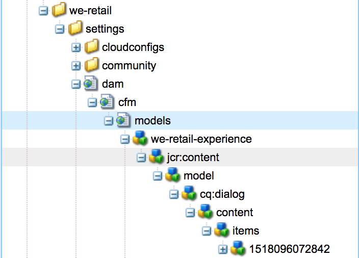

# NON PUBBLICARE, MA NON ELIMINARE LA personalizzazione dei modelli di frammenti di contenuto{#do-not-publish-but-do-not-delete-customizing-content-fragment-models}

L&#39;Editor modello di frammenti di contenuto è una procedura guidata basata su `Formbuilder`, ereditata da:

`granite/ui/components/foundation/form/formbuilder`

Questo componente dispone degli strumenti necessari per eseguire il rendering dell’interfaccia di trascinamento dell’editor modelli, completa di tipi di dati e proprietà per ciascun componente.

## Posizioni {#locations}

I modelli vengono salvati e creati in `/conf`, in una cartella in cui è abilitata la proprietà [Modelli di frammenti di](/help/assets/content-fragments-models.md#enable-content-fragment-models) contenuto. Questa impostazione è visibile anche nelle proprietà **di** configurazione, accessibili dal browser **di** configurazione.

1. Passare al browser tramite **Strumenti**, **Generali**, **Configuration Browser** Ad esempio, `http://localhost:4502/libs/granite/configurations/content/view.html/conf`

1. Dal browser, selezionate la configurazione appropriata, quindi **Proprietà** dalla barra degli strumenti.

   Ad esempio, le proprietà per `global`: `http://localhost:4502/libs/granite/configurations/content/edit.html/conf/global`

Nella console Modelli vengono visualizzate tutte le cartelle con la proprietà Modelli **di frammenti di** contenuto. Navigare tramite **Strumenti**, **Risorse**, Modelli **di frammenti di** contenuto; ad esempio, `http://localhost:4502/libs/dam/cfm/models/console/content/models.html/conf`.

Un utente può [creare un modello](/help/assets/content-fragments-models.md#creating-a-content-fragment-model) di frammento di contenuto utilizzando la procedura guidata **Crea modello** (tramite **Crea** dalla console).

>[!CAUTION]
>
>Non ***devi*** cambiare nulla nel `/libs` percorso.
>
>Questo perché il contenuto di `/libs` viene sovrascritto al successivo aggiornamento dell’istanza (e potrebbe essere sovrascritto quando applicate un hotfix o un pacchetto di funzioni).

## Struttura di un modello {#structure-of-a-model}

Verrà creata una voce con la struttura seguente:

* `../settings/dam/cfm/models`

   Tutti i modelli vengono salvati nelle sottocartelle di questa cartella.

* `jcr:content`

   Ogni modello contiene un `jcr:content` nodo che:

   * contiene proprietà di informazioni sul modello, ad esempio `jcr:title`, `lastModified`, `lastModifiedBy`
   * di solito ha `sling:ResourceType` `dam/cfm/models/console/components/data/entity/default`il

      con `sling:ResourceSuperType``dam/cfm/models/console/components/data/entity`

* `model`

   Il `model` nodo contiene una proprietà `dataTypesConfig`, utilizzata per determinare i tipi di dati utilizzati nell&#39;editor modelli.

* `items`

   Sotto il `items` nodo, tutti i tipi di dati aggiunti al modello vengono salvati (trascinati e rilasciati nell&#39;editor modelli). A ogni elemento viene assegnato un nome di nodo casuale, ma affinché l&#39;editor dei frammenti di contenuto funzioni con questo modello, ogni elemento deve avere una `name` proprietà. Inoltre, su questo nodo vengono salvate tutte le proprietà di configurazione per un particolare tipo di dati, incluse le proprietà predefinite necessarie per eseguire il rendering dei componenti.

>[!CAUTION]
>
>Tutti i tipi di dati trascinati e rilasciati in un editor modelli, e come tale creata, **devono** avere la `name` proprietà immessa dall&#39;utente.
>
>**Viene visualizzato come Nome** proprietà &amp;ast; nella scheda **Proprietà** dell&#39;editor modelli.

## Struttura dell&#39;Editor modello {#structure-of-the-model-editor}

L&#39;Editor **modello di frammento di** contenuto ha due parti:

* Il pannello di anteprima o di visualizzazione a sinistra, in cui è possibile rilasciare gli elementi. Questo:

   * Visualizza un&#39;anteprima del tipo **di** dati di cui viene creata un&#39;istanza.
   * Consente l&#39;ordinamento all&#39;interno dell&#39;Editor modello.

* Le schede **Tipi** di dati/**Proprietà** nel pannello a destra. Questo:

   * Visualizza un elenco di tipi di dati che possono essere trascinati e istanziati.
   * Per l&#39;editor modelli out-of-the-box l&#39;elenco è presente in:

      `/libs/settings/dam/cfm/models/formbuilderconfig/datatypes`

      <!-- Please uncomment when file is used
      This node contains all the data types currently supported in the model editor. For more information on how to configure the data types, see [Customizing Data Types for Content Fragment Models](/help/sites-developing/customizing-content-fragment-model-data-types.md).
      -->

   * Tutti i tipi di dati di cui è stato eseguito il rendering hanno due tag script che, una volta creata l&#39;istanza, formano la vista (il componente rappresentato sul lato sinistro) e la scheda **Proprietà** , che definisce le proprietà che un utente può definire per un determinato componente.

>[!CAUTION]
>
>Non ***devi*** cambiare nulla nel `/libs` percorso.
>
>Questo perché il contenuto di `/libs` viene sovrascritto al successivo aggiornamento dell’istanza (e potrebbe essere sovrascritto quando applicate un hotfix o un pacchetto di funzioni).

<!-- Please uncomment when files are used
The properties on the right side define a form that is submitted directly into JCR under `/conf`; see the path in the example [Structure of a Model](/help/sites-developing/customizing-content-fragment-models.md#structure-of-a-model).
-->

Quando viene creata un&#39;istanza di un tipo di dati, gli input HTML vengono creati per ogni proprietà di cui il componente deve essere rappresentato in un frammento di contenuto. Ad esempio:

* **** Nome proprietà &amp;ast; ( `name`) - funge da identificatore per i componenti

* **Rendering come** ( `metaType`) - il componente deve essere rappresentato come

* **Descrizione** ( `fieldDescription`) - descrizione del componente nel frammento di contenuto

* e altri.

