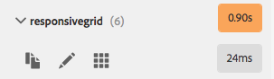

# Modalità Sviluppatore{#developer-mode}

Durante la modifica delle pagine in AEM, sono disponibili diverse [modalità](/help/sites-authoring/author-environment-tools.md#page-modes), inclusa la modalità Sviluppatore. Si apre un pannello laterale con diverse schede che forniscono allo sviluppatore informazioni sulla pagina corrente. Le tre schede sono:

* **[Componenti](#components)** per visualizzare informazioni sulla struttura e sulle prestazioni.
* **[Test](#tests)** per l’esecuzione di test e l’analisi dei risultati.
* **[Si](#errors)** è verificato un errore durante la visualizzazione di eventuali problemi.

che aiutano uno sviluppatore a:

* Scopri: di quali pagine sono composte.
* Debug: cosa sta accadendo dove e quando, che a sua volta aiuta a risolvere i problemi.
* Prova: l&#39;applicazione funziona come previsto.

>[!CAUTION]
>
>Modalità Sviluppatore:
>
>* È disponibile solo nell’interfaccia touch (durante la modifica delle pagine).
>* Non è disponibile sui dispositivi mobili o su piccole finestre sul desktop (a causa di limitazioni di spazio).
   >   * Questo si verifica quando la larghezza è inferiore a 1024 px.
>* È disponibile solo per gli utenti membri del gruppo `administrators`.

>[!CAUTION]
>
>La modalità Sviluppatore è disponibile solo in un’istanza di creazione standard che non utilizza la modalità di esecuzione nosamplecontent.
>
>Se necessario può essere configurato per l’uso:
>
>* in un’istanza di authoring che utilizza la modalità di esecuzione nosamplecontent
>* un’istanza di pubblicazione

>
>
Deve essere nuovamente disattivato dopo l&#39;uso.

>[!NOTE]
>
>Consulta:
>
>* Articolo della Knowledge Base, [Risoluzione dei problemi AEM TouchUI (Problemi di TouchUI)](https://helpx.adobe.com/experience-manager/kb/troubleshooting-aem-touchui-issues.html), per ulteriori suggerimenti e strumenti.
>* AEM sessione Gems su [AEM 6.0 Developer Mode](https://docs.adobe.com/content/ddc/en/gems/aem-6-0-developer-mode.html).

## Apertura della modalità Sviluppatore {#opening-developer-mode}

La modalità Sviluppatore è implementata come pannello laterale all’editor pagina. Per aprire il pannello, selezionare **Sviluppatore** dal selettore modalità nella barra degli strumenti dell&#39;editor pagina:

Il pannello è diviso in due schede:

* **[Componenti](/help/sites-developing/developer-mode.md#components)** : mostra una struttura di componenti, simile alla struttura di  [contenuti ](/help/sites-authoring/author-environment-tools.md#content-tree) per gli autori

* **[Errori](/help/sites-developing/developer-mode.md#errors)**  - In caso di problemi, vengono visualizzati i dettagli per ciascun componente.

### Componenti {#components}

Viene visualizzata una struttura di componenti che:

* Consente di delineare la catena di componenti e modelli di cui è stato eseguito il rendering sulla pagina (SLY, JSP, ecc.). La struttura ad albero può essere espansa per mostrare il contesto all&#39;interno della gerarchia.
* Mostra il tempo di calcolo lato server necessario per eseguire il rendering del componente.
* Consente di espandere la struttura ad albero e selezionare componenti specifici all’interno della struttura. La selezione permette di accedere ai dettagli dei componenti; quali:

   * Percorso archivio
   * Collegamenti agli script (accesso in CRXDE Lite)

* I componenti selezionati (nel flusso del contenuto, indicati da un bordo blu) saranno evidenziati nella struttura del contenuto (e viceversa).

Questo può essere utile per:

* Determinare e confrontare il tempo di rendering per componente.
* Visualizzare e comprendere la gerarchia.
* Comprendere e migliorare il tempo di caricamento della pagina individuando componenti lenti.

Ogni voce di componente può mostrare (ad esempio):

* **Visualizza dettagli**: un collegamento a un elenco che mostra:

   * tutti gli script di componente utilizzati per il rendering del componente.
   * percorso del contenuto dell&#39;archivio per questo componente specifico.

   

* **Modifica script**: un collegamento che:

   * apre lo script del componente in CRXDE Lite.

* L’espansione di una voce di componente (freccia) può anche mostrare:

   * La gerarchia all&#39;interno del componente selezionato.
   * Tempi di rendering del componente selezionato in modo isolato, dei singoli componenti nidificati al suo interno e del totale combinato.

   

>[!CAUTION]
>
>Alcuni collegamenti puntano agli script in `/libs`. Tuttavia, questi sono solo a scopo di riferimento, **non è necessario** modificare nulla in `/libs`, poiché eventuali modifiche apportate potrebbero andare perdute. Ciò è dovuto al fatto che questo ramo può essere modificato ogni volta che si esegue l&#39;aggiornamento o si applica un hotfix/feature pack. Eventuali modifiche necessarie devono essere effettuate in `/apps`, vedere [Overlays and Overrides](/help/sites-developing/overlays.md).

### Errori {#errors}

Si spera che la scheda **Errori** sia sempre vuota (come sopra), ma quando si verificano dei problemi vengono visualizzati i seguenti dettagli per ciascun componente:

* Un avviso se il componente scrive una voce nel registro degli errori, insieme a dettagli sull’errore e collegamenti diretti al codice appropriato all’interno del CRXDE Lite.
* Un avviso se il componente apre una sessione di amministrazione.

Ad esempio, in una situazione in cui viene chiamato un metodo non definito, l&#39;errore risultante verrà visualizzato nella scheda **Errors**:

Anche la voce del componente nella struttura ad albero della scheda Componenti viene contrassegnata con un indicatore quando si verifica un errore.

### Prove {#tests}

>[!CAUTION]
>
>In AEM 6.2, le funzioni di test della modalità Sviluppatore sono state reimplementate come applicazione standalone Tools.
>
>Per informazioni dettagliate, consultate [Verifica dell&#39;interfaccia utente](/help/sites-developing/hobbes.md).
