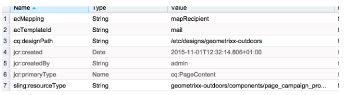

# Creazione di un modello di pagina AEM personalizzato con i componenti del modulo Adobe Campaign{#creating-custom-aem-page-template-with-adobe-campaign-form-components}

>[!CAUTION]
>
>AEM 6.4 ha raggiunto la fine del supporto esteso e questa documentazione non viene più aggiornata. Per maggiori dettagli, consulta la nostra [periodi di assistenza tecnica](https://helpx.adobe.com/it/support/programs/eol-matrix.html). Trova le versioni supportate [qui](https://experienceleague.adobe.com/docs/).

Questa pagina spiega come creare un modello di pagina personalizzato che utilizza [Modulo Adobe Campaign](/help/sites-authoring/adobe-campaign-components.md) i componenti esaminando il modo in cui il modello Geometrixx all&#39;aperto ( `/apps/geometrixx-outdoors/components/page_campaign_profile`) viene implementato e fornisce informazioni importanti utili per la creazione di modelli personalizzati.

>[!NOTE]
>
>[Gli esempi di moduli e-mail sono disponibili solo in Geometrixx](/help/sites-developing/we-retail.md). Scarica il contenuto di Geometrixx di esempio da Condivisione pacchetti.

Per creare un modello di pagina AEM personalizzato utilizzando i componenti Adobe Campaign Form, assicurarsi di disporre dei seguenti elementi:

1. **Correggere resourceSuperType**

   Assicurati che il componente pagina erediti da `mcm/campaign/components/profile`.

   Questo è necessario per i servlet per ottenere e salvare le informazioni

   * `com.day.cq.mcm.campaign.servlets.TemplateListServlet`
   * `com.day.cq.mcm.campaign.servlets.SaveProfileServlet`

   

1. **Impostazioni ClientContext**

   Quando osservi le impostazioni del contesto client ( `/etc/designs/geometrixx-outdoors/jcr:content/page_campaign_profile`) vengono visualizzate le seguenti impostazioni:

   * ClientContext `/etc/clientcontext/campaign`
   * C&#39;è anche un extra *config* nodo.

   

1. **head.jsp (/apps/geometrixx-outdoors/components/page_campaign_profile/head.jsp)**

   In **head.jsp**, vengono visualizzate le seguenti righe che utilizzano il **clientcontext-config** e **gancio a gancio**:

   ```
   <cq:include path="config" resourceType="cq/personalization/components/clientcontext_optimized/config"/>
   <sling:include path="contexthub" resourceType="granite/contexthub/components/contexthub"/>
   <cq:include script="/libs/cq/cloudserviceconfigs/components/servicelibs/servicelibs.jsp"/>
   ```

1. **body.jsp (/apps/geometrixx-outdoors/components/page_campaign_profile/body.jsp)**

   In **body.jsp**, i servizi cloud vengono caricati nella parte inferiore della pagina:

   ```
   <cq:include path="cloudservices" resourceType="cq/cloudserviceconfigs/components/servicecomponents"/>
   ```

1. **Proprietà pagina di Campaign**

   Per poter selezionare un modello Adobe Campaign, le proprietà della pagina vengono estese con **Campaign** scheda:

   `/apps/geometrixx-outdoors/components/page_campaign_profile/dialog/items/tabs/items/campaign`

   

1. **Impostazioni del modello**.

   Nel modello ( `/apps/geometrixx-outdoors/templates/campaign_profile/jcr:content`) vengono visualizzati i seguenti valori predefiniti:

   | **acMapping** | mapRecipient (per Adobe Campaign 6.1), profile (per Adobe Campaign Standard) |
   |---|---|
   | **acTemplateId** | mail |

   
