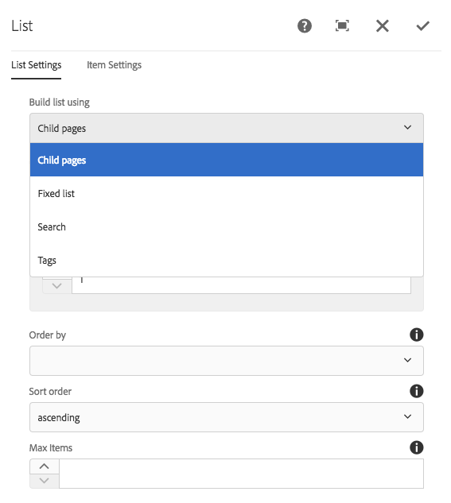

# Utilizzo di Nascondi condizioni{#using-hide-conditions}

Per determinare se la risorsa di un componente è rappresentata o meno, è possibile utilizzare le condizioni Nascondi. Un esempio potrebbe essere rappresentato dalla configurazione da parte dell’autore di un modello del componente [](https://helpx.adobe.com/experience-manager/core-components/using/list.html) elenco dei componenti core nell’editor [](/help/sites-authoring/templates.md) modelli e dalla decisione di disabilitare le opzioni per creare l’elenco in base alle pagine figlie. La disattivazione di questa opzione nella finestra di dialogo di progettazione imposta una proprietà in modo che quando viene eseguito il rendering del componente elenco, venga valutata la condizione Nascondi e l&#39;opzione per mostrare le pagine figlie non venga visualizzata.

## Panoramica {#overview}

Le finestre di dialogo possono diventare molto complesse con numerose opzioni per l&#39;utente, che può utilizzare solo una frazione delle opzioni a sua disposizione. Ciò può portare a un&#39;esperienza dell&#39;interfaccia utente travolgente per gli utenti.

Utilizzando condizioni nascoste, amministratori, sviluppatori e super utenti possono nascondere le risorse in base a una serie di regole. Questa funzione consente loro di decidere quali risorse visualizzare quando un autore modifica il contenuto.

>[!NOTE]
>
>Nascondere una risorsa basata su un&#39;espressione non sostituisce le autorizzazioni ACL. Il contenuto rimane modificabile ma semplicemente non viene visualizzato.

## Dettagli di implementazione e utilizzo {#implementation-and-usage-details}

`com.adobe.granite.ui.components.FilteringResourceWrapper` è responsabile del filtraggio delle risorse in base all&#39;esistenza e al valore della `granite:hide` proprietà, che si trova nel campo da filtrare. L&#39;implementazione di `/libs/cq/gui/components/authoring/dialog/dialog.jsp` include un&#39;istanza di `FilteringResourceWrapper.`

L’implementazione utilizza l’API [](https://helpx.adobe.com/experience-manager/6-4/sites/developing/using/reference-materials/granite-ui/api/jcr_root/libs/granite/ui/docs/server/el.html) ELResolver Granite e aggiunge una variabile `cqDesign` personalizzata tramite ExpressionCustomizer.

Di seguito sono riportati alcuni esempi di condizioni nascoste in un nodo di progettazione che si trova in `etc/design` o come Criterio contenuto.

```
${cqDesign.myProperty}
${!cqDesign.myProperty}
${cqDesign.myProperty == 'someText'}
${cqDesign.myProperty != 'someText'}
${cqDesign.myProperty == true}
${cqDesign.myProperty == true}
${cqDesign.property1 == 'someText' && cqDesign.property2 || cqDesign.property3 != 1 || header.myHeader}
```

Quando definite l’espressione Nascondi, tenete presente:

* Per essere valido, l&#39;ambito in cui viene trovata la proprietà deve essere espresso (ad es. `cqDesign.myProperty`).
* I valori sono di sola lettura.
* Le funzioni (se necessario) devono essere limitate a un determinato insieme fornito dal servizio.

## Esempio {#example}

Esempi di condizioni di nascondimento si trovano in tutta AEM e in particolare nei componenti [](https://docs.adobe.com/content/help/it-IT/experience-manager-core-components/using/introduction.html) core. Ad esempio, si consideri il componente [di base dell’](https://helpx.adobe.com/experience-manager/core-components/using/list.html)elenco.

[Utilizzando l’editor](/help/sites-authoring/templates.md)modelli, l’autore del modello può definire nella finestra di dialogo della progettazione quali opzioni del componente elenco sono disponibili per l’autore della pagina. Opzioni quali se consentire all’elenco di essere un elenco statico, un elenco di pagine figlie, un elenco di pagine con tag e così via. può essere attivato o disabilitato.

Se l&#39;autore di un modello sceglie di disabilitare l&#39;opzione pagine figlie, viene impostata una proprietà di progettazione e viene valutata una condizione Nascondi, in base alla quale l&#39;opzione non viene rappresentata per l&#39;autore della pagina.

1. Per impostazione predefinita, l’autore della pagina può utilizzare il componente di base elenco per creare un elenco utilizzando pagine figlie, scegliendo l’opzione Pagine **** figlie.

   

1. Nella finestra di dialogo di progettazione del componente di base elenco, l’autore del modello può scegliere l’opzione **Disattiva elementi figlio** per impedire che l’opzione generi un elenco basato su pagine figlie venga visualizzata all’autore della pagina.

   

1. Un nodo di criteri viene creato sotto `/conf/we-retail/settings/wcm/policies/weretail/components/content/lis`di esso con una proprietà `disableChildren` impostata su `true`.
1. La condizione hide è definita come valore di una proprietà `granite:hid`e nel nodo della proprietà dialog `/conf/we-retail/settings/wcm/policies/weretail/components/content/list`

   

1. Il valore di `disableChildren` viene estratto dalla configurazione di progettazione e l&#39;espressione `${cdDesign.disableChildren}` restituisce `false`, il che significa che l&#39;opzione non verrà rappresentata come parte del componente.

   È possibile visualizzare l&#39;espressione hide come valore della `granite:hide` proprietà [in GitHub qui](https://github.com/Adobe-Marketing-Cloud/aem-core-wcm-components/blob/master/content/src/content/jcr_root/apps/core/wcm/components/list/v1/list/_cq_dialog/.content.xml#L40).

1. L’opzione Pagine **** figlie non viene più rappresentata per l’autore della pagina quando si utilizza il componente Elenco.

   

