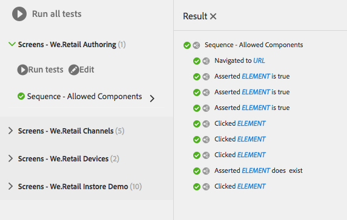

# Verifica dell&#39;interfaccia utente{#testing-your-ui}

AEM fornisce un framework per l&#39;automazione dei test per l&#39;interfaccia utente AEM. Utilizzando il framework, potete scrivere ed eseguire test di interfaccia direttamente in un browser Web. Il framework fornisce un&#39;API javascript per la creazione di test.

Il framework di test AEM utilizza Hobbes.js, una libreria di test scritta in Javascript. Il framework Hobbes.js è stato sviluppato per AEM di test come parte del processo di sviluppo. Il framework è ora disponibile per l&#39;uso pubblico per il test delle applicazioni AEM.

>[!NOTE]
>
>Per informazioni dettagliate sull&#39;API, consultare la documentazione di Hobbes.js [](https://helpx.adobe.com/experience-manager/6-4/sites/developing/using/reference-materials/test-api/index.html).

## Struttura dei test {#structure-of-tests}

Quando si utilizzano test automatizzati all&#39;interno di AEM, è importante comprendere i termini seguenti:

|  |  |
|---|---|
| Azione | Un **Action** è un&#39;attività specifica in una pagina Web, ad esempio fare clic su un collegamento o un pulsante. |
| Caso di prova | Un **Test Case** è una situazione specifica che può essere composta da una o più **Actions**. |
| Suite di test | Una **Suite di test** è un gruppo di casi di test **correlati** che insieme testano un caso d&#39;uso specifico. |

## Esecuzione di test {#executing-tests}

### Visualizzazione delle suite di test {#viewing-test-suites}

Aprite la console di test per visualizzare le suite di test registrate. Il pannello Test contiene un elenco delle suite di test e dei relativi casi di test.

Passare alla console Strumenti tramite **Navigazione globale -> Strumenti > Operazioni -> Test**.


All’apertura della console, le suite di test sono elencate a sinistra insieme a un’opzione per eseguirle tutte in sequenza. Lo spazio a destra visualizzato con uno sfondo a scacchi è un segnaposto per la visualizzazione del contenuto della pagina durante l&#39;esecuzione dei test.


### Esecuzione di una singola suite di test {#running-a-single-test-suite}

Le suite di test possono essere eseguite singolarmente. Quando eseguite una suite di test, la pagina cambia man mano che vengono eseguiti i casi di test e le relative azioni, e i risultati vengono visualizzati dopo il completamento del test. Le icone indicano i risultati.

Un&#39;icona a forma di segno di spunta indica un test superato:


Un&#39;icona &quot;X&quot; indica un test non riuscito:


Per eseguire una suite di test:

1. Nel pannello Test, fate clic o toccate il nome del test case da eseguire per espandere i dettagli delle azioni.

   

1. Tocca o fai clic sul pulsante **Esegui test**.

   

1. Il segnaposto viene sostituito con il contenuto della pagina durante l&#39;esecuzione del test.

   

1. Esaminare i risultati del test case toccando o facendo clic sulla descrizione per aprire il pannello **Result**. Toccando o facendo clic sul nome del test case nel pannello **Result** vengono visualizzati tutti i dettagli.

   

### Esecuzione di più test {#running-multiple-tests}

Le suite di test vengono eseguite in sequenza nell&#39;ordine in cui appaiono nella console. Potete eseguire il drill-down in un test per visualizzare i risultati dettagliati.


1. Nel pannello Test, toccate o fate clic sul pulsante **Esegui tutti i test** oppure sul pulsante **Esegui test** sotto il titolo della suite di test da eseguire.

   

1. Per visualizzare i risultati di ogni test case, toccate o fate clic sul titolo del test case. Toccando o facendo clic sul nome del test nel pannello **Risultato** vengono visualizzati tutti i dettagli.

   

## Creazione e utilizzo di una suite di test semplice {#creating-and-using-a-simple-test-suite}

La procedura seguente illustra la creazione ed esecuzione di una suite di test con [We.Retail content](/help/sites-developing/we-retail.md), ma è possibile modificare facilmente il test per utilizzare una pagina Web diversa.

Per informazioni dettagliate sulla creazione di suite di test, consultate la [documentazione API di Hobbes.js](https://helpx.adobe.com/experience-manager/6-4/sites/developing/using/reference-materials/test-api/index.html).

1. Apri CRXDE Lite. ([http://localhost:4502/crx/de](http://localhost:4502/crx/de))
1. Fare clic con il pulsante destro del mouse sulla cartella `/etc/clientlibs` e scegliere **Crea > Crea cartella**. Digitare `myTests` per il nome e fare clic su **OK**.
1. Fare clic con il pulsante destro del mouse sulla cartella `/etc/clientlibs/myTests` e scegliere **Crea > Crea nodo**. Utilizzare i seguenti valori delle proprietà e quindi fare clic su **OK**:

   * Nome: `myFirstTest`
   * Tipo: `cq:ClientLibraryFolder`

1. Aggiungi le seguenti proprietà al nodo myFirstTest:

   | Nome | Tipo | Valore |
   |---|---|---|
   | `categories` | `String[]` | `granite.testing.hobbes.tests` |
   | `dependencies` | `String[]` | `granite.testing.hobbes.testrunner` |

   >[!NOTE]
   >
   >**solo AEM Forms**
   >
   >Per verificare i moduli adattivi, aggiungere i seguenti valori alle categorie e alle dipendenze. Esempio:
   >
   >**categorie**:  `granite.testing.hobbes.tests, granite.testing.hobbes.af.commons`
   >
   >**dipendenze**:  `granite.testing.hobbes.testrunner, granite.testing.hobbes.af`

1. Fare clic su **Salva tutto**.
1. Fare clic con il pulsante destro del mouse sul nodo `myFirstTest` e scegliere **Crea > Crea file**. Denominate il file `js.txt` e fate clic su **OK**.
1. Nel file `js.txt`, immettete il testo seguente:

   ```
   #base=.
   myTestSuite.js
   ```

1. Fare clic su **Salva tutto**, quindi chiudere il file `js.txt`.
1. Fare clic con il pulsante destro del mouse sul nodo `myFirstTest` e scegliere **Crea > Crea file**. Denominate il file `myTestSuite.js` e fate clic su **OK**.
1. Copiate il codice seguente nel file `myTestSuite.js`, quindi salvate il file:

   ```
   new hobs.TestSuite("Experience Content Test Suite", {path:"/etc/clientlibs/myTests/myFirstTest/myTestSuite.js"})
      .addTestCase(new hobs.TestCase("Navigate to Experience Content")
         .navigateTo("/content/we-retail/us/en/experience/arctic-surfing-in-lofoten.html")
      )
      .addTestCase(new hobs.TestCase("Hover Over Topnav")
         .mouseover("li.visible-xs")
      )
      .addTestCase(new hobs.TestCase("Click Topnav Link")
         .click("li.active a")
   );
   ```

1. Andate alla console **Testing** per provare la suite di test.

