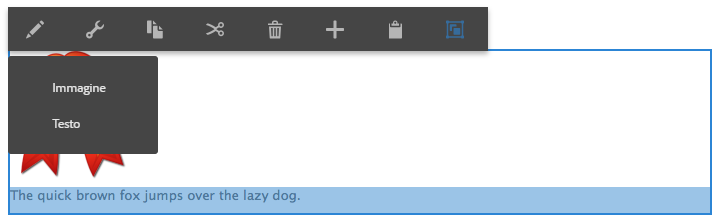

# Configurare più editor in-place {#configure-multiple-in-place-editors}

>[!CAUTION]
>
>AEM 6.4 ha raggiunto la fine del supporto esteso e questa documentazione non viene più aggiornata. Per maggiori dettagli, consulta la nostra [periodi di assistenza tecnica](https://helpx.adobe.com/it/support/programs/eol-matrix.html). Trova le versioni supportate [qui](https://experienceleague.adobe.com/docs/).

È possibile configurare l’editor Rich Text in Adobe Experience Manager in modo che abbia più editor locali. Una volta configurato, puoi selezionare il contenuto appropriato e aprire l’editor appropriato.



## Configurare più editor {#configure-multiple-editors}

Per abilitare più editor in-place alla struttura di un `cq:InplaceEditingConfig` il tipo di nodo è stato migliorato con la definizione di `cq:ChildEditorConfig` tipo di nodo.

Ad esempio:

```js
   /**
       * Configures in-place editing of a component.
       *
       * @prop active true to activate in-place editing for the component.
       * @prop editorType ID of in-place editor to use.
       * @prop cq:childEditors collection of {@link cq:ChildEditorConfig} nodes.
       * @prop configPath path to editor's config (optional).
       * @node config editor's config (used if no configPath is specified; optional).
     */
    [cq:InplaceEditingConfig] > nt:unstructured
      - active (boolean)
      - editorType (string)
      + cq:childEditors (nt:base) = nt:unstructured
      - configPath (string)
      + config (nt:unstructured) = nt:unstructured

    /**
      * Configures one child editor for a sub-component. The name of the this node is
      * used as DD ID.
      *
      * @prop type type of the inline editor. For example, ["image"].
      * @prop title Title of the inline editor.
      * @prop icon Icon to represent the inline editor.
    */
    [cq:ChildEditorConfig] > nt:unstructured
      orderable
      - type (string)
      - title (string)
```

Per configurare più editor, effettua le seguenti operazioni:

1. Sul nodo `cq:inplaceEditing` (di tipo `cq:InplaceEditingConfig`) definiscono le seguenti proprietà:

   * Nome:`editorType`
   * Tipo: `String`
   * Valore: `hybrid`

1. Sotto questo nodo, crea un nodo:

   * Nome: `cq:ChildEditors`
   * Tipo: `nt:unstructured`

1. Sotto `cq:childEditors` nodo, crea un nodo per ogni editor in-place:

   * Nome: Il nome di ogni nodo è il nome della proprietà che rappresenta, come nel caso delle destinazioni di rilascio. Ad esempio: `image` e `text`.
   * Tipo: `cq:ChildEditorConfig`

   >[!NOTE]
   >
   >Esiste una correlazione tra i target di rilascio definiti e gli editor figlio. Nome della `cq:ChildEditorConfig` node è considerato come ID target di rilascio, da utilizzare come parametro per l’editor figlio selezionato. Se l’area secondaria modificabile non dispone, ad esempio, di una destinazione di rilascio in un componente di testo, il nome dell’editor figlio viene comunque considerato come un ID per identificare l’area modificabile corrispondente.

1. Su ciascuno di questi nodi (`cq:ChildEditorConfig`) definisci le proprietà:

   * Nome: `type`.
   * Valore: il nome dell&#39;editor interno registrato; ad esempio, `image` e `text`.

   * Nome: `title`.
   * Valore: Titolo visualizzato nell’elenco di selezione dei componenti degli editor disponibili. Ad esempio: `Image` e `Text`.

### Configurazione aggiuntiva per gli editor Rich Text {#additional-configuration-for-rich-text-editors}

La configurazione per più editor Rich Text è leggermente diversa, in quanto puoi configurare ogni singola istanza RTE separatamente. Per maggiori dettagli, vedi [configurare l’editor Rich Text](/help/sites-administering/rich-text-editor.md). Per avere più editor Rich Text, crea una configurazione per ogni editor Rich Text sul posto. Adobe consiglia di creare il nuovo nodo di configurazione in `cq:InplaceEditingConfig` poiché ogni singolo editor Rich Text può avere una configurazione diversa. Sotto il nuovo nodo crea ogni singola configurazione RTE.

```xml
    texttext
        cq:dialog
        cq:editConfig
            cq:inplaceEditing
                cq:childEditors
                    someconfig
                        text1
                            rtePlugins
                        text2
                            rtePlugins
```

>[!NOTE]
>
>Tuttavia, per l’editor Rich Text, l’ `configPath` è supportata quando nel componente è presente una sola istanza dell&#39;editor di testo (sottoarea modificabile). Questo utilizzo `configPath` è fornito per supportare la compatibilità con le versioni precedenti delle finestre di dialogo dell’interfaccia utente del componente.

>[!CAUTION]
>
>Non denominare il nodo di configurazione dell’editor Rich Text come `config`. In caso contrario, le configurazioni dell’editor Rich Text sono disponibili solo per gli amministratori e non per gli utenti del gruppo `content-author`.

## Esempi di codice {#code-samples}

Puoi trovare il codice di questa pagina in [progetto aem-authoring-hybridedit su GitHub](https://github.com/Adobe-Marketing-Cloud/aem-authoring-hybrideditors). Puoi scaricare l’intero progetto come [archivio ZIP](https://github.com/Adobe-Marketing-Cloud/aem-authoring-hybrideditors/archive/master.zip).

## Aggiungere un editor locale {#add-an-in-place-editor}

Per informazioni generali sull’aggiunta di un editor locale, consulta il documento [personalizzare l’authoring delle pagine](/help/sites-developing/customizing-page-authoring-touch.md#add-new-in-place-editor).

>[!MORELIKETHIS]
>
>* [Configurare l’editor Rich Text in Experience Manager](/help/sites-administering/rich-text-editor.md).

