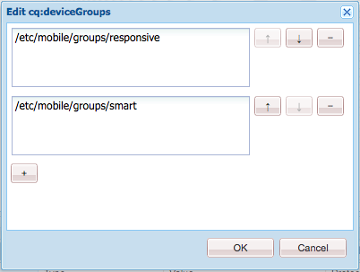

# Rendering modello adattivo{#adaptive-template-rendering}

Il rendering del modello adattivo consente di gestire una pagina con varianti. Originariamente utile per fornire vari output HTML per dispositivi mobili (ad esempio, telefoni cellulari con funzionalità e smartphone), questa funzione è utile quando le esperienze devono essere distribuite a vari dispositivi che necessitano di markup o output HTML diversi.

## Panoramica {#overview}

I modelli sono generalmente basati su una griglia reattiva e le pagine create in base a questi modelli sono completamente reattive, adattandosi automaticamente alla finestra del dispositivo client. Tramite la barra degli strumenti Emulatore nell’editor di pagina, gli autori possono eseguire il targeting dei layout per dispositivi specifici.

È inoltre possibile impostare modelli per il supporto del rendering adattivo. Quando i gruppi di dispositivi sono configurati correttamente, viene eseguito il rendering della pagina con un altro selettore nell’URL quando si seleziona un dispositivo in modalità emulatore. Utilizzando un selettore, è possibile richiamare direttamente il rendering di una pagina mediante l’URL.

Ricorda quando imposti i gruppi di dispositivi:

* Ogni dispositivo deve essere in almeno un gruppo di dispositivi.
* Un dispositivo può appartenere a più gruppi di dispositivi.
* Poiché i dispositivi possono essere raggruppati in più gruppi di dispositivi, i selettori possono essere combinati.
* La combinazione di selettori viene valutata dall&#39;alto verso il basso mentre sono persistenti nella directory archivio.

>[!NOTE]
>
>Il gruppo di dispositivi **Dispositivi reattivi** non avrà mai un selettore, perché i dispositivi riconosciuti come il supporto della progettazione reattiva non necessitano di un layout adattivo

## Configurazione {#configuration}

I selettori di rendering adattivi possono essere configurati per i gruppi di dispositivi esistenti o per i [gruppi creati dall&#39;utente.](/help/sites-developing/mobile.md#device-groups)

Per questo esempio, stiamo per configurare il gruppo di dispositivi **Smart Phones** in modo che sia disponibile un selettore di rendering adattivo nell&#39;ambito del modello **Experience Page** in We.Retail.

1. Modificate il gruppo di dispositivi che richiede un selettore adattivo in `http://localhost:4502/miscadmin#/etc/mobile/groups`

   Impostare l&#39;opzione **Disattiva emulatore** e salvare.

   

1. Il selettore sarà disponibile per i **Blackberry** e **iPhone 4** purché il gruppo di dispositivi **Smart Phone** sia aggiunto al modello e alle strutture di pagina nei seguenti passaggi.

   

1. Utilizzando CRX DE Lite, consentite che il gruppo di dispositivi sia utilizzato nel modello aggiungendolo alla proprietà stringa multi-valore `cq:deviceGroups` nella struttura del modello.

   `/conf/<your-site>/settings/wcm/templates/<your-template>/structure/jcr:content`

   Ad esempio, se si desidera aggiungere il gruppo di dispositivi Smart Phone:

   `/conf/we-retail/settings/wcm/templates/experience-page/structure/jcr:content`

   

1. Utilizzando CRX DE Lite, consentite che il gruppo di dispositivi sia utilizzato sul sito aggiungendolo alla proprietà stringa multi-valore `cq:deviceGroups` nella struttura del sito.

   `/content/<your-site>/jcr:content`

   Ad esempio, se si desidera consentire il gruppo di dispositivi **Smart Phone**:

   `/content/we-retail/jcr:content`

   

Ora, quando si utilizza l&#39; [emulatore](/help/sites-authoring/responsive-layout.md#layout-definitions-device-emulation-and-breakpoints) nell&#39;editor di pagina (ad esempio quando [si modifica il layout](/help/sites-authoring/responsive-layout.md)) e si sceglie un dispositivo del gruppo di dispositivi configurato, la pagina verrà rappresentata con un selettore come parte dell&#39;URL.

Nel nostro esempio, quando si modifica una pagina basata sul modello **Experience Page** e si sceglie iPhone 4 nell&#39;emulatore, viene eseguito il rendering della pagina includendo il selettore `arctic-surfing-in-lofoten.smart.html` invece di `arctic-surfing-in-lofoten.html`

La pagina può essere chiamata direttamente tramite questo selettore.

