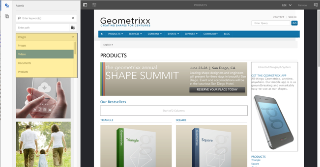

# Struttura dell&#39;AEM interfaccia touch{#structure-of-the-aem-touch-enabled-ui}

L’interfaccia AEM touch presenta diversi principi di base ed è composta da diversi elementi chiave:

## Console {#consoles}

### Layout di base e ridimensionamento {#basic-layout-and-resizing}

L&#39;interfaccia utente è destinata sia ai dispositivi mobili che a quelli desktop, ma invece di creare due stili  Adobe ha deciso di utilizzare uno stile che funziona per tutti gli schermi e i dispositivi.

Tutti i moduli utilizzano lo stesso layout di base, AEM può essere visto come:

Il layout aderisce a uno stile di progettazione reattivo e si adatta alle dimensioni del dispositivo/finestra in uso.

Ad esempio, quando la risoluzione è inferiore a 1024 px (come su un dispositivo mobile), il display viene regolato di conseguenza:

### Barra intestazione {#header-bar}

La barra di intestazione mostra gli elementi globali, tra cui:

* il logo e lo specifico prodotto/soluzione che state utilizzando; per AEM questo collegamento viene creato anche un collegamento alla navigazione globale
* Ricerca
* icona per accedere alle risorse della guida
* icona per accedere ad altre soluzioni
* un indicatore di (e l&#39;accesso a) eventuali avvisi o elementi in entrata in attesa
* l&#39;icona utente, insieme a un collegamento alla gestione del profilo

### Barra degli strumenti {#toolbar}

Questo è contestuale agli strumenti relativi alla posizione e alle superfici per controllare la visualizzazione o le risorse nella pagina sottostante. La barra degli strumenti è specifica per il prodotto, ma gli elementi sono comuni.

In qualsiasi punto della barra degli strumenti sono visualizzate le azioni attualmente disponibili:

Dipende anche dalla selezione di una risorsa:

### Barra a sinistra {#left-rail}

La barra a sinistra può essere aperta o nascosta come richiesto per mostrare:

* **Timeline**
* **Riferimenti**
* **Filtro**

Il valore predefinito è **Solo contenuto** (barra nascosta).

## Authoring delle pagine {#page-authoring}

Durante l’authoring delle pagine, le aree strutturali sono le seguenti:

### Cornice contenuto {#content-frame}

Il contenuto della pagina viene rappresentato nella cornice contenuto. La cornice contenuto è completamente indipendente dall&#39;editor, per garantire che non vi siano conflitti dovuti a CSS o javascript.

La cornice contenuto si trova nella sezione destra della finestra, sotto la barra degli strumenti.

### Fotogramma editor {#editor-frame}

La cornice dell’editor realizza le funzioni di modifica.

La cornice dell&#39;editor è un contenitore (astratto) per tutti gli elementi *di authoring delle pagine*. Vive sopra la cornice contenuto e include:

* barra degli strumenti superiore
* il pannello laterale
* tutte le sovrapposizioni
* qualsiasi altro elemento di authoring delle pagine; ad esempio, la barra degli strumenti del componente

### Pannello laterale {#side-panel}

Contiene due schede predefinite che consentono di selezionare risorse e componenti; possono essere trascinate da qui e rilasciate sulla pagina.

Per impostazione predefinita, il pannello laterale è nascosto. Se selezionata, la finestra verrà visualizzata a sinistra oppure scorrerà per coprire l’intera finestra (quando la dimensione della finestra è inferiore a 1024 px; ad esempio su un dispositivo mobile).

### Pannello laterale - Risorse {#side-panel-assets}

Nella scheda Risorse puoi selezionare una delle risorse disponibili. Potete anche filtrare un termine specifico o selezionare un gruppo.

### Pannello laterale - Gruppi di risorse {#side-panel-asset-groups}

Nella scheda Risorsa è disponibile un elenco a discesa che potete usare per selezionare i gruppi di risorse specifici.

### Pannello laterale - Componenti {#side-panel-components}

Nella scheda Componenti è possibile selezionare uno dei componenti disponibili. Potete anche filtrare un termine specifico o selezionare un gruppo.

### Sovrapposizioni {#overlays}

Questi elementi sovrappongono la cornice contenuto e vengono utilizzati dai [livelli](#layer) per comprendere quali sono le modalità di interazione (completamente trasparente) con i componenti e il relativo contenuto.

Le sovrapposizioni sono presenti nella cornice dell’editor (con tutti gli altri elementi di authoring delle pagine), ma in realtà sovrappongono i componenti appropriati nella cornice contenuto.

### Livello {#layer}

Un livello è un pacchetto indipendente di funzionalità che può essere attivato per:

* fornire una visualizzazione diversa della pagina
* consente di manipolare e/o interagire con una pagina

I livelli forniscono funzionalità sofisticate per l’intera pagina, anziché azioni specifiche su un singolo componente.

AEM sono disponibili diversi livelli già implementati per l’authoring delle pagine; ad esempio, modifica, anteprima, annotazione.

>[!NOTE]
>
>I livelli sono un concetto potente che influisce sulla visualizzazione e l&#39;interazione dell&#39;utente con il contenuto della pagina. Quando sviluppate i vostri livelli, dovete assicurarvi che il livello si pulisca quando viene estratto.

### Commutatore livello {#layer-switcher}

Lo switcher di livello consente di scegliere il livello da usare. Una volta chiuso, indica il livello attualmente in uso.

Lo switcher di livello è disponibile come elenco a discesa dalla barra degli strumenti (nella parte superiore della finestra, all’interno della cornice dell’editor).

### Barra degli strumenti del componente {#component-toolbar}

Ogni istanza di un componente visualizzerà la propria barra degli strumenti quando viene fatto clic (una volta o con un doppio clic lento). La barra degli strumenti contiene le azioni specifiche (ad es. copia, incolla, editor aperto) disponibili per l’istanza del componente (modificabile) sulla pagina.

A seconda dello spazio disponibile, le barre degli strumenti dei componenti sono posizionate nell’angolo superiore o inferiore destro del componente appropriato.

## Ulteriori informazioni {#further-information}

Per ulteriori dettagli sui concetti relativi all&#39;interfaccia touch, continuate con l&#39;articolo [Concetti dell&#39;interfaccia AEM touch](/help/sites-developing/touch-ui-concepts.md).

Per ulteriori informazioni tecniche, consultate la sezione [Documentazione JS set](https://helpx.adobe.com/experience-manager/6-4/sites/developing/using/reference-materials/jsdoc/ui-touch/editor-core/index.html) per l&#39;editor pagina touch.

