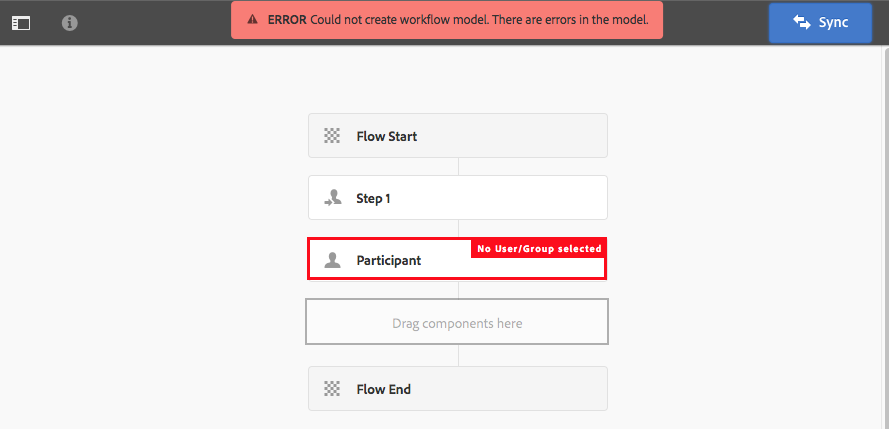
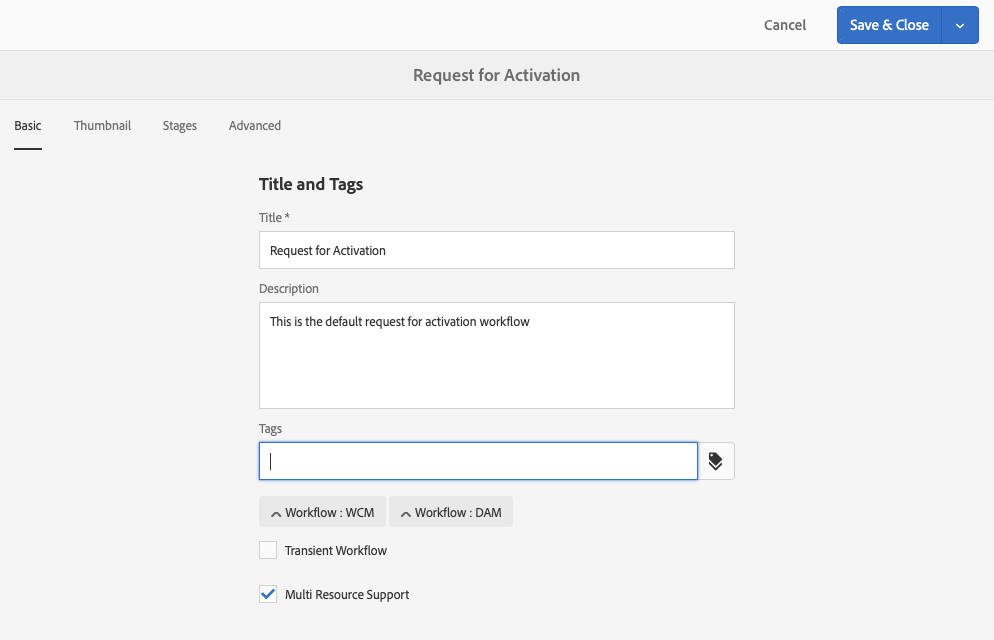

# Creazione di modelli di flussi di lavoro{#creating-workflow-models}

>[!CAUTION]
>
>AEM 6.4 ha raggiunto la fine del supporto esteso e questa documentazione non viene più aggiornata. Per maggiori dettagli, consulta la nostra [periodi di assistenza tecnica](https://helpx.adobe.com/it/support/programs/eol-matrix.html). Trova le versioni supportate [qui](https://experienceleague.adobe.com/docs/).

>[!CAUTION]
>
>Per l’utilizzo dell’interfaccia classica, consulta [Documentazione di AEM 6.3](https://helpx.adobe.com/experience-manager/6-3/sites-developing/workflows-models.html) di riferimento.

Crea un [modello di flusso di lavoro](/help/sites-developing/workflows.md#model) definire la serie di passaggi eseguiti quando un utente avvia il flusso di lavoro. Puoi anche definire le proprietà del modello, ad esempio se il flusso di lavoro è transitorio o se utilizza più risorse.

Quando un utente avvia un flusso di lavoro, viene avviata un’istanza; si tratta del modello runtime corrispondente, creato quando [Sincronizzazione](#sync-your-workflow-generate-a-runtime-model) le modifiche.

## Creazione di un nuovo flusso di lavoro {#creating-a-new-workflow}

Quando crei un nuovo modello di flusso di lavoro, questo contiene:

* I passaggi, **[!UICONTROL Inizio flusso]** e **[!UICONTROL Fine flusso]**.

   che rappresentano l’inizio e la fine del flusso di lavoro. Questi passaggi sono obbligatori e non possono essere modificati o rimossi.

* Un esempio **Partecipante** passaggio denominato **Passaggio 1**.

   Questo passaggio è configurato per assegnare un elemento di lavoro all’iniziatore del flusso di lavoro. Modifica o elimina questo passaggio e aggiungi i passaggi necessari.

Per creare un nuovo flusso di lavoro con l’editor:

1. Apri **[!UICONTROL Modelli di flusso di lavoro]** console; mediante **[!UICONTROL Strumenti]**, **[!UICONTROL Flusso di lavoro]**, **[!UICONTROL Modelli]** o, ad esempio:

   [http://localhost:4502/aem/workflow](http://localhost:4502/aem/workflow)

1. Seleziona **[!UICONTROL Crea]**, quindi **[!UICONTROL Crea modello]**.
1. La **[!UICONTROL Aggiungi modello flusso di lavoro]** viene visualizzata la finestra di dialogo. Inserisci il **[!UICONTROL Titolo]** e **[!UICONTROL Nome]** (facoltativo) prima di selezionare **[!UICONTROL Fine]**.
1. Il nuovo modello è elencato nella **[!UICONTROL Modelli di flusso di lavoro]** console.
1. Seleziona il nuovo flusso di lavoro, quindi utilizza [**[!UICONTROL Modifica ]**per aprirlo alla configurazione](#editing-a-workflow):

   

>[!NOTE]
>
>Se crei modelli a livello di programmazione (utilizzando un pacchetto crx) puoi anche creare una sottocartella in:
>
>`/var/workflow/models`
>
>Ad esempio `/var/workflow/models/prototypes`
>
>Questa cartella può quindi essere utilizzata per [gestione dell’accesso ai modelli in quella cartella](/help/sites-administering/workflows-managing.md#create-a-subfolder-in-var-workflow-models-and-apply-the-acl-to-that).

## Modifica di un flusso di lavoro {#editing-a-workflow}

Puoi modificare qualsiasi modello di flusso di lavoro esistente in modo da:

* [definire i passaggi](#adding-a-step-to-a-model) e loro [parameters](#configuring-a-workflow-step)

* configurare le proprietà del flusso di lavoro, tra cui [stadi](#configuring-workflow-stages-that-show-workflow-progress), [se il flusso di lavoro è transitorio](#creating-a-transient-workflow) e/o [utilizza più risorse](#configuring-a-workflow-for-multi-resource-support)

Modifica di un [**Predefinito o legacy** Flusso di lavoro predefinito](#editing-a-default-or-legacy-workflow-for-the-first-time) dispone di un ulteriore passaggio per garantire che [copia sicura](/help/sites-developing/workflows-best-practices.md#locations-workflow-models) viene eseguito prima delle modifiche.

Quando gli aggiornamenti al flusso di lavoro sono completi devi utilizzare **[!UICONTROL Sincronizzazione]** a **[!UICONTROL Generare un modello runtime]**. Vedi [Sincronizza il flusso di lavoro](#sync-your-workflow-generate-a-runtime-model) per i dettagli.

### Sincronizza il flusso di lavoro - Genera un modello runtime {#sync-your-workflow-generate-a-runtime-model}

**Sincronizzazione** (a destra nella barra degli strumenti dell’editor) genera un [modello runtime](/help/sites-developing/workflows.md#runtime-model). Il modello di runtime è il modello effettivamente utilizzato quando un utente avvia un flusso di lavoro. Se non **[!UICONTROL Sincronizzazione]** le modifiche apportate non saranno quindi disponibili in fase di esecuzione.

Quando apporti modifiche al flusso di lavoro (o a qualsiasi altro utente) devi utilizzare **[!UICONTROL Sincronizzazione]** per generare un modello di runtime, anche quando le singole finestre di dialogo (ad esempio, per i passaggi) dispongono di opzioni di salvataggio personalizzate.

Quando le modifiche sono sincronizzate con il modello runtime (salvato), **[!UICONTROL Sincronizzato]** viene invece visualizzato.

Alcuni passaggi dispongono di campi obbligatori e/o di una convalida integrata. Quando queste condizioni non sono soddisfatte, viene visualizzato un errore quando si tenta di **[!UICONTROL Sincronizzazione]** il modello. Ad esempio, quando non è stato definito alcun partecipante per un **[!UICONTROL Partecipante]** passo:



### Modifica di un flusso di lavoro predefinito o legacy per la prima volta {#editing-a-default-or-legacy-workflow-for-the-first-time}

Quando si apre un [Modello predefinito e/o legacy](/help/sites-developing/workflows.md#workflow-types) per la modifica:

* La **[!UICONTROL Passaggi]** browser non disponibile (lato sinistro).
* C&#39;è un **[!UICONTROL Modifica]** nella barra degli strumenti (a destra).
* Inizialmente il modello e le sue proprietà vengono presentate in modalità di sola lettura come segue:

   * I flussi di lavoro predefiniti si trovano in `/libs`
   * I flussi di lavoro legacy si trovano in `/etc`

Selezione **[!UICONTROL Modifica]** :

* acquisire una copia del flusso di lavoro in `/conf`
* fare in modo che **[!UICONTROL Passaggi]** browser disponibile
* consente di apportare modifiche

>[!NOTE]
>
>Vedi [Posizioni dei modelli di flussi di lavoro](/help/sites-developing/workflows-best-practices.md#locations-workflow-models) per ulteriori informazioni.


### Aggiunta di un passaggio a un modello {#adding-a-step-to-a-model}

Sarà necessario aggiungere passaggi al modello per rappresentare l’attività da eseguire. Ogni passaggio esegue un’attività specifica. Una selezione di componenti passo è disponibile in un’istanza AEM standard.

Quando modificate un modello, i passaggi disponibili vengono visualizzati nei vari gruppi della **[!UICONTROL Passaggi]** browser. Ad esempio:


>[!NOTE]
>
>Per informazioni sui componenti del passaggio principale installati con AEM, consulta [Riferimento passaggi del flusso di lavoro](/help/sites-developing/workflows-step-ref.md).

**Per aggiungere un passaggio a un modello**:

1. Apri un modello di flusso di lavoro esistente da modificare. Da **[!UICONTROL Modello flussi di lavoro]** console, selezionate il modello desiderato, quindi **[!UICONTROL Modifica]**.
1. Apri **[!UICONTROL Passaggi]** browser; utilizzo **[!UICONTROL Attiva/Disattiva pannello laterale]** all’estrema sinistra della barra degli strumenti superiore. È possibile:

   * **[!UICONTROL Filtro]** per passaggi specifici.
   * Utilizza il selettore a discesa per limitare la selezione a un gruppo specifico di passaggi.
   * Seleziona l’icona Mostra descrizione  per visualizzare ulteriori dettagli sul passaggio appropriato.

   

1. Trascina i passaggi appropriati nella posizione desiderata nel modello.

   Ad esempio, un **[!UICONTROL Passaggio partecipante]**.

   Una volta aggiunto al flusso, puoi [configurare il passaggio](#configuring-a-workflow-step).

   

1. Aggiungi tutti i passaggi necessari o altri aggiornamenti.

   In fase di esecuzione, i passaggi vengono eseguiti nell’ordine in cui compaiono nel modello. Dopo aver aggiunto i componenti passo, potete trascinarli in una posizione diversa nel modello.

   È inoltre possibile copiare, tagliare, incollare, raggruppare o eliminare i passaggi esistenti; come con il [editor di pagine.](/help/sites-authoring/editing-content.md)

   È inoltre possibile comprimere/espandere i passaggi suddivisi utilizzando l’opzione della barra degli strumenti: 

1. Conferma le modifiche con **[!UICONTROL Sincronizzazione]** (barra degli strumenti dell’editor) per generare il modello di runtime.

   Vedi [Sincronizza il flusso di lavoro](#sync-your-workflow-generate-a-runtime-model) per i dettagli.

### Configurazione di un passaggio del flusso di lavoro {#configuring-a-workflow-step}

È possibile **Configura** e personalizzare il comportamento di un passaggio del flusso di lavoro utilizzando **[!UICONTROL Proprietà passaggio]** finestre di dialogo.

1. Per aprire **[!UICONTROL Proprietà passaggio]** finestra di dialogo per un passaggio:

   * Tocca il passaggio nel modello di flusso di lavoro e seleziona **[!UICONTROL Configura]** dalla barra degli strumenti del componente.
   * Fare doppio clic sul passaggio.

   >[!NOTE]
   >
   >Per informazioni sui componenti del passaggio principale installati con AEM, consulta [Riferimento passaggi del flusso di lavoro](/help/sites-developing/workflows-step-ref.md).

1. Configura le **[!UICONTROL Proprietà passaggio]** se necessario; le proprietà disponibili dipendono dal tipo di passaggio, possono essere disponibili anche diverse schede. Ad esempio, il valore predefinito **[!UICONTROL Passaggio partecipante]**, presente in un nuovo flusso di lavoro come `Step 1`:

   

1. Conferma gli aggiornamenti con il segno di spunta.
1. Conferma le modifiche con **[!UICONTROL Sincronizzazione]** (barra degli strumenti dell’editor) per generare il modello di runtime.

   Vedi [Sincronizza il flusso di lavoro](#sync-your-workflow-generate-a-runtime-model) per i dettagli.

### Creazione di un flusso di lavoro transitorio {#creating-a-transient-workflow}

Puoi creare una [Transiente](/help/sites-developing/workflows.md#transient-workflows) modello di flusso di lavoro durante la creazione di un nuovo modello o modificando un modello esistente:

1. Apri il modello di flusso di lavoro per [modifica](#editing-a-workflow).
1. Seleziona **[!UICONTROL Proprietà modello flusso di lavoro]** dalla barra degli strumenti.
1. Nella finestra di dialogo, attiva **[!UICONTROL Flusso di lavoro transitorio]** (o disattivalo se necessario):

   

1. Conferma la modifica con **[!UICONTROL Salva e chiudi]**; seguito da **[!UICONTROL Sincronizzazione]** (barra degli strumenti dell’editor) per generare il modello di runtime.

   Vedi [Sincronizza il flusso di lavoro](#sync-your-workflow-generate-a-runtime-model) per i dettagli.

>[!NOTE]
>
>Quando esegui un flusso di lavoro in [transient](/help/sites-developing/workflows.md#transient-workflows) la modalità AEM non memorizza alcuna cronologia del flusso di lavoro. Pertanto, [Timeline](/help/sites-authoring/basic-handling.md#timeline) non visualizza alcuna informazione relativa a quel flusso di lavoro. [](/help/sites-authoring/basic-handling.md#timeline)

### Rendere disponibili i modelli di flusso di lavoro nell’interfaccia utente touch {#make-workflow-models-available-in-touchui}

Se un modello di flusso di lavoro è presente nell’interfaccia classica, ma manca nel menu a comparsa di selezione nella **[!UICONTROL Timeline]** barra dell’interfaccia utente touch, quindi segui la configurazione per renderla disponibile. I passaggi seguenti illustrano l’utilizzo del modello di flusso di lavoro denominato **[!UICONTROL Richiesta di attivazione]**.

1. Verifica che il modello non sia disponibile nell’interfaccia utente touch. Accedere a una risorsa utilizzando `/assets.html/content/dam` percorso. Seleziona una risorsa. Apri **[!UICONTROL Timeline]** nella barra a sinistra. Fai clic su **[!UICONTROL Avvia flusso di lavoro]** e confermare che **[!UICONTROL Richiesta di attivazione]** modello non presente nell&#39;elenco popup.

1. Passa a **[!UICONTROL Strumenti > Generale > Assegnazione tag]**. Seleziona **[!UICONTROL Flusso di lavoro]**.

1. Seleziona **[!UICONTROL Crea > Crea tag]**. Imposta **[!UICONTROL Titolo]** come `DAM` e **[!UICONTROL Nome]** come `dam`. Seleziona **[!UICONTROL Invia]**.
   

1. Passa a **[!UICONTROL Strumenti > Flusso di lavoro > Modelli]**. Seleziona **[!UICONTROL Richiesta di attivazione]**, quindi seleziona **[!UICONTROL Modifica]**.

1. Seleziona **[!UICONTROL Modifica]** , quindi apri **[!UICONTROL Proprietà modello flusso di lavoro]**. Vai a **[!UICONTROL Base]** scheda .

1. Aggiungi `Workflow : DAM` a **[!UICONTROL Tag]** campo . Conferma la selezione con il segno di spunta (segno di spunta).

1. Conferma l’aggiunta del tag con **[!UICONTROL Salva e chiudi]**.
   

1. Completa il processo con **[!UICONTROL Sincronizzazione]**. Il flusso di lavoro è ora disponibile nell’interfaccia touch.

### Configurazione di un flusso di lavoro per il supporto di più risorse {#configuring-a-workflow-for-multi-resource-support}

Puoi configurare un modello di flusso di lavoro per [Supporto per più risorse](/help/sites-developing/workflows.md#multi-resource-support) durante la creazione di un nuovo modello o modificando un modello esistente:

1. Apri il modello di flusso di lavoro per [modifica](#editing-a-workflow).
1. Seleziona **[!UICONTROL Proprietà modello flusso di lavoro]** dalla barra degli strumenti.

1. Nella finestra di dialogo, attiva **[!UICONTROL Supporto per più risorse]** (o disattivalo se necessario):

   

1. Conferma la modifica con **[!UICONTROL Salva e chiudi]**; seguito da **[!UICONTROL Sincronizzazione]** (barra degli strumenti dell’editor) per generare il modello di runtime.

   Vedi [Sincronizza il flusso di lavoro](#sync-your-workflow-generate-a-runtime-model) per i dettagli.

### Configurazione delle fasi del flusso di lavoro (che mostrano l’avanzamento del flusso di lavoro) {#configuring-workflow-stages-that-show-workflow-progress}

[Fasi del flusso di lavoro](/help/sites-developing/workflows.md#workflow-stages) aiuta a visualizzare l’avanzamento di un flusso di lavoro durante la gestione delle attività.

>[!CAUTION]
>
>Se le fasi del flusso di lavoro sono definite in **[!UICONTROL Proprietà pagina]**, ma non utilizzato per nessuno dei passaggi del flusso di lavoro, la barra di avanzamento non mostrerà alcun progresso (indipendentemente dal passaggio del flusso di lavoro corrente).

Le fasi da rendere disponibili sono definite nei modelli di flusso di lavoro; i modelli di flusso di lavoro esistenti possono essere aggiornati per includere le definizioni degli stadi. Puoi definire un numero qualsiasi di fasi per il modello di flusso di lavoro.

Per definire **[!UICONTROL Fasi]** per il flusso di lavoro:

1. Apri il modello di flusso di lavoro per la modifica.
1. Seleziona **[!UICONTROL Proprietà modello flusso di lavoro]** dalla barra degli strumenti. Quindi apri la **[!UICONTROL Fasi]** scheda .
1. Aggiungi (e posiziona) il tuo **[!UICONTROL Fasi]**. Puoi definire un numero qualsiasi di fasi per il modello di flusso di lavoro.

   Ad esempio:

   

1. Fai clic su **[!UICONTROL Salva e chiudi]** per salvare le proprietà.
1. Assegna un passaggio a ciascuno dei passaggi del modello di flusso di lavoro. Ad esempio:

   

   Un passaggio può essere assegnato a più passaggi. Ad esempio:

   | **Passaggio** | **Ambiente di staging** |
   |---|---|
   | Passaggio 1 | Creare |
   | Passaggio 2 | Creare |
   | Passaggio 3 | Recensione |
   | Passaggio 4 | Approva |
   | Passaggio 5 | Approva |
   | Passaggio 6 | Completa |

1. Conferma le modifiche con **[!UICONTROL Sincronizzazione]** (barra degli strumenti dell’editor) per generare il modello di runtime.

   Vedi [Sincronizza il flusso di lavoro](#sync-your-workflow-generate-a-runtime-model) per i dettagli.

## Esportazione di un modello di flusso di lavoro in un pacchetto {#exporting-a-workflow-model-in-a-package}

1. Crea un nuovo pacchetto utilizzando [Gestione pacchetti](/help/sites-administering/package-manager.md#package-manager):

   1. Passa a Gestione pacchetti tramite **[!UICONTROL Strumenti]**, **[!UICONTROL Distribuzione]**, **[!UICONTROL Pacchetti]**.
   1. Fai clic su **[!UICONTROL Crea pacchetto]**.
   1. Specifica la **[!UICONTROL Nome pacchetto]**, e tutti gli altri dettagli richiesti.
   1. Fai clic su **[!UICONTROL OK]**.

1. Fai clic su **[!UICONTROL Modifica]** sulla barra degli strumenti del nuovo pacchetto.

1. Apri **[!UICONTROL Filtri]** scheda .

1. Seleziona **[!UICONTROL Aggiungi filtro]** e specifica il percorso del modello di flusso di lavoro *progettazione*:

   `/conf/global/settings/workflow/models/<*your-model-name*>`

   Fai clic su **[!UICONTROL Fine]**.

1. Seleziona **[!UICONTROL Aggiungi filtro]** e specifica il percorso del *runtime* modello di flusso di lavoro:

   `/var/workflow/models/<*your-model-name*>`

   Fai clic su **[!UICONTROL Fine]**.

1. Aggiungi altri filtri per gli script personalizzati utilizzati dal modello.
1. Fai clic su **[!UICONTROL Salva]** per confermare le definizioni dei filtri.
1. Seleziona **[!UICONTROL Crea]** dalla barra degli strumenti della definizione del pacchetto.
1. Seleziona **[!UICONTROL Scarica]** dalla barra degli strumenti del pacchetto.

## Utilizzo dei flussi di lavoro per elaborare gli invii di moduli {#using-workflows-to-process-form-submissions}

È possibile configurare un modulo da elaborare dal flusso di lavoro selezionato. Quando gli utenti inviano il modulo, viene creata una nuova istanza di flusso di lavoro con i dati dell’invio del modulo come payload.

Per configurare il flusso di lavoro da utilizzare con il modulo:

1. Crea una nuova pagina e aprila per la modifica.
1. Aggiungi un **[!UICONTROL Modulo]** alla pagina.
1. Configura le **[!UICONTROL Inizio modulo]** componente visualizzato nella pagina.
1. Utilizzo **[!UICONTROL Avvia flusso di lavoro]** per selezionare il flusso di lavoro desiderato tra quelli disponibili:

   

1. Confermare la nuova configurazione del modulo con un segno di spunta.

## Verifica dei flussi di lavoro {#testing-workflows}

È buona prassi testare un flusso di lavoro per utilizzare diversi tipi di payload; compresi i tipi diversi da quello per il quale è stato sviluppato. Ad esempio, se vuoi che il flusso di lavoro gestisca le risorse, testalo impostando una pagina come payload e accertati che non generi errori.

Ad esempio, verifica il nuovo flusso di lavoro come segue:

1. [Avvia il modello di flusso di lavoro](/help/sites-administering/workflows-starting.md) dalla console.
1. Definisci la **[!UICONTROL Payload]** e confermare.

1. Esegui le azioni necessarie affinché il flusso di lavoro proceda.
1. Monitora i file di registro mentre il flusso di lavoro è in esecuzione.

Puoi anche configurare AEM da visualizzare **[!UICONTROL DEBUG]** nei file di registro. Vedi [Registrazione](/help/sites-deploying/configure-logging.md) per ulteriori informazioni e al termine dello sviluppo, imposta la **[!UICONTROL Livello di log]** torna a **[!UICONTROL Info]**.

## Esempi {#examples}

### Esempio: Creazione di un flusso di lavoro (semplice) per accettare o rifiutare una richiesta di pubblicazione {#example-creating-a-simple-workflow-to-accept-or-reject-a-request-for-publication}

Per illustrare alcune delle possibilità di creazione di un flusso di lavoro, l’esempio seguente crea una variante del `Publish Example` workflow.

1. [Creare un nuovo modello di flusso di lavoro](#creating-a-new-workflow).

   Il nuovo flusso di lavoro conterrà:

   * **[!UICONTROL Avvio del flusso]**
   * `Step 1`
   * **[!UICONTROL Fine del flusso]**

1. Elimina `Step 1` (in quanto si tratta di un tipo di passaggio errato per questo esempio):

   * Fai clic sul passaggio e seleziona **[!UICONTROL Elimina]** dalla barra degli strumenti del componente. Conferma l’azione.

1. Da **[!UICONTROL Flusso di lavoro]** selezione del browser dei passaggi, trascinare un **[!UICONTROL Passaggio partecipante]** nel flusso di lavoro e posizionalo tra **[!UICONTROL Inizio flusso]** e **[!UICONTROL Fine flusso*]*
1. Per aprire la finestra di dialogo delle proprietà:

   * Fai clic sul passaggio del partecipante e seleziona **[!UICONTROL Configura]** dalla barra degli strumenti del componente.
   * Fare doppio clic sul passaggio del partecipante.

1. In **[!UICONTROL Comune]** inserisci `Validate Content` per entrambi **[!UICONTROL Titolo]** e **[!UICONTROL Descrizione]**.
1. Apri **[!UICONTROL Utente/gruppo]** scheda:

   * Attiva **[!UICONTROL Notifica all’utente via e-mail]**.
   * Seleziona `Administrator` ( `admin`) per **[!UICONTROL Utente/gruppo]** campo .

   >[!NOTE]
   >
   >Per le e-mail da inviare, [i dettagli del servizio e dell&#39;account utente devono essere configurati](/help/sites-administering/notification.md).

1. Conferma gli aggiornamenti con il segno di spunta.

   Verrai riportato alla panoramica del modello di flusso di lavoro, in cui il passaggio del partecipante sarà stato rinominato in `Validate Content`.

1. Trascina un **[!UICONTROL O Divisione]** nel flusso di lavoro e posizionalo tra `Validate Content` e **[!UICONTROL Fine flusso]**.
1. Apri **[!UICONTROL O Divisione]** per la configurazione.
1. Configurare:

   * **[!UICONTROL Comune]**: select **[!UICONTROL 2 rami]**
   * **[!UICONTROL Filiale 1]**: select **[!UICONTROL Percorso predefinito]**.
   * **[!UICONTROL Filiale 2]**: assicurare **[!UICONTROL Percorso predefinito]** non è selezionato.

1. Conferma gli aggiornamenti di **[!UICONTROL Divisione OR]**.
1. Trascina un **[!UICONTROL Passaggio partecipante]** al ramo a sinistra, apri le proprietà, specifica i seguenti valori, quindi conferma le modifiche:

   * **[!UICONTROL Titolo]**: `Reject Publish Request`
   * **[!UICONTROL Utente/gruppo]**: ad esempio, `projects-administrators`
   * **[!UICONTROL Notifica all’utente via e-mail]**: Attiva per ricevere notifiche dall’utente tramite e-mail.

1. Trascina un **[!UICONTROL Passaggio al processo]** al ramo di destra, apri le proprietà, specifica i seguenti valori, quindi conferma le modifiche:

   * **[!UICONTROL Titolo]**: `Publish Page as Requested`
   * **[!UICONTROL Processo]**: select `Activate Page`. Questa procedura pubblica la pagina selezionata alle istanze dell’editore.

1. Fai clic su **[!UICONTROL Sincronizzazione]** (barra degli strumenti dell’editor) per generare il modello di runtime.

   Vedi [Sincronizza il flusso di lavoro](#sync-your-workflow-generate-a-runtime-model) per i dettagli.

   Il nuovo modello di flusso di lavoro sarà simile al seguente:

   

1. Applica questo flusso di lavoro alla pagina, in modo che quando l’utente si sposta in **[!UICONTROL Completa]** la **[!UICONTROL Convalida contenuto]** possono scegliere se desiderano **[!UICONTROL Pubblica pagina come richiesto]** oppure **[!UICONTROL Rifiuta richiesta di pubblicazione]**.

   

### Esempio: Definizione di una regola per una divisione OR {#example-defining-a-rule-for-an-or-split}

**[!UICONTROL Divisione OR]** i passaggi ti consentono di introdurre percorsi di elaborazione condizionale nel flusso di lavoro.

Per definire una regola OR:

1. Creare due script e salvarli nell&#39;archivio, ad esempio in:

   `/apps/myapp/workflow/scripts`

   >[!NOTE]
   >
   >Gli script devono avere un [Funzione `check()`](#function-check) che restituisce un valore booleano.

1. Modifica il flusso di lavoro e aggiungi il **[!UICONTROL Divisione OR]** al modello.
1. Modifica le proprietà di **[!UICONTROL Filiale 1]** del **[!UICONTROL Divisione OR]**:

   * Definisci questo come **[!UICONTROL Percorso predefinito]** impostando **[!UICONTROL Valore]** a `true`.
   * Come **[!UICONTROL Regola]**, imposta il percorso dello script. Ad esempio:

      `/apps/myapp/workflow/scripts/myscript1.ecma`
   >[!NOTE]
   >
   >Se necessario, puoi cambiare l’ordine del ramo.

1. Modifica le proprietà del **[!UICONTROL Filiale 2]** del **[!UICONTROL Divisione OR]**.

   * Come **[!UICONTROL Regola]**, imposta il percorso dell&#39;altro script. Ad esempio:

      `/apps/myapp/workflow/scripts/myscript2.ecma`

1. Imposta le proprietà dei singoli passaggi in ciascun ramo. Assicurati che **[!UICONTROL Utente/gruppo]** è impostato.
1. Fai clic su **Sincronizzazione** (barra degli strumenti dell’editor) per mantenere le modifiche apportate al modello di runtime.

   Vedi [Sincronizza il flusso di lavoro](#sync-your-workflow-generate-a-runtime-model) per i dettagli.

#### Funzione Check() {#function-check}

>[!NOTE]
>
>Vedi [Utilizzo di ECMAScript](/help/sites-developing/workflows-customizing-extending.md#using-ecmascript).

Il seguente script di esempio restituisce `true` se il nodo è un `JCR_PATH` situato sotto `/content/we-retail/us/en`:

```
function check() {
    if (workflowData.getPayloadType() == "JCR_PATH") {
      var path = workflowData.getPayload().toString();
      var node = jcrSession.getItem(path);

      if (node.getPath().indexOf("/content/we-retail/us/en") >= 0) {
       return true;
      } else {
       return false;
      } 
     } else {
      return false;
     }
}
```

### Esempio: Richiesta di attivazione personalizzata {#example-customized-request-for-activation}

Puoi personalizzare uno qualsiasi dei flussi di lavoro predefiniti. Per ottenere un comportamento personalizzato sovrapponi i dettagli del flusso di lavoro appropriato.

Ad esempio: **[!UICONTROL Richiesta di attivazione]**. Questo flusso di lavoro viene utilizzato per la pubblicazione delle pagine all’interno di **[!UICONTROL Sites]** e viene attivato automaticamente quando un autore di contenuti non dispone dei diritti di replica appropriati. Vedi [Personalizzazione dell’authoring delle pagine - Personalizzazione del flusso di lavoro di richiesta di attivazione](/help/sites-developing/customizing-page-authoring-touch.md#customizing-the-request-for-activation-workflow) per ulteriori dettagli.
