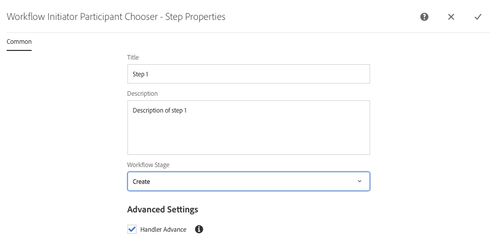

# Creazione di modelli di flussi di lavoro{#creating-workflow-models}

>[!CAUTION]
>
>Per l&#39;utilizzo dell&#39;interfaccia classica, consultare la [documentazione di AEM 6.3](https://helpx.adobe.com/experience-manager/6-3/sites-developing/workflows-models.html) come riferimento.

È possibile creare un [modello di flusso di lavoro](/help/sites-developing/workflows.md#model) per definire la serie di passaggi eseguiti quando un utente avvia il flusso di lavoro. Potete inoltre definire le proprietà del modello, ad esempio se il flusso di lavoro è transitorio o utilizza più risorse.

Quando un utente avvia un flusso di lavoro, viene avviata un’istanza; questo è il modello runtime corrispondente, creato quando si [Sincronizza](#sync-your-workflow-generate-a-runtime-model) le modifiche.

## Creazione di un nuovo flusso di lavoro {#creating-a-new-workflow}

La prima volta che create un nuovo modello di workflow, questo contiene:

* I passaggi, **[!UICONTROL Inizio flusso]** e **[!UICONTROL Fine flusso]**.

   che rappresentano l’inizio e la fine del flusso di lavoro. Questi passaggi sono obbligatori e non possono essere modificati o rimossi.

* Esempio di passaggio **Participant** denominato **Step 1**.

   Questo passaggio è configurato per assegnare un elemento di lavoro all’iniziatore del flusso di lavoro. Modificate o eliminate questo passaggio e aggiungete i passaggi richiesti.

Per creare un nuovo flusso di lavoro con l’editor:

1. Aprire la console **[!UICONTROL Workflow Models]**; mediante **[!UICONTROL Strumenti]**, **[!UICONTROL Flusso di lavoro]**, **[!UICONTROL Modelli]** o, ad esempio:

   [http://localhost:4502/aem/workflow](http://localhost:4502/aem/workflow)

1. Selezionare **[!UICONTROL Crea]**, quindi **[!UICONTROL Crea modello]**.
1. Viene visualizzata la finestra di dialogo **[!UICONTROL Aggiungi modello flusso di lavoro]**. Immettere **[!UICONTROL Title]** e **[!UICONTROL Name]** (facoltativo) prima di selezionare **[!UICONTROL Done]**.
1. Il nuovo modello è elencato nella console **[!UICONTROL Workflow Models]**.
1. Selezionate il nuovo flusso di lavoro, quindi utilizzate [**[!UICONTROL Edit ]**per aprirlo per la configurazione](#editing-a-workflow):

   

>[!NOTE]
>
>Se create modelli a livello di programmazione (utilizzando un pacchetto crx), potete anche creare una sottocartella all&#39;interno di:
>
>`/var/workflow/models`
>
>Esempio, `/var/workflow/models/prototypes`
>
>Questa cartella può essere utilizzata per [gestire l&#39;accesso ai modelli in quella cartella](/help/sites-administering/workflows-managing.md#create-a-subfolder-in-var-workflow-models-and-apply-the-acl-to-that).

## Modifica di un flusso di lavoro {#editing-a-workflow}

Puoi modificare qualsiasi modello di flusso di lavoro esistente per:

* [definire ](#adding-a-step-to-a-model) le fasi e  [i relativi parametri](#configuring-a-workflow-step)

* configurare le proprietà del flusso di lavoro, incluse [fasi](#configuring-workflow-stages-that-show-workflow-progress), [transienti](#creating-a-transient-workflow) e/o [più risorse](#configuring-a-workflow-for-multi-resource-support)

La modifica di un flusso di lavoro [**Predefinito o Legacy** (out-of-the-box)](#editing-a-default-or-legacy-workflow-for-the-first-time) dispone di un passaggio aggiuntivo, per garantire che prima di apportare le modifiche venga effettuata una [copia sicura](/help/sites-developing/workflows-best-practices.md#locations-workflow-models).

Al termine degli aggiornamenti al flusso di lavoro, è necessario utilizzare **[!UICONTROL Sync]** per **[!UICONTROL Generare un modello runtime]**. Per ulteriori informazioni, vedere [Sincronizzazione del flusso di lavoro](#sync-your-workflow-generate-a-runtime-model).

### Sincronizzazione del flusso di lavoro - Generazione di un modello runtime {#sync-your-workflow-generate-a-runtime-model}

**La sincronizzazione**  (a destra nella barra degli strumenti dell&#39;editor) genera un modello [ ](/help/sites-developing/workflows.md#runtime-model)runtime. Il modello di runtime è il modello effettivamente utilizzato quando un utente avvia un flusso di lavoro. Se non **[!UICONTROL Sincronizza]** le modifiche, le modifiche non saranno disponibili in fase di esecuzione.

Quando modificate il flusso di lavoro (o qualsiasi altro utente) dovete utilizzare **[!UICONTROL Sync]** per generare un modello di runtime, anche quando le singole finestre di dialogo (ad esempio, per i passaggi) dispongono di proprie opzioni di salvataggio.

Quando le modifiche vengono sincronizzate con il modello runtime (salvato), viene visualizzato **[!UICONTROL Sincronizzato]**.

Alcuni passaggi contengono campi obbligatori e/o sono incorporati nella convalida. Se queste condizioni non sono soddisfatte, quando si tenta di **[!UICONTROL sincronizzare]** il modello verrà visualizzato un errore. Ad esempio, quando non è stato definito alcun partecipante per un passaggio **[!UICONTROL Participant]**:


### Modifica di un flusso di lavoro predefinito o legacy per la prima volta {#editing-a-default-or-legacy-workflow-for-the-first-time}

Quando si apre un modello [Predefinito e/o Legacy](/help/sites-developing/workflows.md#workflow-types) per la modifica:

* Il browser **[!UICONTROL Passaggi]** non è disponibile (lato sinistro).
* È disponibile un&#39;azione **[!UICONTROL Modifica]** nella barra degli strumenti (a destra).
* Inizialmente il modello e le relative proprietà vengono presentati in modalità di sola lettura come segue:

   * I flussi di lavoro predefiniti si trovano in `/libs`
   * I flussi di lavoro legacy si trovano in `/etc`

Se si seleziona **[!UICONTROL Edit]**, è possibile:

* acquisire una copia del flusso di lavoro in `/conf`
* rendere disponibile il browser **[!UICONTROL Passaggi]**
* consente di apportare modifiche

>[!NOTE]
>
>Per ulteriori informazioni, vedere [Locations of Workflow Models](/help/sites-developing/workflows-best-practices.md#locations-workflow-models).


### Aggiunta di un passaggio a un modello {#adding-a-step-to-a-model}

Sarà necessario aggiungere dei passaggi al modello per rappresentare l&#39;attività da eseguire. Ogni passaggio esegue un&#39;attività specifica. Una selezione di componenti passo è disponibile in un’istanza AEM standard.

Quando modificate un modello, i passaggi disponibili vengono visualizzati nei vari gruppi del browser **[!UICONTROL Passaggi]**. Esempio:


>[!NOTE]
>
>Per informazioni sui componenti del passaggio principale installati con AEM, vedere [Riferimento passaggi del flusso di lavoro](/help/sites-developing/workflows-step-ref.md).

**Per aggiungere un passaggio a un modello**:

1. Aprire un modello di flusso di lavoro esistente per la modifica. Dalla console **[!UICONTROL Modello flussi di lavoro]**, selezionare il modello richiesto, quindi **[!UICONTROL Modifica]**.
1. Aprire il browser **[!UICONTROL Passaggi]**; utilizzando **[!UICONTROL Attiva/disattiva pannello laterale]**, all&#39;estrema sinistra della barra degli strumenti superiore. È possibile:

   * **** Filtro per passaggi specifici.
   * Utilizzate il selettore a discesa per limitare la selezione a un gruppo specifico di passaggi.
   * Selezionate l&#39;icona Mostra descrizione  per visualizzare ulteriori dettagli sul passaggio appropriato.

   

1. Trascinate i passaggi appropriati nella posizione desiderata nel modello.

   Ad esempio, un **[!UICONTROL Passaggio partecipante]**.

   Dopo l&#39;aggiunta al flusso è possibile [configurare il passaggio](#configuring-a-workflow-step).

   

1. Aggiungi tutti i passaggi necessari o altri aggiornamenti.

   In fase di esecuzione, i passaggi vengono eseguiti nell&#39;ordine in cui appaiono nel modello. Dopo aver aggiunto i componenti passo, è possibile trascinarli in un&#39;altra posizione nel modello.

   È inoltre possibile copiare, tagliare, incollare, raggruppare o eliminare passaggi esistenti; come con l&#39;editor di [pagina.](/help/sites-authoring/editing-content.md)

   È inoltre possibile comprimere o espandere i passaggi suddivisi tramite l’opzione della barra degli strumenti: 

1. Confermate le modifiche con **[!UICONTROL Sync]** (barra degli strumenti dell&#39;editor) per generare il modello runtime.

   Per ulteriori informazioni, vedere [Sincronizzazione del flusso di lavoro](#sync-your-workflow-generate-a-runtime-model).

### Configurazione di un passaggio del flusso di lavoro {#configuring-a-workflow-step}

È possibile **Configurare** e personalizzare il comportamento di un passaggio di workflow utilizzando le finestre di dialogo **[!UICONTROL Proprietà passaggio]**.

1. Per aprire la finestra di dialogo **[!UICONTROL Proprietà passaggio]** per un passaggio:

   * Toccate il passaggio nel modello di workflow e selezionate **[!UICONTROL Configura]** dalla barra degli strumenti del componente.
   * Fare doppio clic sul passaggio.

   >[!NOTE]
   >
   >Per informazioni sui componenti del passaggio principale installati con AEM, vedere [Riferimento passaggi del flusso di lavoro](/help/sites-developing/workflows-step-ref.md).

1. Configurare le **[!UICONTROL Proprietà passaggio]** come necessario; le proprietà disponibili dipendono dal tipo di passaggio. Possono essere disponibili anche diverse schede. Ad esempio, il **[!UICONTROL Passo partecipante predefinito]**, presente in un nuovo flusso di lavoro come `Step 1`:

   

1. Conferma gli aggiornamenti con un segno di spunta.
1. Confermate le modifiche con **[!UICONTROL Sync]** (barra degli strumenti dell&#39;editor) per generare il modello runtime.

   Per ulteriori informazioni, vedere [Sincronizzazione del flusso di lavoro](#sync-your-workflow-generate-a-runtime-model).

### Creazione di un flusso di lavoro transitorio {#creating-a-transient-workflow}

È possibile creare un modello di flusso di lavoro [Temporaneo](/help/sites-developing/workflows.md#transient-workflows) durante la creazione di un nuovo modello o modificando un modello esistente:

1. Aprire il modello di workflow per [modificare](#editing-a-workflow).
1. Selezionare **[!UICONTROL Proprietà modello flusso di lavoro]** dalla barra degli strumenti.
1. Nella finestra di dialogo, attivare **[!UICONTROL Flusso di lavoro transitorio]** (o disattivare se necessario):

   

1. Confermare la modifica con **[!UICONTROL Save &amp; Close]**; seguito da **[!UICONTROL Sincronizza]** (barra degli strumenti dell&#39;editor) per generare il modello di runtime.

   Per ulteriori informazioni, vedere [Sincronizzazione del flusso di lavoro](#sync-your-workflow-generate-a-runtime-model).

>[!NOTE]
>
>Quando si esegue un flusso di lavoro in modalità [transient](/help/sites-developing/workflows.md#transient-workflows), AEM non viene memorizzata alcuna cronologia del flusso di lavoro. Di conseguenza, [Timeline](/help/sites-authoring/basic-handling.md#timeline) non visualizza alcuna informazione relativa a tale flusso di lavoro. [](/help/sites-authoring/basic-handling.md#timeline)

### Rendere disponibili i modelli di workflow nell&#39;interfaccia touch{#make-workflow-models-available-in-touchui}

Se un modello di workflow è presente nell&#39;interfaccia classica, ma manca nel menu a comparsa di selezione nella barra **[!UICONTROL Timeline]** dell&#39;interfaccia utente touch, segui la configurazione per renderlo disponibile. Nei passaggi seguenti viene illustrato l&#39;utilizzo del modello di flusso di lavoro denominato **[!UICONTROL Richiesta di attivazione]**.

1. Verificate che il modello non sia disponibile nell&#39;interfaccia touch. Accedete a una risorsa utilizzando il percorso `/assets.html/content/dam`. Selezionate una risorsa. Aprire **[!UICONTROL Timeline]** nella barra a sinistra. Fare clic su **[!UICONTROL Avvia flusso di lavoro]** e confermare che il modello **[!UICONTROL Richiedi attivazione]** non è presente nell&#39;elenco a comparsa.

1. Navigare tra **[!UICONTROL Strumenti > Generale > Assegnazione tag]**. Selezionare **[!UICONTROL Workflow]**.

1. Selezionare **[!UICONTROL Crea > Crea tag]**. Impostare **[!UICONTROL Title]** come `DAM` e **[!UICONTROL Name]** come `dam`. Seleziona **[!UICONTROL Invia]**.
   

1. Passare a **[!UICONTROL Strumenti > Flusso di lavoro > Modelli]**. Selezionare **[!UICONTROL Request for Activation]**, quindi selezionare **[!UICONTROL Edit]**.

1. Selezionare **[!UICONTROL Edit]** , quindi aprire **[!UICONTROL Workflow Model Properties]**. Passate alla scheda **[!UICONTROL Base]**.

1. Aggiungere `Workflow : DAM` al campo **[!UICONTROL Tag]**. Confermare la selezione con il segno di spunta (segno di spunta).

1. Confermate l&#39;aggiunta del tag con **[!UICONTROL Save &amp; Close]**.
   

1. Completare il processo con **[!UICONTROL Sync]**. Il flusso di lavoro è ora disponibile nell’interfaccia touch.

### Configurazione di un flusso di lavoro per il supporto di risorse multiple {#configuring-a-workflow-for-multi-resource-support}

È possibile configurare un modello di flusso di lavoro per [Supporto risorse multiple](/help/sites-developing/workflows.md#multi-resource-support) durante la creazione di un nuovo modello o modificando uno esistente:

1. Aprire il modello di workflow per [modificare](#editing-a-workflow).
1. Selezionare **[!UICONTROL Proprietà modello flusso di lavoro]** dalla barra degli strumenti.

1. Nella finestra di dialogo, attivare **[!UICONTROL Supporto risorse multiple]** (o disattivare se necessario):

   

1. Confermare la modifica con **[!UICONTROL Save &amp; Close]**; seguito da **[!UICONTROL Sincronizza]** (barra degli strumenti dell&#39;editor) per generare il modello di runtime.

   Per ulteriori informazioni, vedere [Sincronizzazione del flusso di lavoro](#sync-your-workflow-generate-a-runtime-model).

### Configurazione delle fasi del flusso di lavoro (che mostrano l&#39;avanzamento del flusso di lavoro) {#configuring-workflow-stages-that-show-workflow-progress}

[Gli ](/help/sites-developing/workflows.md#workflow-stages) stadi del flusso di lavoro consentono di visualizzare l’avanzamento di un flusso di lavoro durante la gestione delle attività.

>[!CAUTION]
>
>Se le fasi del flusso di lavoro sono definite in **[!UICONTROL Proprietà pagina]**, ma non sono utilizzate per nessuna delle fasi del flusso di lavoro, la barra di avanzamento non mostrerà alcun avanzamento (indipendentemente dal passaggio del flusso di lavoro corrente).

Le fasi da rendere disponibili sono definite nei modelli di flusso di lavoro; i modelli di flusso di lavoro esistenti possono essere aggiornati per includere le definizioni degli stadi. Potete definire un numero qualsiasi di fasi per il modello di workflow.

Per definire **[!UICONTROL stadi]** per il flusso di lavoro:

1. Aprite il modello di workflow per la modifica.
1. Selezionare **[!UICONTROL Proprietà modello flusso di lavoro]** dalla barra degli strumenti. Aprite la scheda **[!UICONTROL Stages]**.
1. Aggiungete (e posizionate) le **[!UICONTROL fasi]** richieste. Potete definire un numero qualsiasi di fasi per il modello di workflow.

   Esempio:

   

1. Fare clic su **[!UICONTROL Salva e chiudi]** per salvare le proprietà.
1. Assegnare un passaggio a ciascuno dei passaggi del modello di workflow. Esempio:

   

   Un passaggio può essere assegnato a più passaggi. Esempio:

   | **Incremento** | **Stadio** |
   |---|---|
   | Passaggio 1 | Crea |
   | Passaggio 2 | Crea |
   | Passaggio 3 | Recensione |
   | Passaggio 4 | Approva |
   | Passaggio 5 | Approva |
   | Passaggio 6 | Completa |

1. Confermate le modifiche con **[!UICONTROL Sync]** (barra degli strumenti dell&#39;editor) per generare il modello runtime.

   Per ulteriori informazioni, vedere [Sincronizzazione del flusso di lavoro](#sync-your-workflow-generate-a-runtime-model).

## Esportazione di un modello di flusso di lavoro in un pacchetto {#exporting-a-workflow-model-in-a-package}

1. Create un nuovo pacchetto utilizzando [Gestione pacchetti](/help/sites-administering/package-manager.md#package-manager):

   1. Andate a Gestione pacchetti tramite **[!UICONTROL Strumenti]**, **[!UICONTROL Distribuzione]**, **[!UICONTROL Pacchetti]**.
   1. Fare clic su **[!UICONTROL Crea pacchetto]**.
   1. Specificate il **[!UICONTROL Nome pacchetto]** e tutti gli altri dettagli richiesti.
   1. Fai clic su **[!UICONTROL OK]**.

1. Fate clic su **[!UICONTROL Modifica]** sulla barra degli strumenti del nuovo pacchetto.

1. Aprire la scheda **[!UICONTROL Filtri]**.

1. Selezionare **[!UICONTROL Aggiungi filtro]** e specificare il percorso del modello di flusso di lavoro *progettazione*:

   `/conf/global/settings/workflow/models/<*your-model-name*>`

   Fare clic su **[!UICONTROL Fine]**.

1. Selezionare **[!UICONTROL Aggiungi filtro]** e specificare il percorso del modello di flusso di lavoro *runtime*:

   `/var/workflow/models/<*your-model-name*>`

   Fare clic su **[!UICONTROL Fine]**.

1. Aggiungere altri filtri per eventuali script personalizzati utilizzati dal modello.
1. Fare clic su **[!UICONTROL Salva]** per confermare le definizioni dei filtri.
1. Selezionate **[!UICONTROL Build]** dalla barra degli strumenti della definizione del pacchetto.
1. Selezionate **[!UICONTROL Download]** dalla barra degli strumenti del pacchetto.

## Utilizzo dei flussi di lavoro per elaborare gli invii di moduli {#using-workflows-to-process-form-submissions}

È possibile configurare un modulo da elaborare in base al flusso di lavoro selezionato. Quando gli utenti inviano il modulo, viene creata una nuova istanza di workflow con i dati dell&#39;invio del modulo come payload.

Per configurare il flusso di lavoro da utilizzare con il modulo:

1. Create una nuova pagina e apritela per la modifica.
1. Aggiungete un componente **[!UICONTROL Modulo]** alla pagina.
1. Configurare il componente **[!UICONTROL Inizio modulo]** visualizzato nella pagina.
1. Utilizzate **[!UICONTROL Avvia flusso di lavoro]** per selezionare il flusso di lavoro desiderato tra quelli disponibili:

   

1. Confermare la nuova configurazione del modulo con il segno di spunta.

## Verifica dei flussi di lavoro {#testing-workflows}

È buona prassi, quando si esegue il test di un flusso di lavoro, utilizzare diversi tipi di payload; compresi i tipi diversi da quello per il quale è stato sviluppato. Ad esempio, se intendete gestire il flusso di lavoro con le risorse, verificatene il funzionamento impostando una pagina come payload e accertatevi che non generi errori.

Ad esempio, verificate il nuovo flusso di lavoro come segue:

1. [Avviate il ](/help/sites-administering/workflows-starting.md) modello di flusso di lavoro dalla console.
1. Definire il **[!UICONTROL Payload]** e confermare.

1. Eseguite le azioni necessarie per continuare il flusso di lavoro.
1. Monitorare i file di registro mentre il flusso di lavoro è in esecuzione.

È inoltre possibile configurare AEM per visualizzare i messaggi **[!UICONTROL DEBUG]** nei file di registro. Per ulteriori informazioni, vedere [Logging](/help/sites-deploying/configure-logging.md) e al termine dello sviluppo, impostare il **[!UICONTROL Livello di registro]** di nuovo su **[!UICONTROL Info]**.

## Esempi {#examples}

### Esempio: Creazione di un flusso di lavoro (semplice) per accettare o rifiutare una richiesta di pubblicazione {#example-creating-a-simple-workflow-to-accept-or-reject-a-request-for-publication}

Per illustrare alcune delle possibilità di creazione di un flusso di lavoro, nell&#39;esempio seguente viene creata una variante del flusso di lavoro `Publish Example`.

1. [Creare un nuovo modello](#creating-a-new-workflow) di workflow.

   Il nuovo flusso di lavoro conterrà:

   * **[!UICONTROL Avvio del flusso]**
   * `Step 1`
   * **[!UICONTROL Fine del flusso]**

1. Elimina `Step 1` (in quanto si tratta del tipo di passaggio errato per questo esempio):

   * Fare clic sul passaggio e selezionare **[!UICONTROL Elimina]** dalla barra degli strumenti del componente. Conferma l’azione.

1. Dalla selezione **[!UICONTROL Workflow]** del browser dei passaggi, trascinare un **[!UICONTROL Passo partecipante]** nel flusso di lavoro e posizionarlo tra **[!UICONTROL Inizio flusso]** e **[!UICONTROL Fine flusso*]*.
1. Per aprire la finestra di dialogo delle proprietà:

   * Fate clic sul passaggio del partecipante e selezionate **[!UICONTROL Configura]** dalla barra degli strumenti del componente.
   * Fate doppio clic sul passaggio del partecipante.

1. Nella scheda **[!UICONTROL Common]** immettere `Validate Content` sia per **[!UICONTROL Title]** che per **[!UICONTROL Description]**.
1. Aprite la scheda **[!UICONTROL Utente/gruppo]**:

   * Attivare **[!UICONTROL Notificare l&#39;utente tramite e-mail]**.
   * Selezionare `Administrator` ( `admin`) per il campo **[!UICONTROL Utente/Gruppo]**.

   >[!NOTE]
   >
   >Per inviare le e-mail, [i dettagli del servizio e dell&#39;account utente devono essere configurati](/help/sites-administering/notification.md).

1. Confermate gli aggiornamenti con il segno di spunta.

   Nella panoramica del modello di workflow, il passaggio partecipante verrà rinominato in `Validate Content`.

1. Trascinare un elemento **[!UICONTROL O dividere]** nel flusso di lavoro e posizionarlo tra `Validate Content` e **[!UICONTROL Fine flusso]**.
1. Aprire la **[!UICONTROL O Split]** per la configurazione.
1. Configurazione:

   * **[!UICONTROL Comune]**: seleziona  **[!UICONTROL 2 rami]**
   * **[!UICONTROL Filiale 1]**: selezionare Percorso **** predefinito.
   * **[!UICONTROL Filiale 2]**: assicurarsi che  **[!UICONTROL i]** router predefiniti non siano selezionati.

1. Confermate gli aggiornamenti alla **[!UICONTROL OR Split]**.
1. Trascinate un **[!UICONTROL passo partecipante]** sul ramo sinistro, aprite le proprietà, specificate i seguenti valori, quindi confermate le modifiche:

   * **[!UICONTROL Titolo]**: `Reject Publish Request`
   * **[!UICONTROL Utente/gruppo]**: ad esempio,  `projects-administrators`
   * **[!UICONTROL Notifica agli utenti tramite e-mail]**: Attivate questa opzione per ricevere una notifica tramite e-mail all’utente.

1. Trascinate un **[!UICONTROL Passaggio processo]** sul ramo di destra, aprite le proprietà, specificate i seguenti valori, quindi confermate le modifiche:

   * **[!UICONTROL Titolo]**: `Publish Page as Requested`
   * **[!UICONTROL Processo]**: selezionare  `Activate Page`. Questa procedura consente di pubblicare la pagina selezionata nelle istanze dell&#39;editore.

1. Fare clic su **[!UICONTROL Sincronizza]** (barra degli strumenti dell&#39;editor) per generare il modello di runtime.

   Per ulteriori informazioni, vedere [Sincronizzazione del flusso di lavoro](#sync-your-workflow-generate-a-runtime-model).

   Il nuovo modello di flusso di lavoro sarà simile al seguente:

   

1. Applicate questo flusso di lavoro alla pagina, in modo che quando l&#39;utente passa al passaggio **[!UICONTROL Completa]** **[!UICONTROL Convalida contenuto]**, possa selezionare se desidera **[!UICONTROL Pubblicare pagina come richiesto]** o **[!UICONTROL Rifiuta richiesta di pubblicazione]**.

   

### Esempio: Definizione di una regola per una divisione OR {#example-defining-a-rule-for-an-or-split}

**[!UICONTROL OPPURE]** Le fasi iniziali consentono di introdurre percorsi di elaborazione condizionale nel flusso di lavoro.

Per definire una regola OR:

1. Creare due script e salvarli nell&#39;archivio, ad esempio in:

   `/apps/myapp/workflow/scripts`

   >[!NOTE]
   >
   >Gli script devono avere una funzione [`check()`](#function-check) che restituisce un valore booleano.

1. Modificate il flusso di lavoro e aggiungete **[!UICONTROL OR Split]** al modello.
1. Modificare le proprietà di **[!UICONTROL Ramo 1]** della **[!UICONTROL OR Split]**:

   * Definite questo valore come percorso **[!UICONTROL predefinito]** impostando il valore **[!UICONTROL Valore]** su `true`.
   * Come **[!UICONTROL Rule]**, impostate il percorso dello script. Esempio:

      `/apps/myapp/workflow/scripts/myscript1.ecma`
   >[!NOTE]
   >
   >Se necessario, è possibile cambiare l&#39;ordine del ramo.

1. Modificare le proprietà della **[!UICONTROL Ramo 2]** della **[!UICONTROL OR Split]**.

   * Come **[!UICONTROL Rule]**, imposta il percorso dell&#39;altro script. Esempio:

      `/apps/myapp/workflow/scripts/myscript2.ecma`

1. Impostare le proprietà dei singoli passaggi in ciascun ramo. Assicurarsi che l&#39;opzione **[!UICONTROL Utente/gruppo]** sia impostata.
1. Fare clic su **Sincronizza** (barra degli strumenti dell&#39;editor) per mantenere le modifiche apportate al modello di runtime.

   Per ulteriori informazioni, vedere [Sincronizzazione del flusso di lavoro](#sync-your-workflow-generate-a-runtime-model).

#### Funzione Check() {#function-check}

>[!NOTE]
>
>Vedere [Utilizzo di ECMAScript](/help/sites-developing/workflows-customizing-extending.md#using-ecmascript).

Lo script di esempio seguente restituisce `true` se il nodo è un `JCR_PATH` situato sotto `/content/we-retail/us/en`:

```
function check() {
    if (workflowData.getPayloadType() == "JCR_PATH") {
      var path = workflowData.getPayload().toString();
      var node = jcrSession.getItem(path);

      if (node.getPath().indexOf("/content/we-retail/us/en") >= 0) {
       return true;
      } else {
       return false;
      } 
     } else {
      return false;
     }
}
```

### Esempio: Richiesta personalizzata di attivazione {#example-customized-request-for-activation}

Puoi personalizzare qualsiasi flusso di lavoro predefinito. Per ottenere un comportamento personalizzato, sovrapponete i dettagli del flusso di lavoro appropriato.

Ad esempio, **[!UICONTROL Richiesta di attivazione]**. Questo flusso di lavoro viene utilizzato per la pubblicazione di pagine all&#39;interno di **[!UICONTROL Sites]** e viene attivato automaticamente quando un autore di contenuto non dispone dei diritti di replica appropriati. Per ulteriori informazioni, consultate [Personalizzazione dell&#39;authoring delle pagine - Personalizzazione del flusso di lavoro di richiesta dell&#39;attivazione](/help/sites-developing/customizing-page-authoring-touch.md#customizing-the-request-for-activation-workflow).
